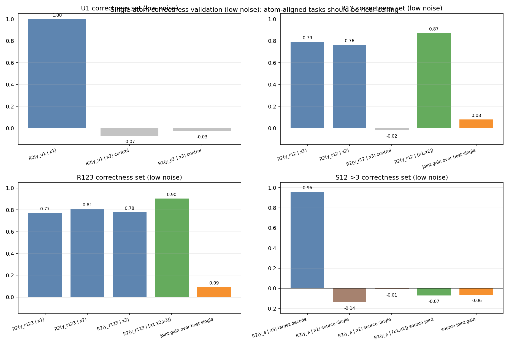

# PID-SAR-3++ Dataset Notes

This note summarizes the dataset definition, raw-data validation metrics, key diagnostic figures, and the implementation entry points in `pid_sar3_dataset.py` and `tests/test_pid_sar3_dataset.py`.

## 1. Formal Dataset and Task Specification

### 1.1 Dataset Overview and Notation

PID-SAR-3++ is a synthetic three-view benchmark for multi-view representation learning under controlled information structure. Each sample contains three observations $x_1, x_2, x_3 \in \mathbb{R}^d$, and exactly one PID-inspired atom is active. The atom set is $\mathcal{A}=\{U_1,U_2,U_3,R_{12},R_{13},R_{23},R_{123},S_{12 \to 3},S_{13 \to 2},S_{23 \to 1}\}$. The generator returns $(x_1,x_2,x_3,\mathrm{pid\_id},\alpha,\sigma,\rho,h)$, where `rho=-1` for non-redundancy atoms and `h=0` for non-synergy atoms.

### 1.2 Task Definition (Training and Evaluation Protocol)

During training, the learner sees only `(x1, x2, x3)`; metadata (`pid_id`, `rho`, `h`) are hidden. During evaluation, frozen representations are probed for unique, redundant, and directional-synergistic structure. Before encoder training, the generator should be validated directly on raw observations to verify that empirical signatures match the intended atom structure. This note emphasizes the `U/R` subset first because it provides the most interpretable sanity checks.

### 1.3 Generative Parameters

The latent dimensionality satisfies `m << d`. Typical defaults are $d=32$, $m=8$, $\alpha \sim \mathrm{Uniform}(\alpha_{\min},\alpha_{\max})$, $\sigma>0$, and $(\rho,h)\in \mathcal{R}\times\mathcal{H}$ with $\mathcal{R}\subset(0,1)$ and $\mathcal{H}\subset\mathbb{N}$. In `pid_sar3_dataset.py`, defaults are `alpha_min=0.8`, `alpha_max=1.2`, `rho_choices={0.2,0.5,0.8}`, and `hop_choices={1,2,3,4}`.

### 1.4 Fixed Projection Operators (Sampled Once per Dataset Seed)

For each view `k ∈ {1,2,3}` and each component `c`, the generator samples a fixed projection matrix $P_k^{(c)} \in \mathbb{R}^{d \times m}$ with entries $P_k^{(c)}[i,j] \sim \mathcal{N}(0,1/d)$, and each column is normalized as $P_k^{(c)}[:,j] \leftarrow P_k^{(c)}[:,j]/\|P_k^{(c)}[:,j]\|_2$. These operators are then held fixed for all samples generated with the same dataset seed.

### 1.5 Observation Noise

Each view receives additive isotropic Gaussian noise $\varepsilon_k \sim \mathcal{N}(0,\sigma^2 I_d)$ for $k\in\{1,2,3\}$, and the observed variable is $x_k = \mathrm{signal}_k + \varepsilon_k$.

### 1.6 Unique Atoms

For `U_i`, the generator samples a latent Gaussian vector $u \sim \mathcal{N}(0,I_m)$ and places the signal only in the active view, i.e., $x_i = \alpha P_i^{(U_i)} u + \varepsilon_i$, while inactive views contain noise only, $x_j = \varepsilon_j$ for $j \neq i$.

### 1.7 Pairwise Redundancy Atoms

For `R_{ij}`, the generator samples $r,\eta_i,\eta_j \overset{\mathrm{i.i.d.}}{\sim} \mathcal{N}(0,I_m)$ and constructs view-specific latent realizations with overlap coefficient `rho` as $r_i = \sqrt{\rho}\,r + \sqrt{1-\rho}\,\eta_i$ and $r_j = \sqrt{\rho}\,r + \sqrt{1-\rho}\,\eta_j$. The observations are then generated as $x_i = \alpha P_i^{(R_{ij})} r_i + \varepsilon_i$ and $x_j = \alpha P_j^{(R_{ij})} r_j + \varepsilon_j$, while $x_k = \varepsilon_k$ for $k\notin\{i,j\}$. As `rho` increases, the shared structure between the two active views becomes stronger.

### 1.8 Triple Redundancy Atom

For `R_{123}`, the generator samples $r,\eta_1,\eta_2,\eta_3 \overset{\mathrm{i.i.d.}}{\sim} \mathcal{N}(0,I_m)$, defines per-view redundant latents $r_k = \sqrt{\rho}\,r + \sqrt{1-\rho}\,\eta_k$ for $k\in\{1,2,3\}$, and sets $x_k = \alpha P_k^{(R_{123})} r_k + \varepsilon_k$.

### 1.9 Directional Synergy Atoms

For `S_{ij→k}`, the generator samples source latents and a hop parameter, $a,b \sim \mathcal{N}(0,I_m)$ and $h \in \mathcal{H}$. The source views are generated linearly as $x_i = \alpha P_i^{(A_{ij})} a + \varepsilon_i$ and $x_j = \alpha P_j^{(B_{ij})} b + \varepsilon_j$. A fixed nonlinear readout network `phi_h` then produces a target latent $s_0 = \phi_h([a,b]) \in \mathbb{R}^m$, which is de-leaked via $s = s_0 - C_a^{(h)} a - C_b^{(h)} b$, and the target view is generated as $x_k = \alpha P_k^{(\mathrm{SYN}_{ij})} s + \varepsilon_k$. This construction reduces single-source linear leakage and yields a more directional synergy signal.

### 1.10 Synergy De-leakage Fit (Offline, per Dataset Seed)

For each hop `h`, de-leakage maps are fit by ridge regression on synthetic latent samples:

```math
W^{(h)} = \arg\min_W \|S_0 - XW\|_F^2 + \lambda \|W\|_F^2,
```

with

```math
X = [A\;B] \in \mathbb{R}^{N\times 2m},\qquad S_0 \in \mathbb{R}^{N\times m}.
```

The fitted matrix is partitioned as

```math
W^{(h)} =
\begin{bmatrix}
C_a^{(h)} \\
C_b^{(h)}
\end{bmatrix}.
```

and these maps are then used during generation to compute the de-leaked target latent `s`.

## 2. Validation Metrics (Raw Data, Pre-Encoder)

### 2.1 Symmetric Dependence Proxy

Given two view matrices `X_A` and `X_B`, define $D(X_A,X_B)=\frac{1}{2}\left(R^2(X_A\to X_B)+R^2(X_B\to X_A)\right)$, where each `R^2` is computed by ridge regression on a train/test split. Intuitively, `D(1,2)` measures shared predictable structure between views 1 and 2: it is low for `U1`, high for `R12`, and elevated for `R123`. It is not a PID estimator or a causal quantity; it is a controlled dependence proxy for validating raw cross-view geometry. Expected U/R signatures are low values for `U1/U2/U3`, pair-specific peaks for `R12/R13/R23`, broad elevation for `R123`, monotonic growth with `rho`, and decay as `sigma` increases.

### 2.2 CCA-Based Geometric Diagnostics

For a fixed atom, let `X_k` denote the sample matrix from view `k`. Linear CCA is used as a cross-view geometric diagnostic, with fit-on-train and report-on-test to reduce overfitting. CCA complements `D(i,j)`; it does not replace it.

## 3. Dataset Exploration (Figures with Equations and Interpretation)

This section summarizes the main raw-data checks before the code walkthrough. Most plots use the dependence proxy $D(X_A,X_B)=\tfrac{1}{2}(R^2(X_A\to X_B)+R^2(X_B\to X_A))$. In the U/R regime, `D(1,2)` should be low for unique atoms and high for atoms that share signal between views 1 and 2.

### 3.1 Figure A: Atom Gain Controls (Amplifying U vs R Unequally)


This figure shows atom-dependent gain control, $\alpha_{\mathrm{eff}}=\alpha \cdot g(\mathrm{pid\_id})$, with fixed noise scale $\sigma`. The left panel tracks observed scale (mean $\|x_1\|$), and the right panel tracks `D(1,2)`. Boosting redundancy increases `D(1,2)` for `R12`, while boosting unique atoms mostly increases magnitude without adding cross-view dependence. Per-`pid` overrides support unequal emphasis within a family (for example, stronger `R12`, weaker `R123`).

### 3.2 Figure B: PID Metadata Distributions (Sampling Sanity Check)


This figure validates the sampling pipeline. Under a balanced schedule, class counts should be uniform across `pid_id`. The `alpha` boxplots should match the configured range, while `rho` should appear only for redundancy atoms and `hop` only for synergy atoms.

### 3.3 Figure C: PID Dependence Distributions (Repeated-Batch Variability)


This figure shows repeated-batch distributions of $D(i,j)$, not just single estimates. It captures both the expected ordering (`R12` dominates `D(1,2)`, `R13` dominates `D(1,3)`, `R23` dominates `D(2,3)`) and sampling variability. `R123` remains elevated across all three pairs.

### 3.4 Figure D: U/R Signature Grid Across Noise


This heatmap is the fastest U/R sanity check. Each cell is $D(i,j)$ for one atom and one noise level $\sigma$. Unique atoms stay near the noise floor, pairwise redundancy atoms activate the matching pair, and `R123` elevates all pairs. As $\sigma$ increases, all values contract toward zero.

### 3.5 Figure E: Hyperparameter Sweeps (`rho`, `sigma`, `alpha`)


The left panel links the redundancy equation $r_i=\sqrt{\rho}\,r+\sqrt{1-\rho}\,\eta_i$ to the observed statistics: increasing $\rho$ increases shared latent content and should increase $D(x_1,x_2)$ for `R12`. The right panel shows how observed norm changes with signal amplitude `alpha` and noise scale `sigma` in $x_k=\mathrm{signal}_k+\varepsilon_k$.

### 3.6 Figure F: Holdout CCA Companion (All Pairs, U1/R12/R123)


These figures are the primary geometric sanity check for shared cross-view structure. For each atom (`U1`, `R12`, `R123`) and view pair, they show held-out CCA1 scores. At low noise (`sigma = 0.15`), `U1` stays low on pair `1-2`, `R12` is strongly elevated on pair `1-2`, and `R123` is elevated across all pairs. At high noise (`sigma = 0.9`), all values decrease but the redundancy ordering remains visible.

Table 1 summarizes held-out CCA1 correlations from the current figures. Exact values vary with seed; the qualitative ordering is the main signal.

| Atom | Sigma | CCA(1,2) | CCA(1,3) | CCA(2,3) | Interpretation |
| --- | ---: | ---: | ---: | ---: | --- |
| `U1` | 0.15 | 0.082 | 0.014 | 0.199 | Mostly low cross-view shared structure; residual nonzero values can occur due to finite-sample effects and random projections. |
| `R12` | 0.15 | 0.523 | 0.114 | 0.033 | Strongly elevated on the matching pair `(1,2)`, low on mismatched pairs. |
| `R123` | 0.15 | 0.368 | 0.436 | 0.322 | Elevated across all three pairs, consistent with triple redundancy. |
| `U1` | 0.90 | 0.051 | 0.047 | 0.052 | Near-noise-floor across pairs under high noise. |
| `R12` | 0.90 | 0.126 | 0.140 | 0.025 | Weaker than low-noise but still structured; pair `(1,2)` remains informative. |
| `R123` | 0.90 | 0.115 | 0.160 | 0.240 | Shared structure persists across pairs but is attenuated by noise. |

### 3.7 Figure G: Single-Atom Correctness Validation (Low Noise, Atom-Aligned Tasks)



Before stress tests, the generator should pass a correctness check: if only one atom is present, the aligned task should be solved nearly perfectly under low noise. The figure uses separate validation sets for `U1`, `R12`, `R123`, and `S12->3` with fixed settings (`sigma = 0.05`, `alpha = 1.5`, `rho = 0.8`, `hop = 2`). Targets are latent-derived (`y_u1`, `y_r12`, `y_r123`, `y_s12_3`), and probes are matched to the mechanism (linear decoders for unique/redundancy targets and a target-view decode for `S12->3`).

Read this figure row-wise. For `U1`, `R²(y_u1 \mid x1)` should be near one and inactive-view controls near chance. For `R12`, both `x1` and `x2` should decode `y_r12`, `x3` should remain a control, and `[x1,x2]` should be best. For `R123`, all three views should decode `y_r123`, with `[x1,x2,x3]` strongest. For `S12->3`, the stable correctness criterion is `R²(y_s12_3 \mid x3)` because the synergy latent is linearly projected into view 3; source-side synergy diagnostics are probe-dependent and handled below.

| Atom-only validation set | Metric | Score | Expected behavior |
| --- | --- | ---: | --- |
| `U1` | `R²(y_u1 | x1)` | 0.998 | Near-ceiling decode from the active view. |
| `U1` | `R²(y_u1 | x2)` / `R²(y_u1 | x3)` (controls) | -0.068 / -0.025 | Inactive views stay near chance. |
| `R12` | `R²(y_r12 | x1)` / `R²(y_r12 | x2)` | 0.791 / 0.764 | Both redundant source views carry the shared latent. |
| `R12` | `R²(y_r12 | x3)` (control) | -0.016 | Inactive third view remains near chance. |
| `R12` | `R²(y_r12 | [x1,x2])` | 0.871 | Joint decoder improves over either source alone. |
| `R123` | `R²(y_r123 | x1/x2/x3)` | 0.774 / 0.811 / 0.778 | All three views decode the triple-shared latent. |
| `R123` | `R²(y_r123 | [x1,x2,x3])` | 0.905 | Joint decoder is strongest. |
| `S12->3` | `R²(y_s12_3 | x3)` | 0.960 | Near-ceiling target-view decode for the synergy-generated latent. |

This correctness block is the main guardrail for interpreting the later stress tests.

### 3.8 Figures H-J: Boosting Stress Tests (CCA, Atom-Aligned Tasks, and Synergy Gap)

The next three summaries are stress tests, not correctness checks. They test whether diagnostics move in the expected direction when one atom is selectively amplified via `pid_gain_overrides`, with nuisance settings fixed (`sigma = 0.45`, `rho = 0.5`, `hop = 2`).


The first heatmap uses holdout CCA summaries. It is informative for redundancy atoms (`R12`, `R123`) and intentionally weak for directional synergy. The `S12->3` entry uses `CCA([x1,x2], x3)` rather than pairwise CCA, but remains small because the synergy mechanism is nonlinear and de-leaked.

| Scenario | U1 summary CCA | R12 summary CCA | R123 summary CCA | `S12->3` joint CCA (`CCA([x1,x2],x3)`) |
| --- | ---: | ---: | ---: | ---: |
| baseline | 0.022 | 0.294 | 0.380 | 0.028 |
| boost `U1` | 0.035 | 0.294 | 0.380 | 0.028 |
| boost `R12` | 0.022 | 0.436 | 0.380 | 0.028 |
| boost `R123` | 0.022 | 0.294 | 0.455 | 0.028 |
| boost `S12->3` | 0.022 | 0.294 | 0.380 | 0.008 |


The second heatmap uses atom-aligned downstream tasks, which makes `U1` and `S12->3` boosts visible. Increasing `U1` does not change `y_u1`; it improves predictability of `y_u1` from `x1` by increasing signal in `x1`. `boost_S12->3` is visible in the target-view decode `Y_S12->3 from x3`.

| Scenario | `Y_U1` from `x1` | `Y_R12` from `[x1,x2]` | `Y_R123` from `[x1,x2,x3]` | `Y_S12->3` from `x3` |
| --- | ---: | ---: | ---: | ---: |
| baseline | 0.012 | 0.539 | 0.443 | 0.049 |
| boost `U1` | 0.023 | 0.539 | 0.443 | 0.049 |
| boost `R12` | 0.012 | 0.605 | 0.443 | 0.049 |
| boost `R123` | 0.012 | 0.539 | 0.492 | 0.049 |
| boost `S12->3` | 0.012 | 0.539 | 0.443 | 0.338 |


The third summary isolates the joint-source aspect of `S12->3` using a probe gap, $\Delta_{\mathrm{task}} = R^2([x_1,x_2]\rightarrow y) - \max\{R^2(x_1\rightarrow y), R^2(x_2\rightarrow y)\}$. Absolute values are probe-dependent because the target is nonlinear and de-leaked; the useful signal is comparative. Boosting `S12->3` increases `R²(x3 \rightarrow y_s12_3)` and moves the joint-vs-single gap upward relative to baseline and unrelated boosts.

| Scenario | `R²(x1→y)` | `R²(x2→y)` | `R²([x1,x2]→y)` | `Δ_task` | `R²(x3→y)` |
| --- | ---: | ---: | ---: | ---: | ---: |
| baseline | -0.159 | -0.093 | -0.197 | -0.104 | 0.076 |
| boost `U1` | -0.159 | -0.093 | -0.197 | -0.104 | 0.076 |
| boost `R12` | -0.159 | -0.093 | -0.197 | -0.104 | 0.076 |
| boost `R123` | -0.159 | -0.093 | -0.197 | -0.104 | 0.076 |
| boost `S12->3` | -0.147 | -0.214 | -0.129 | 0.018 | 0.257 |

## 4. Code Tutorial (How the Dataset Is Implemented and Used)

This section maps the formal specification to the implementation.

### 4.1 Instantiate the Generator

`PIDSar3DatasetGenerator` encapsulates fixed projection sampling, fixed synergy MLP sampling, de-leakage fitting, and sample/batch generation.

Minimal example:

```python
from pid_sar3_dataset import PIDDatasetConfig, PIDSar3DatasetGenerator

cfg = PIDDatasetConfig(
    d=32,
    m=8,
    sigma=0.45,
    alpha_min=0.8,
    alpha_max=1.2,
    rho_choices=(0.2, 0.5, 0.8),
    hop_choices=(1, 2, 3, 4),
    seed=0,
)
gen = PIDSar3DatasetGenerator(cfg)
```

To amplify atom families (or specific atoms) unequally, use gain controls:

```python
cfg = PIDDatasetConfig(
    seed=0,
    unique_gain=1.6,       # boost all U atoms
    redundancy_gain=0.8,   # suppress all R atoms
    synergy_gain=1.0,
    pid_gain_overrides={
        3: 2.0,  # specifically boost R12
        6: 0.7,  # specifically weaken R123
    },
)
gen = PIDSar3DatasetGenerator(cfg)
```

The effective signal amplitude becomes `alpha_eff = alpha * gain(pid_id)`, while the additive noise scale `sigma` is unchanged.

### 4.2 Generate a Single Sample

```python
sample = gen.sample(pid_id=3)  # R12

# keys: x1, x2, x3, pid_id, alpha, sigma, rho, hop
print(sample["x1"].shape)  # (32,)
print(sample["pid_id"])    # 3
```

### 4.3 Generate a Balanced U/R Subset

The U/R-only subset corresponds to $\{0,1,2,3,4,5,6\} = \{U_1,U_2,U_3,R_{12},R_{13},R_{23},R_{123}\}$.

```python
import numpy as np

ur_pid_ids = [0, 1, 2, 3, 4, 5, 6]
n_per_atom = 5000
pid_schedule = np.repeat(ur_pid_ids, n_per_atom)

batch = gen.generate(n=len(pid_schedule), pid_ids=pid_schedule.tolist())
print(batch["x1"].shape)      # (35000, d)
print(batch["pid_id"].shape)  # (35000,)
```

### 4.4 Save the Dataset to Disk

```python
import numpy as np
np.savez_compressed("data/pid_sar3_ur_train.npz", **batch)
```

### 4.5 Where the Diagnostics Are Implemented

The main diagnostics are implemented in `tests/test_pid_sar3_dataset.py`: `test_plot_atom_gain_controls_ur()`, `test_plot_pid_metadata_distributions()`, `test_plot_pid_dependence_distributions_boxplots()`, `test_plot_ur_compact_signature_grid_over_sigma()`, `test_plot_ur_hyperparameter_sweeps_compact()`, `test_plot_cca_all_pairs_ur()`, `test_plot_single_atom_correctness_validation()`, `test_plot_cca_boosting_mechanisms_summary()`, `test_plot_downstream_task_boosting_summary()`, and `test_plot_synergy_task_gap_boosting_summary()`. They serve both as regression checks and as figure-generation scripts.

## 5. Commands to Reproduce the Dataset and Figures

### 5.1 Generate the U/R Diagnostic Figures (Recommended Entry Point)

```bash
python - <<'PY'
from tests.test_pid_sar3_dataset import (
    test_plot_atom_gain_controls_ur,
    test_plot_pid_metadata_distributions,
    test_plot_pid_dependence_distributions_boxplots,
    test_plot_cca_all_pairs_ur,
    test_plot_single_atom_correctness_validation,
    test_plot_cca_boosting_mechanisms_summary,
    test_plot_downstream_task_boosting_summary,
    test_plot_synergy_task_gap_boosting_summary,
    test_plot_ur_compact_signature_grid_over_sigma,
    test_plot_ur_hyperparameter_sweeps_compact,
)

test_plot_atom_gain_controls_ur()
test_plot_pid_metadata_distributions()
test_plot_pid_dependence_distributions_boxplots()
test_plot_cca_all_pairs_ur()
test_plot_single_atom_correctness_validation()
test_plot_cca_boosting_mechanisms_summary()
test_plot_downstream_task_boosting_summary()
test_plot_synergy_task_gap_boosting_summary()
test_plot_ur_compact_signature_grid_over_sigma()
test_plot_ur_hyperparameter_sweeps_compact()
print("Saved plots under test_outputs/pid_sar3")
PY
```

This command generates the figures and CSV summaries referenced in Section 3, including the CCA diagnostics, single-atom correctness validation, and the boosting stress-test summaries.

### 5.2 Generate and Save a Balanced U/R Dataset (`.npz`)

```bash
mkdir -p data
python - <<'PY'
import numpy as np
from pid_sar3_dataset import PIDDatasetConfig, PIDSar3DatasetGenerator

cfg = PIDDatasetConfig(seed=0, d=32, m=8, sigma=0.45)
gen = PIDSar3DatasetGenerator(cfg)

ur_pid_ids = [0, 1, 2, 3, 4, 5, 6]
n_per_atom = 5000
pid_schedule = np.repeat(ur_pid_ids, n_per_atom)

batch = gen.generate(n=len(pid_schedule), pid_ids=pid_schedule.tolist())
np.savez_compressed("data/pid_sar3_ur_train.npz", **batch)
print("Saved data/pid_sar3_ur_train.npz with", len(pid_schedule), "samples")
PY
```

### 5.3 Generate a U/R Dataset with Intentional U/R Imbalance (Gain Controls)

```bash
mkdir -p data
python - <<'PY'
import numpy as np
from pid_sar3_dataset import PIDDatasetConfig, PIDSar3DatasetGenerator

cfg = PIDDatasetConfig(
    seed=7,
    d=32,
    m=8,
    sigma=0.45,
    unique_gain=1.5,
    redundancy_gain=0.9,
    pid_gain_overrides={3: 2.0, 6: 0.6},  # stronger R12, weaker R123
)
gen = PIDSar3DatasetGenerator(cfg)

ur_pid_ids = [0, 1, 2, 3, 4, 5, 6]
pid_schedule = np.repeat(ur_pid_ids, 3000)
batch = gen.generate(n=len(pid_schedule), pid_ids=pid_schedule.tolist())
np.savez_compressed("data/pid_sar3_ur_imbalanced_gain.npz", **batch)
print("Saved data/pid_sar3_ur_imbalanced_gain.npz")
PY
```

### 5.4 Generate Train / Val / Test Splits

```bash
mkdir -p data
python - <<'PY'
import numpy as np
from pid_sar3_dataset import PIDDatasetConfig, PIDSar3DatasetGenerator

cfg = PIDDatasetConfig(seed=42, d=32, m=8, sigma=0.45)
gen = PIDSar3DatasetGenerator(cfg)
ur_pid_ids = [0,1,2,3,4,5,6]

def make_split(path, n_per_atom):
    pid_schedule = np.repeat(ur_pid_ids, n_per_atom)
    batch = gen.generate(n=len(pid_schedule), pid_ids=pid_schedule.tolist())
    np.savez_compressed(path, **batch)
    print("Saved", path, "N=", len(pid_schedule))

make_split("data/pid_sar3_ur_train.npz", 10000)
make_split("data/pid_sar3_ur_val.npz",   1000)
make_split("data/pid_sar3_ur_test.npz",  1000)
PY
```
