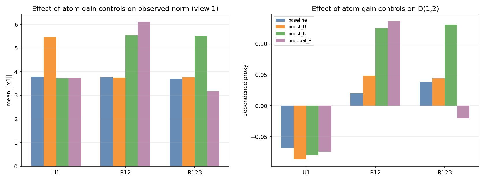
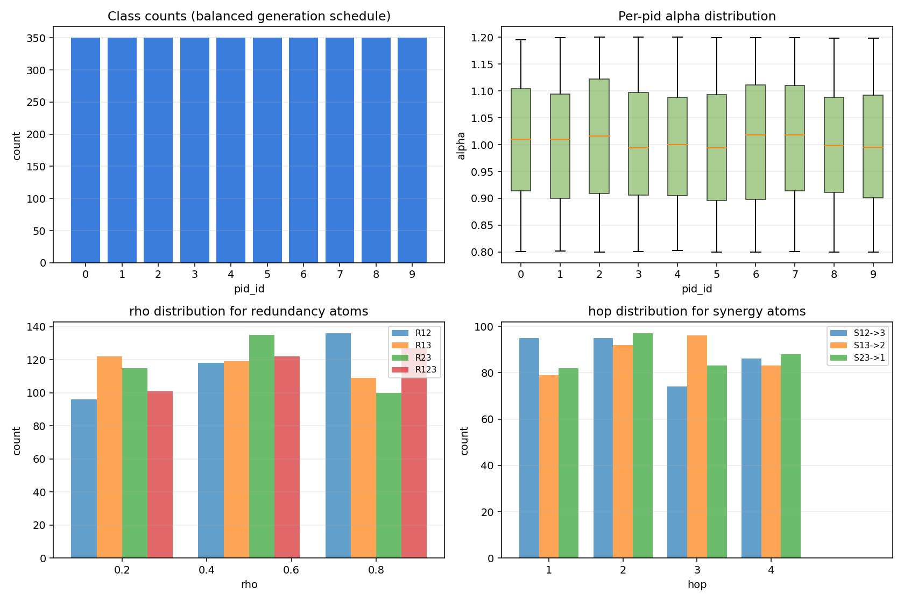
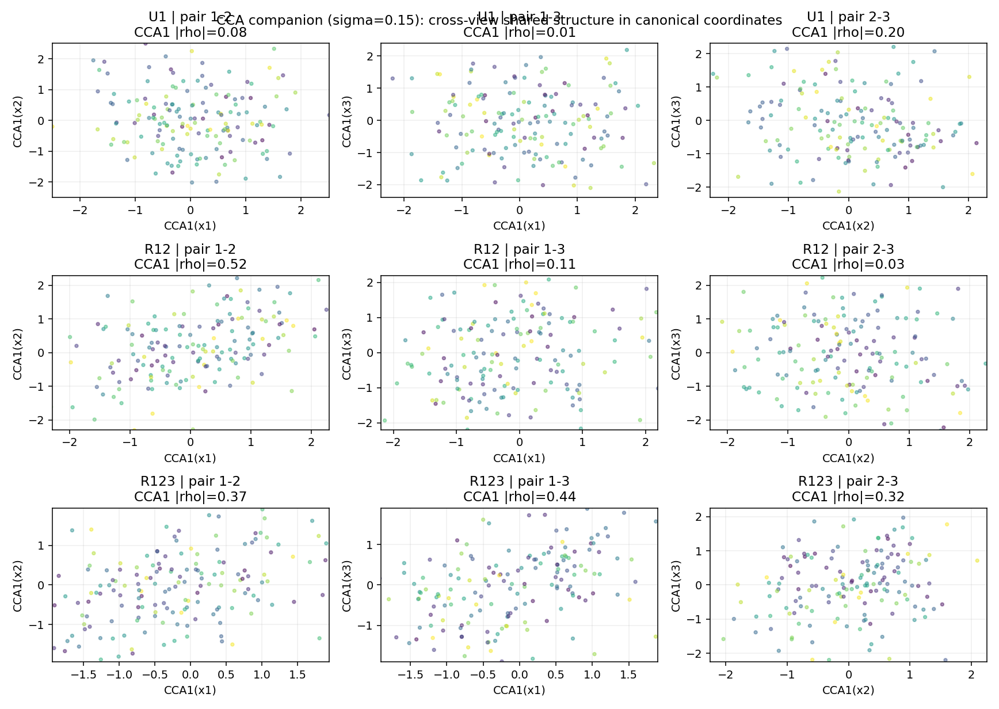
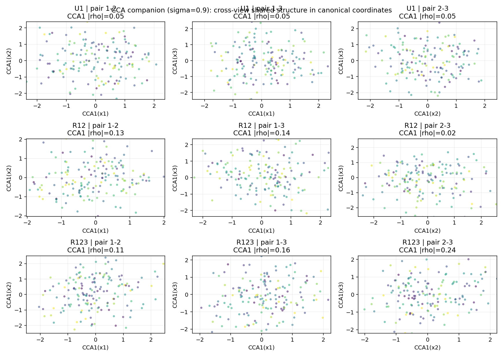
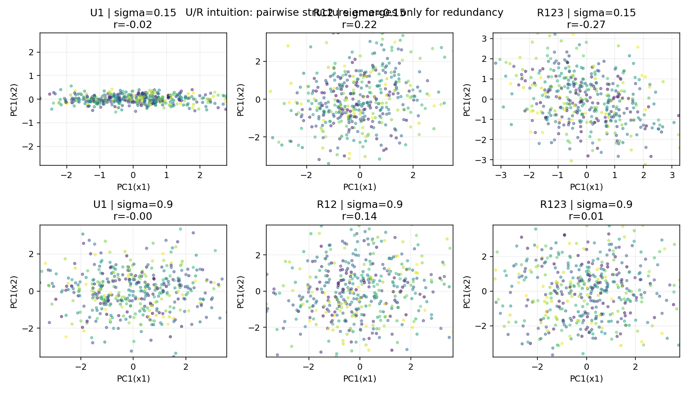
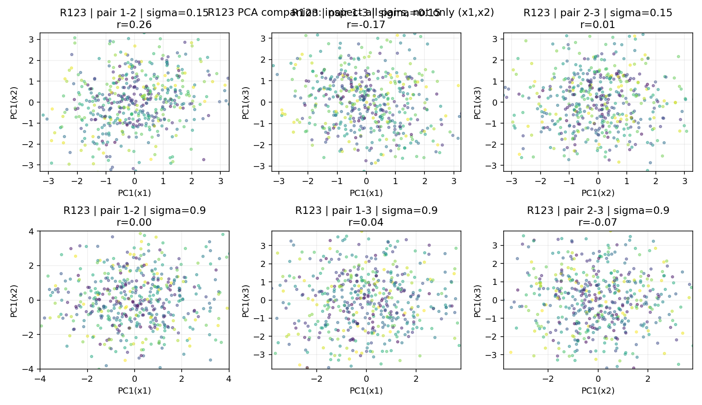

# PID-SAR-3++: Formal Dataset Specification, Implementation Tutorial, and U/R Intuition Figures

This document has four parts: a formal dataset/task specification written in a paper-style format, validation metrics and intuition for the raw observations, a dataset-exploration section with figures and equation-linked interpretation, and a code tutorial mapping the specification to the implementation. The reference implementation is in `pid_sar3_dataset.py` and `tests/test_pid_sar3_dataset.py`.

## 1. Formal Dataset and Task Specification

### 1.1 Dataset Overview and Notation

PID-SAR-3++ is a synthetic three-view benchmark for evaluating multi-view representation learning under controlled information structure. Each sample consists of three observations $x_1, x_2, x_3 \in \mathbb{R}^d$, and exactly one PID-inspired information atom is active per sample. The atom families are Unique (`U`), Redundancy (`R`), and Directional Synergy (`S`), with full atom set $\mathcal{A} = \{U_1,U_2,U_3,R_{12},R_{13},R_{23},R_{123},S_{12 \to 3},S_{13 \to 2},S_{23 \to 1}\}$. Each sample is annotated with a categorical atom identifier `pid_id ∈ {0,…,9}` used for evaluation only (not for SSL training), and the generator returns $(x_1,x_2,x_3,\mathrm{pid\_id},\alpha,\sigma,\rho,h)$, where `alpha` is the signal amplitude, `sigma` is the observation noise scale, `rho` is the redundancy overlap parameter (undefined for non-redundancy atoms and encoded as `-1`), and `h` is the synergy depth parameter (undefined for non-synergy atoms and encoded as `0`).

### 1.2 Task Definition (Training and Evaluation Protocol)

In the training protocol, the learner receives only the three views `(x1, x2, x3)` and does not receive `pid_id`, `rho`, or `h`; a multi-view self-supervised objective is trained directly on the observations. In the evaluation protocol, encoders are frozen after training and the resulting representations are assessed for retention of unique, redundant, and directional-synergistic structure. Before any encoder is trained, the generator itself should be validated on the raw observations using dependence and synergy proxies to verify that the empirical signatures match the intended atom-level structure. This note emphasizes the `U/R` subset first because it provides the most interpretable sanity checks.

### 1.3 Generative Parameters

The latent dimensionality satisfies `m << d`. Typical defaults are $d = 32$, $m = 8$, $\alpha \sim \mathrm{Uniform}(\alpha_{\min}, \alpha_{\max})$, $\sigma > 0$, and $(\rho,h) \in \mathcal{R}\times\mathcal{H}$ with $\mathcal{R}\subset (0,1)$ and $\mathcal{H}\subset \mathbb{N}$. In the current implementation (`pid_sar3_dataset.py`), the default values are `alpha_min = 0.8`, `alpha_max = 1.2`, `rho_choices = {0.2, 0.5, 0.8}`, and `hop_choices = {1,2,3,4}`.

### 1.4 Fixed Projection Operators (Sampled Once per Dataset Seed)

For each view `k ∈ {1,2,3}` and each component `c`, the generator samples a fixed projection matrix $P_k^{(c)} \in \mathbb{R}^{d \times m}$ with entries $P_k^{(c)}[i,j] \sim \mathcal{N}(0,1/d)$, and each column is normalized as $P_k^{(c)}[:,j] \leftarrow P_k^{(c)}[:,j]/\|P_k^{(c)}[:,j]\|_2$. These operators are then held fixed for all samples generated with the same dataset seed.

### 1.5 Observation Noise

Each view receives additive isotropic Gaussian noise $\varepsilon_k \sim \mathcal{N}(0,\sigma^2 I_d)$ for $k\in\{1,2,3\}$, and the observed variable is $x_k = \mathrm{signal}_k + \varepsilon_k$.

### 1.6 Unique Atoms

For `U_i`, the generator samples a latent Gaussian vector $u \sim \mathcal{N}(0,I_m)$ and places the signal only in the active view, i.e., $x_i = \alpha P_i^{(U_i)} u + \varepsilon_i$, while inactive views contain noise only, $x_j = \varepsilon_j$ for $j \neq i$.

### 1.7 Pairwise Redundancy Atoms

For `R_{ij}`, the generator samples $r,\eta_i,\eta_j \overset{\mathrm{i.i.d.}}{\sim} \mathcal{N}(0,I_m)$ and constructs view-specific latent realizations with overlap coefficient `rho` as $r_i = \sqrt{\rho}\,r + \sqrt{1-\rho}\,\eta_i$ and $r_j = \sqrt{\rho}\,r + \sqrt{1-\rho}\,\eta_j$. The observations are then generated as $x_i = \alpha P_i^{(R_{ij})} r_i + \varepsilon_i$ and $x_j = \alpha P_j^{(R_{ij})} r_j + \varepsilon_j$, while $x_k = \varepsilon_k$ for $k\notin\{i,j\}$. As `rho` increases, the shared structure between the two active views becomes stronger.

### 1.8 Triple Redundancy Atom

For `R_{123}`, the generator samples $r,\eta_1,\eta_2,\eta_3 \overset{\mathrm{i.i.d.}}{\sim} \mathcal{N}(0,I_m)$, defines per-view redundant latents $r_k = \sqrt{\rho}\,r + \sqrt{1-\rho}\,\eta_k$ for $k\in\{1,2,3\}$, and sets $x_k = \alpha P_k^{(R_{123})} r_k + \varepsilon_k$.

### 1.9 Directional Synergy Atoms

For `S_{ij→k}`, the generator samples source latents and a hop parameter, $a,b \sim \mathcal{N}(0,I_m)$ and $h \in \mathcal{H}$. The source views are generated linearly as $x_i = \alpha P_i^{(A_{ij})} a + \varepsilon_i$ and $x_j = \alpha P_j^{(B_{ij})} b + \varepsilon_j$. A fixed nonlinear readout network `phi_h` then produces a target latent $s_0 = \phi_h([a,b]) \in \mathbb{R}^m$, which is de-leaked via $s = s_0 - C_a^{(h)} a - C_b^{(h)} b$, and the target view is generated as $x_k = \alpha P_k^{(\mathrm{SYN}_{ij})} s + \varepsilon_k$. This construction reduces single-source linear leakage and yields a more directional synergy signal.

### 1.10 Synergy De-leakage Fit (Offline, per Dataset Seed)

For each hop `h`, de-leakage maps are fit by ridge regression on synthetic latent samples:

```math
W^{(h)} = \arg\min_W \|S_0 - XW\|_F^2 + \lambda \|W\|_F^2,
```

with

```math
X = [A\;B] \in \mathbb{R}^{N\times 2m},\qquad S_0 \in \mathbb{R}^{N\times m}.
```

The fitted matrix is partitioned as

```math
W^{(h)} =
\begin{bmatrix}
C_a^{(h)} \\
C_b^{(h)}
\end{bmatrix}.
```

and these maps are then used during generation to compute the de-leaked target latent `s`.

## 2. Validation Metrics (Raw Data, Pre-Encoder)

### 2.1 Symmetric Dependence Proxy

Given two view matrices `X_A` and `X_B` (rows are samples), define $D(X_A, X_B)=\frac{1}{2}\left(R^2(X_A\to X_B) + R^2(X_B\to X_A)\right)$,

where each `R^2` is computed using ridge regression on a train/test split.

Intuitively, `D(1,2)` answers the question: "How much predictable structure is shared between view 1 and view 2?" If `x1` helps linearly predict `x2` (and conversely `x2` helps linearly predict `x1`), then `D(1,2)` is high; if the two views mostly contain unrelated signal/noise, then `D(1,2)` is low. In this dataset, `U1` should have low `D(1,2)` because only `x1` contains signal and `x2` is mostly noise, `R12` should have high `D(1,2)` because both views share overlapping latent structure, and `R123` should also have elevated `D(1,2)` because views 1 and 2 both inherit the shared triple-redundant latent. In paper terms, `D(1,2)` is not a causal quantity and not a PID estimator; it is a controlled dependence proxy used to validate whether the generator induces the intended cross-view geometry in the observations. Accordingly, the expected U/R signatures are low pairwise dependence for `U1/U2/U3`, pair-specific high dependence for `R12/R13/R23`, broad elevation for `R123`, monotonic growth with `rho`, and degradation as `sigma` increases.

### 2.2 CCA and PCA Geometric Diagnostics

For a fixed atom, let `X_k` denote the matrix of samples from view `k`. A stronger cross-view geometric diagnostic than PCA is linear CCA, which finds directions in two views that maximize shared correlation. In this note, the CCA figures use a train/test split (fit on train, visualize/report on test) to avoid the strong overfitting that can occur with in-sample CCA in moderate dimensions. PCA is still useful as a qualitative projection diagnostic, with the first principal-component score defined as $z_k = \mathrm{PC1}(X_k)$ for $k\in\{1,2,3\}$, but PCA panel interpretation should be treated as secondary evidence and read together with dependence-proxy and CCA figures.

## 3. Dataset Exploration (Figures with Equations and Interpretation)

This section is intentionally placed before the code tutorial so that the reader first understands what the dataset looks like statistically and geometrically. The central quantity used throughout is the symmetric dependence proxy $D(X_A, X_B)=\tfrac{1}{2}(R^2(X_A\to X_B)+R^2(X_B\to X_A))$, which summarizes how much linearly predictable structure is shared across two views on held-out samples. In the U/R regime, `D(1,2)` should be low for unique atoms and high for atoms that explicitly share signal between views 1 and 2.

### 3.1 Figure A: Atom Gain Controls (Amplifying U vs R Unequally)



This figure demonstrates a controllable extension of the generator in which the effective signal amplitude is modulated by an atom-dependent gain, i.e., $\alpha_{\mathrm{eff}}=\alpha \cdot g(\mathrm{pid\_id})$, while the observation noise scale $\sigma$ is held fixed. The left panel shows how this changes the observed scale (mean $\|x_1\|$), and the right panel shows how it changes the cross-view dependence proxy `D(1,2)`. The key point is that boosting redundancy (e.g., `redundancy_gain > 1`) selectively increases `D(1,2)` for `R12`, whereas boosting unique atoms primarily increases magnitude without inducing cross-view dependence. Per-`pid` overrides allow unequal emphasis within the same family (for example, stronger `R12` but weaker `R123`), which is useful for creating difficulty-controlled stress tests.

### 3.2 Figure B: PID Metadata Distributions (Sampling Sanity Check)



This figure validates the sampling pipeline itself. Under a balanced generation schedule, class counts should be uniform across `pid_id`. The per-`pid` `alpha` boxplots should follow the configured amplitude range, while `rho` should appear only for redundancy atoms and `hop` should appear only for synergy atoms. This is important because many downstream conclusions rely on the assumption that metadata are activated only when the corresponding generative mechanism is active.

### 3.3 Figure C: PID Dependence Distributions (Repeated-Batch Variability)


Rather than showing only a single estimate per atom, this figure shows repeated-batch distributions of the dependence proxy for each pair of views. The governing quantity is again $D(i,j)$, and the figure makes two things visible simultaneously: the expected ordering (e.g., `R12` should dominate in `D(1,2)`, `R13` in `D(1,3)`, `R23` in `D(2,3)`) and the sampling variability around those expectations. `R123` should remain elevated across all three panels because the same triple-redundant latent contributes to all views.

### 3.4 Figure D: U/R Signature Grid Across Noise


This compact heatmap view is the quickest way to inspect the U/R subset. Each cell corresponds to a dependence score $D(i,j)$ for a fixed atom and a fixed noise level $\sigma$. Unique atoms (`U1`, `U2`, `U3`) should remain near the noise floor because only one view carries signal, whereas pairwise redundancy atoms should activate the matching pair and `R123` should elevate all pairs. As $\sigma$ increases, all dependence values typically contract toward zero, which is exactly the expected degradation under additive noise.

### 3.5 Figure E: Hyperparameter Sweeps (`rho`, `sigma`, `alpha`)


The left panel links the redundancy mechanism directly to the data statistics: because $r_i=\sqrt{\rho}\,r+\sqrt{1-\rho}\,\eta_i$ and $r_j=\sqrt{\rho}\,r+\sqrt{1-\rho}\,\eta_j$, increasing $\rho$ increases shared latent content and should therefore increase $D(x_1,x_2)$ for `R12`. The right panel shows how the observed norm scales with signal amplitude and noise. Since observations take the form $x_k=\mathrm{signal}_k+\varepsilon_k$, increasing `alpha` increases the signal contribution, while increasing `sigma` increases the noise contribution and changes the effective scale of the raw vectors.

### 3.6 Figure F: Holdout CCA Companion (All Pairs, U1/R12/R123)





These figures replace PCA as the primary geometric sanity check for shared cross-view structure. For each atom (`U1`, `R12`, `R123`) and each view pair, the plot shows the first canonical variate (CCA1) in each view, learned on a training split and evaluated on a held-out split. This aligns the two views specifically for shared structure, which is exactly what PCA on separate views fails to do reliably. In the current generated figures, the low-noise case (`sigma = 0.15`) clearly separates atoms: `U1` remains low on pair `1-2` (holdout CCA correlation approximately `0.082`), `R12` is strongly elevated on pair `1-2` (approximately `0.523`), and `R123` is elevated across all pairs (approximately `0.368`, `0.436`, and `0.322`). At high noise (`sigma = 0.9`), all values decrease, but `R12` and `R123` remain above the `U1` baseline on the relevant pairs, which makes the expected redundancy structure much easier to see than in PC1-vs-PC1 plots.

To make this easier to cite in the text, Table 1 summarizes the holdout CCA1 correlations from the current generated figures (same seeds and code path as the plotting test). The exact values will vary with seed, but the qualitative ordering is the important signal.

| Atom | Sigma | CCA(1,2) | CCA(1,3) | CCA(2,3) | Interpretation |
| --- | ---: | ---: | ---: | ---: | --- |
| `U1` | 0.15 | 0.082 | 0.014 | 0.199 | Mostly low cross-view shared structure; residual nonzero values can occur due to finite-sample effects and random projections. |
| `R12` | 0.15 | 0.523 | 0.114 | 0.033 | Strongly elevated on the matching pair `(1,2)`, low on mismatched pairs. |
| `R123` | 0.15 | 0.368 | 0.436 | 0.322 | Elevated across all three pairs, consistent with triple redundancy. |
| `U1` | 0.90 | 0.051 | 0.047 | 0.052 | Near-noise-floor across pairs under high noise. |
| `R12` | 0.90 | 0.126 | 0.140 | 0.025 | Weaker than low-noise but still structured; pair `(1,2)` remains informative. |
| `R123` | 0.90 | 0.115 | 0.160 | 0.240 | Shared structure persists across pairs but is attenuated by noise. |

### 3.7 Figure G: CCA Summary Under Targeted Boosting Mechanisms


The previous CCA table establishes that holdout CCA is a better geometric summary than PCA. A natural next question is whether this summary responds correctly when we intentionally amplify specific atoms using the gain controls. To answer that, the figure above and the table below compare baseline generation against targeted boosts of `U1`, `R12`, `R123`, and `S12->3`, using fixed `sigma = 0.45`, `rho = 0.5`, and `hop = 2` to reduce nuisance variability. The summary statistic is atom-specific: mean pairwise CCA for `U1` and `R123`, `CCA(1,2)` for `R12`, and the *joint* source-target CCA `CCA([x1,x2], x3)` for `S12->3`.

| Scenario | U1 summary CCA | R12 summary CCA | R123 summary CCA | S12->3 summary CCA | Interpretation |
| --- | ---: | ---: | ---: | ---: | --- |
| baseline | 0.022 | 0.294 | 0.380 | 0.028 | Baseline CCA is low for `U1` and `S12->3`, high for redundancy atoms. |
| boost `U1` | 0.035 | 0.294 | 0.380 | 0.028 | Boosting `U1` modestly increases the `U1` CCA summary without changing redundancy rows. |
| boost `R12` | 0.022 | 0.436 | 0.380 | 0.028 | Boosting `R12` strongly increases `CCA(1,2)` for `R12`, as expected. |
| boost `R123` | 0.022 | 0.294 | 0.455 | 0.028 | Boosting `R123` increases CCA across all pairs, reflected in the larger mean. |
| boost `S12->3` | 0.022 | 0.294 | 0.380 | 0.008 | Joint linear CCA for `S12->3` remains weak/unstable, which is expected for a directional nonlinear synergy mechanism. |

This table is useful because it separates two ideas that are easy to conflate. First, the gain controls do work as intended and can selectively amplify targeted atoms. Second, the *right metric must be used for the right atom family*: pairwise / joint linear CCA is highly responsive for redundancy atoms, only weakly responsive for unique atoms, and still not a primary diagnostic for directional nonlinear synergy.

### 3.8 Figure H: Downstream-Task Validation Under Targeted Boosts


The limitation above motivates a task-aligned validation view. This figure summarizes four latent-derived downstream tasks, each with a target chosen to match a specific atom family: `Y_U1` (decoded from `x1`), `Y_R12` (decoded from `[x1,x2]`), `Y_R123` (decoded from `[x1,x2,x3]`), and `Y_S12->3` (decoded from `x3`). Because the generator is synthetic, these targets are derived from the actual latent variables used during generation (exported by the generator in an auxiliary mode). This makes the effect of each boost directly measurable.

| Scenario | `Y_U1` from `x1` | `Y_R12` from `[x1,x2]` | `Y_R123` from `[x1,x2,x3]` | `Y_S12->3` from `x3` | Interpretation |
| --- | ---: | ---: | ---: | ---: | --- |
| baseline | 0.012 | 0.539 | 0.443 | 0.049 | Baseline task difficulty differs by atom family. |
| boost `U1` | 0.023 | 0.539 | 0.443 | 0.049 | `U1` boost is now clearly visible in a task that actually targets `U1`. |
| boost `R12` | 0.012 | 0.605 | 0.443 | 0.049 | `R12` boost improves the `R12` target task. |
| boost `R123` | 0.012 | 0.539 | 0.492 | 0.049 | `R123` boost improves the triple-redundancy target task. |
| boost `S12->3` | 0.012 | 0.539 | 0.443 | 0.338 | `S12->3` boost is strongly visible when the target aligns with the synergy-generated latent in view 3. |

This is the key reason to keep both metric families in the validation pipeline. Cross-view dependence/CCA plots validate the geometry of the observations, while downstream latent-target tasks make atom-specific boosts visible even when cross-view metrics are not the right lens (especially for unique and synergy components).

### 3.9 Figure I: PCA Intuition Scatter Plots (Secondary Diagnostic)



These plots visualize the first principal-component scores $z_k=\mathrm{PC1}(X_k)$ and scatter paired scores $(z_1,z_2)$ for the same samples. In this document they are intentionally secondary to the CCA figures, because PCA is fit independently per view and therefore does not explicitly align shared cross-view directions. The useful reading strategy is to compare the *shape* of the cloud and the *magnitude* of the panel correlation, not the sign of the slope. In the currently generated figure (same code path and seeds as the test), the low-noise row (`sigma = 0.15`) shows a near-zero association for `U1` (approximately $|r| \approx 0.016$), while `R12` and `R123` show visibly stronger alignment (approximately $|r| \approx 0.218$ and $|r| \approx 0.274$, respectively). In the high-noise row (`sigma = 0.9`), the `R12` panel still retains a visible dependence signal (approximately $|r| \approx 0.137$), whereas `U1` remains near zero (approximately $|r| \approx 0.003$) and `R123` may collapse toward the noise floor in this particular `(x1,x2)` PCA projection (approximately $|r| \approx 0.007$). This is a projection limitation, not evidence that the `R123` atom disappeared. Because PCA signs are arbitrary, slope direction may flip across runs; the presence and magnitude of alignment are the meaningful features.

### 3.10 Figure J: `R123` PCA Companion Across All View Pairs



This companion figure addresses exactly that ambiguity by plotting `R123` across all three view pairs, `(x1,x2)`, `(x1,x3)`, and `(x2,x3)`, each at low and high noise. At low noise (`sigma = 0.15`), the current run shows a strong PCA alignment for pair `1-2` (approximately $|r| \approx 0.265$) and a visible alignment for pair `1-3` (approximately $|r| \approx 0.170$), while pair `2-3` is weak in this specific PC1-vs-PC1 view (approximately $|r| \approx 0.008$). At high noise (`sigma = 0.9`), all three PCA-pair correlations become small (approximately $|r| \approx 0.003$, $0.038$, and $0.071$), which is consistent with additive noise washing out low-dimensional projections. The practical takeaway is that PCA panels are qualitative projection diagnostics, while the dependence-proxy figures (`D(1,2)`, `D(1,3)`, `D(2,3)`) remain the primary evidence for the intended redundancy topology.

## 4. Code Tutorial (How the Dataset Is Implemented and Used)

This section maps the formal definition to the actual code.

### 4.1 Instantiate the Generator

`PIDSar3DatasetGenerator` encapsulates fixed projection sampling, fixed synergy MLP sampling, de-leakage fitting, and per-sample / batch generation.

Minimal example:

```python
from pid_sar3_dataset import PIDDatasetConfig, PIDSar3DatasetGenerator

cfg = PIDDatasetConfig(
    d=32,
    m=8,
    sigma=0.45,
    alpha_min=0.8,
    alpha_max=1.2,
    rho_choices=(0.2, 0.5, 0.8),
    hop_choices=(1, 2, 3, 4),
    seed=0,
)
gen = PIDSar3DatasetGenerator(cfg)
```

To amplify atom families (or specific atoms) unequally, use gain controls:

```python
cfg = PIDDatasetConfig(
    seed=0,
    unique_gain=1.6,       # boost all U atoms
    redundancy_gain=0.8,   # suppress all R atoms
    synergy_gain=1.0,
    pid_gain_overrides={
        3: 2.0,  # specifically boost R12
        6: 0.7,  # specifically weaken R123
    },
)
gen = PIDSar3DatasetGenerator(cfg)
```

The effective signal amplitude becomes `alpha_eff = alpha * gain(pid_id)`, while the additive noise scale `sigma` is unchanged.

### 4.2 Generate a Single Sample

```python
sample = gen.sample(pid_id=3)  # R12

# keys: x1, x2, x3, pid_id, alpha, sigma, rho, hop
print(sample["x1"].shape)  # (32,)
print(sample["pid_id"])    # 3
```

### 4.3 Generate a Balanced U/R Subset

The U/R-only subset corresponds to $\{0,1,2,3,4,5,6\} = \{U_1,U_2,U_3,R_{12},R_{13},R_{23},R_{123}\}$.

```python
import numpy as np

ur_pid_ids = [0, 1, 2, 3, 4, 5, 6]
n_per_atom = 5000
pid_schedule = np.repeat(ur_pid_ids, n_per_atom)

batch = gen.generate(n=len(pid_schedule), pid_ids=pid_schedule.tolist())
print(batch["x1"].shape)      # (35000, d)
print(batch["pid_id"].shape)  # (35000,)
```

### 4.4 Save the Dataset to Disk

```python
import numpy as np
np.savez_compressed("data/pid_sar3_ur_train.npz", **batch)
```

### 4.5 Where the Diagnostics Are Implemented

The main U/R plots are produced by `test_plot_atom_gain_controls_ur()`, `test_plot_pid_metadata_distributions()`, `test_plot_pid_dependence_distributions_boxplots()`, `test_plot_ur_compact_signature_grid_over_sigma()`, `test_plot_ur_hyperparameter_sweeps_compact()`, `test_plot_cca_all_pairs_ur()`, `test_plot_cca_boosting_mechanisms_summary()`, `test_plot_downstream_task_boosting_summary()`, `test_plot_ur_intuition_scatter_examples()`, and `test_plot_r123_pca_all_pairs()` in `tests/test_pid_sar3_dataset.py`. These functions are written as tests so they can serve both as regression checks and as reproducible figure-generation scripts.

## 5. Commands to Reproduce the Dataset and Figures

### 5.1 Generate the U/R Diagnostic Figures (Recommended Entry Point)

```bash
python - <<'PY'
from tests.test_pid_sar3_dataset import (
    test_plot_atom_gain_controls_ur,
    test_plot_pid_metadata_distributions,
    test_plot_pid_dependence_distributions_boxplots,
    test_plot_cca_all_pairs_ur,
    test_plot_cca_boosting_mechanisms_summary,
    test_plot_downstream_task_boosting_summary,
    test_plot_r123_pca_all_pairs,
    test_plot_ur_compact_signature_grid_over_sigma,
    test_plot_ur_hyperparameter_sweeps_compact,
    test_plot_ur_intuition_scatter_examples,
)

test_plot_atom_gain_controls_ur()
test_plot_pid_metadata_distributions()
test_plot_pid_dependence_distributions_boxplots()
test_plot_cca_all_pairs_ur()
test_plot_cca_boosting_mechanisms_summary()
test_plot_downstream_task_boosting_summary()
test_plot_r123_pca_all_pairs()
test_plot_ur_compact_signature_grid_over_sigma()
test_plot_ur_hyperparameter_sweeps_compact()
test_plot_ur_intuition_scatter_examples()
print("Saved plots under test_outputs/pid_sar3")
PY
```

This command generates `test_outputs/pid_sar3/atom_gain_controls_ur.png`, `test_outputs/pid_sar3/pid_metadata_distributions.png`, `test_outputs/pid_sar3/pid_dependence_distributions_boxplots.png`, `test_outputs/pid_sar3/cca_all_pairs_ur_sigma_0p15.png`, `test_outputs/pid_sar3/cca_all_pairs_ur_sigma_0p9.png`, `test_outputs/pid_sar3/cca_boosting_mechanisms_summary.png`, `test_outputs/pid_sar3/cca_boosting_mechanisms_summary.csv`, `test_outputs/pid_sar3/downstream_task_boosting_summary.png`, `test_outputs/pid_sar3/downstream_task_boosting_summary.csv`, `test_outputs/pid_sar3/r123_pca_all_pairs.png`, `test_outputs/pid_sar3/ur_compact_signature_grid_over_sigma.png`, `test_outputs/pid_sar3/ur_hyperparameter_sweeps_compact.png`, and `test_outputs/pid_sar3/ur_intuition_scatter_examples.png`.

### 5.2 Generate and Save a Balanced U/R Dataset (`.npz`)

```bash
mkdir -p data
python - <<'PY'
import numpy as np
from pid_sar3_dataset import PIDDatasetConfig, PIDSar3DatasetGenerator

cfg = PIDDatasetConfig(seed=0, d=32, m=8, sigma=0.45)
gen = PIDSar3DatasetGenerator(cfg)

ur_pid_ids = [0, 1, 2, 3, 4, 5, 6]
n_per_atom = 5000
pid_schedule = np.repeat(ur_pid_ids, n_per_atom)

batch = gen.generate(n=len(pid_schedule), pid_ids=pid_schedule.tolist())
np.savez_compressed("data/pid_sar3_ur_train.npz", **batch)
print("Saved data/pid_sar3_ur_train.npz with", len(pid_schedule), "samples")
PY
```

### 5.3 Generate a U/R Dataset with Intentional U/R Imbalance (Gain Controls)

```bash
mkdir -p data
python - <<'PY'
import numpy as np
from pid_sar3_dataset import PIDDatasetConfig, PIDSar3DatasetGenerator

cfg = PIDDatasetConfig(
    seed=7,
    d=32,
    m=8,
    sigma=0.45,
    unique_gain=1.5,
    redundancy_gain=0.9,
    pid_gain_overrides={3: 2.0, 6: 0.6},  # stronger R12, weaker R123
)
gen = PIDSar3DatasetGenerator(cfg)

ur_pid_ids = [0, 1, 2, 3, 4, 5, 6]
pid_schedule = np.repeat(ur_pid_ids, 3000)
batch = gen.generate(n=len(pid_schedule), pid_ids=pid_schedule.tolist())
np.savez_compressed("data/pid_sar3_ur_imbalanced_gain.npz", **batch)
print("Saved data/pid_sar3_ur_imbalanced_gain.npz")
PY
```

### 5.4 Generate Train / Val / Test Splits

```bash
mkdir -p data
python - <<'PY'
import numpy as np
from pid_sar3_dataset import PIDDatasetConfig, PIDSar3DatasetGenerator

cfg = PIDDatasetConfig(seed=42, d=32, m=8, sigma=0.45)
gen = PIDSar3DatasetGenerator(cfg)
ur_pid_ids = [0,1,2,3,4,5,6]

def make_split(path, n_per_atom):
    pid_schedule = np.repeat(ur_pid_ids, n_per_atom)
    batch = gen.generate(n=len(pid_schedule), pid_ids=pid_schedule.tolist())
    np.savez_compressed(path, **batch)
    print("Saved", path, "N=", len(pid_schedule))

make_split("data/pid_sar3_ur_train.npz", 10000)
make_split("data/pid_sar3_ur_val.npz",   1000)
make_split("data/pid_sar3_ur_test.npz",  1000)
PY
```

## 6. Suggested Paper-Style Writeup Snippets

### 6.1 Methods (Dataset)

We generate a synthetic three-view dataset in which each sample contains exactly one information atom from a predefined PID-inspired atom set. Let $x_1,x_2,x_3 \in \mathbb{R}^d$ denote the observed views. For each view and atom-specific component, we sample a fixed projection matrix $P_k^{(c)} \in \mathbb{R}^{d\times m}$ at dataset initialization. Unique atoms are generated by projecting a latent Gaussian vector into a single view, while redundant atoms are generated by mixing a shared latent Gaussian factor with view-specific Gaussian perturbations using an overlap coefficient $\rho$. All observations include additive isotropic Gaussian noise with scale $\sigma$, and signal amplitude is modulated by a per-sample scalar $\alpha$. This construction provides explicit control over dependence topology (unique, pairwise redundancy, and triple redundancy) and signal-to-noise conditions.

### 6.2 Results (U/R Sanity Checks)

On the U/R subset, pairwise dependence heatmaps recover the intended atom structure: unique atoms remain near the noise floor across all pairwise dependencies, pairwise redundant atoms activate the corresponding view pair, and triple redundancy elevates all pairwise dependencies. PCA-based scatter plots of $(\mathrm{PC1}(x_1),\mathrm{PC1}(x_2))$ provide an intuitive geometric corroboration: unique atoms appear as diffuse clouds, whereas redundant atoms exhibit aligned low-dimensional structure whose visibility degrades gracefully as the observation noise $\sigma$ increases.
