# PID-SAR-3++ Dataset Notes

This note summarizes the dataset definition, raw-data validation metrics, key diagnostic figures, and the implementation entry points in `pid_sar3_dataset.py` and `tests/test_pid_sar3_dataset.py`.

## 1. Formal Dataset and Task Specification

### 1.1 Dataset Overview and Notation

PID-SAR-3++ is a synthetic three-view benchmark for multi-view representation learning under controlled information structure. Each sample contains three observations $x_1, x_2, x_3 \in \mathbb{R}^d$, and exactly one PID-inspired atom is active. The atom set is $\mathcal{A}=\{U_1,U_2,U_3,R_{12},R_{13},R_{23},R_{123},S_{12 \to 3},S_{13 \to 2},S_{23 \to 1}\}$. The generator returns $(x_1,x_2,x_3,\mathrm{pid\_id},\alpha,\sigma,\rho,h)$, where `rho=-1` for non-redundancy atoms and `h=0` for non-synergy atoms.

### 1.2 Task Definition (Training and Evaluation Protocol)

During training, the learner sees only `(x1, x2, x3)`; metadata (`pid_id`, `rho`, `h`) are hidden. During evaluation, frozen representations are probed for unique, redundant, and directional-synergistic structure. Before encoder training, the generator should be validated directly on raw observations to verify that empirical signatures match the intended atom structure. This note emphasizes the `U/R` subset first because it provides the most interpretable sanity checks.

### 1.3 Generative Parameters

The latent dimensionality satisfies `m << d`. Typical defaults are $d=32$, $m=8$, $\alpha \sim \mathrm{Uniform}(\alpha_{\min},\alpha_{\max})$, $\sigma>0$, and $(\rho,h)\in \mathcal{R}\times\mathcal{H}$ with $\mathcal{R}\subset(0,1)$ and $\mathcal{H}\subset\mathbb{N}$. In `pid_sar3_dataset.py`, defaults are `alpha_min=0.8`, `alpha_max=1.2`, `rho_choices={0.2,0.5,0.8}`, and `hop_choices={1,2,3,4}`.

### 1.4 Fixed Projection Operators (Sampled Once per Dataset Seed)

For each view `k ∈ {1,2,3}` and each component `c`, the generator samples a fixed projection matrix $P_k^{(c)} \in \mathbb{R}^{d \times m}$ with entries $P_k^{(c)}[i,j] \sim \mathcal{N}(0,1/d)$, and each column is normalized as $P_k^{(c)}[:,j] \leftarrow P_k^{(c)}[:,j]/\|P_k^{(c)}[:,j]\|_2$. These operators are then held fixed for all samples generated with the same dataset seed.

### 1.5 Observation Noise

Each view receives additive isotropic Gaussian noise $\varepsilon_k \sim \mathcal{N}(0,\sigma^2 I_d)$ for $k\in\{1,2,3\}$, and the observed variable is $x_k = \mathrm{signal}_k + \varepsilon_k$.

### 1.6 Unique Atoms

For `U_i`, the generator samples a latent Gaussian vector $u \sim \mathcal{N}(0,I_m)$ and places the signal only in the active view, i.e., $x_i = \alpha P_i^{(U_i)} u + \varepsilon_i$, while inactive views contain noise only, $x_j = \varepsilon_j$ for $j \neq i$.

### 1.7 Pairwise Redundancy Atoms

For `R_{ij}`, the generator first samples three independent latent vectors `r`, `eta_i`, and `eta_j`, each from a standard Gaussian in `R^m`. It then constructs view-specific latent realizations with overlap coefficient `rho` as $r_i = \sqrt{\rho}\,r + \sqrt{1-\rho}\,\eta_i$ and $r_j = \sqrt{\rho}\,r + \sqrt{1-\rho}\,\eta_j$. The observations are generated as $x_i = \alpha P_i^{(R_{ij})} r_i + \varepsilon_i$ and $x_j = \alpha P_j^{(R_{ij})} r_j + \varepsilon_j$, while $x_k = \varepsilon_k$ for $k\notin\{i,j\}$. As `rho` increases, the shared structure between the two active views becomes stronger.

### 1.8 Triple Redundancy Atom

For `R_{123}`, the generator samples $r,\eta_1,\eta_2,\eta_3 \overset{\mathrm{i.i.d.}}{\sim} \mathcal{N}(0,I_m)$, defines per-view redundant latents $r_k = \sqrt{\rho}\,r + \sqrt{1-\rho}\,\eta_k$ for $k\in\{1,2,3\}$, and sets $x_k = \alpha P_k^{(R_{123})} r_k + \varepsilon_k$.

### 1.9 Directional Synergy Atoms

For `S_{ij→k}`, the generator samples source latents and a hop parameter, $a,b \sim \mathcal{N}(0,I_m)$ and $h \in \mathcal{H}$. The source views are generated linearly as $x_i = \alpha P_i^{(A_{ij})} a + \varepsilon_i$ and $x_j = \alpha P_j^{(B_{ij})} b + \varepsilon_j$. A fixed nonlinear readout network `phi_h` then produces a target latent $s_0 = \phi_h([a,b]) \in \mathbb{R}^m$, which is de-leaked via $s = s_0 - C_a^{(h)} a - C_b^{(h)} b$, and the target view is generated as $x_k = \alpha P_k^{(\mathrm{SYN}_{ij})} s + \varepsilon_k$. This construction reduces single-source linear leakage and yields a more directional synergy signal.

### 1.10 Synergy De-leakage Fit (Offline, per Dataset Seed)

For each hop `h`, de-leakage maps are fit by ridge regression on synthetic latent samples:

```math
W^{(h)} = \arg\min_W \|S_0 - XW\|_F^2 + \lambda \|W\|_F^2,
```

with

```math
X = [A\;B] \in \mathbb{R}^{N\times 2m},\qquad S_0 \in \mathbb{R}^{N\times m}.
```

The fitted matrix is partitioned as

```math
W^{(h)} =
\begin{bmatrix}
C_a^{(h)} \\
C_b^{(h)}
\end{bmatrix}.
```

and these maps are then used during generation to compute the de-leaked target latent `s`.

## 2. Validation Metrics (Raw Data, Pre-Encoder)

### 2.1 Symmetric Dependence Proxy

Given two view matrices `X_A` and `X_B`, define $D(X_A,X_B)=\frac{1}{2}\left(R^2(X_A\to X_B)+R^2(X_B\to X_A)\right)$, where each `R^2` is computed by ridge regression on a train/test split. Intuitively, `D(1,2)` measures shared predictable structure between views 1 and 2: it is low for `U1`, high for `R12`, and elevated for `R123`. It is not a PID estimator or a causal quantity; it is a controlled dependence proxy for validating raw cross-view geometry. Expected U/R signatures are low values for `U1/U2/U3`, pair-specific peaks for `R12/R13/R23`, broad elevation for `R123`, monotonic growth with `rho`, and decay as `sigma` increases.

### 2.2 CCA-Based Geometric Diagnostics

For a fixed atom, let `X_k` denote the sample matrix from view `k`. Linear CCA is used as a cross-view geometric diagnostic, with fit-on-train and report-on-test to reduce overfitting. CCA complements `D(i,j)`; it does not replace it.

## 3. Dataset Exploration (Core Validation First)

This section is ordered by evidential value for validating the generator. First comes single-atom correctness (the strongest check), then raw cross-view structure through the dependence proxy $D$, then stress behavior under targeted boosts. Throughout this section, `D(1,2)` means one thing: how much linearly predictable structure is shared between views 1 and 2.

### 3.1 Single-Atom Correctness Validation (Most Important)

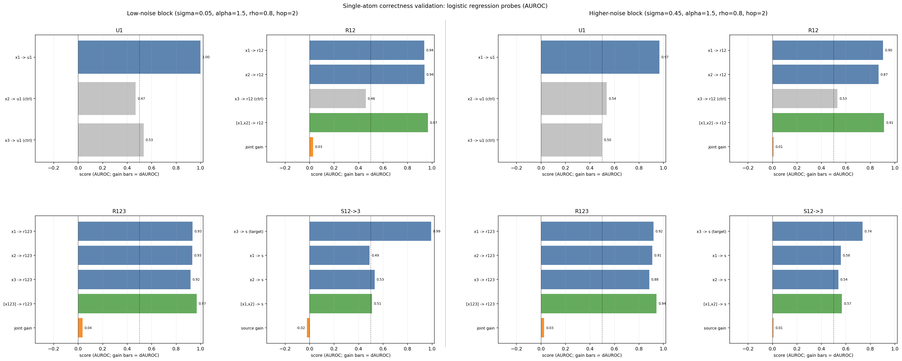

*Figure 1A. Single-atom correctness validation with logistic-regression probes (AUROC).* The left 2x2 block uses low noise (`sigma = 0.05`) and the right 2x2 block uses higher noise (`sigma = 0.45`), with `alpha = 1.5`, `rho = 0.8`, and `hop = 2` fixed. Each panel corresponds to one atom-only dataset (`U1`, `R12`, `R123`, `S12->3`) and reports atom-aligned held-out classification scores.

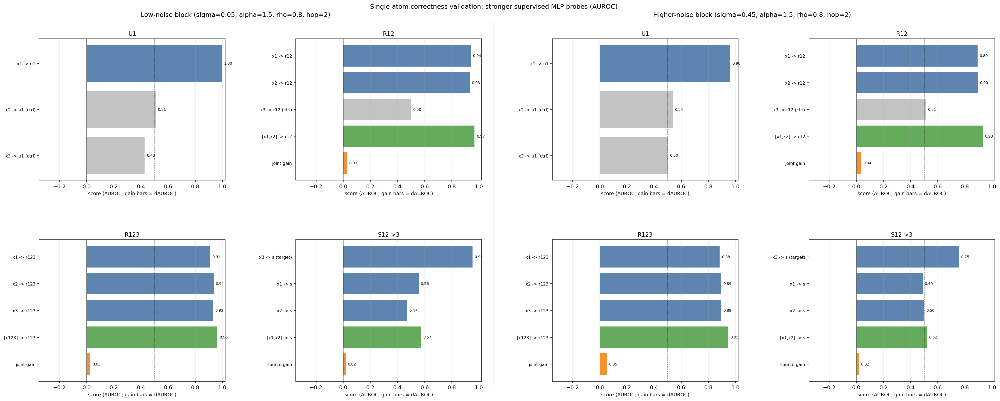

*Figure 1B. Single-atom correctness validation with a stronger supervised MLP probe (AUROC).* The panel layout and noise settings are identical to Figure 1A, which allows direct comparison between a linear classifier and a higher-capacity nonlinear probe.

These are the primary validation figures. If the low-noise block fails in either Figure 1A or Figure 1B, the rest of the diagnostics are not interpretable. The higher-noise block is included to show degradation under noisier observations without changing the task definition.

Figures 1A and 1B use held-out `AUROC` (area under the ROC curve) for binary probe tasks obtained by thresholding each latent target into a binary label. If $\hat{s}^{\mathrm{te}}$ denotes a probe score on the test split and $z^{\mathrm{te}}\in\{0,1\}$ the corresponding binary label, then AUROC is the probability that a randomly chosen positive example receives a higher score than a randomly chosen negative example. Bars labeled `joint gain` or `source gain` report a difference in AUROC relative to the best single-source probe (that is, `ΔAUROC`).

Table 1 summarizes a compact subset of the AUROC results shown in Figures 1A and 1B. The columns are chosen to reflect the main visual claims: an aligned probe, a control probe, a joint redundancy probe, a triple-redundancy probe, a target-view synergy probe, and a source-joint synergy probe.

| Noise | Probe | `U1: x1->u1` | `U1 ctrl: x2->u1` | `R12: [x1,x2]->r12` | `R123: [x123]->r123` | `S12->3: x3->s` | `S12->3: [x1,x2]->s` |
| --- | --- | ---: | ---: | ---: | ---: | ---: | ---: |
| low (`sigma=0.05`) | logistic | 0.998 | 0.469 | 0.966 | 0.968 | 0.992 | 0.509 |
| low (`sigma=0.05`) | stronger MLP | 0.997 | 0.508 | 0.967 | 0.963 | 0.952 | 0.574 |
| low (`sigma=0.05`) | RBF-SVM | 0.997 | 0.468 | 0.958 | 0.963 | 0.965 | 0.670 |
| higher (`sigma=0.45`) | logistic | 0.967 | 0.537 | 0.912 | 0.944 | 0.736 | 0.568 |
| higher (`sigma=0.45`) | stronger MLP | 0.961 | 0.538 | 0.931 | 0.947 | 0.755 | 0.519 |
| higher (`sigma=0.45`) | RBF-SVM | 0.947 | 0.509 | 0.938 | 0.946 | 0.642 | 0.583 |

Table 1 should be read together with Figures 1A and 1B. Aligned probes remain high for `U1`, `R12`, and `R123`, control probes remain near chance (`AUROC ≈ 0.5`), and `x3 -> s` is the stable correctness probe for `S12->3`. Increasing noise degrades aligned probes without changing these qualitative roles.

For `AUROC`, values near `1` indicate strong separability, and values near `0.5` indicate near-chance binary discrimination.

The bar labels follow a strict convention: `input -> target`. For example, `x1 -> y_u1` means a probe predicts the latent-derived target `y_u1` from view `x1`, and `[x1,x2] -> y_r12` means a probe predicts `y_r12` from the concatenated views `x1` and `x2`. Labels ending in `(ctrl)` are controls and should stay near chance because that view should not carry the target information. Bars named `joint gain` or `source joint gain` are improvements over the best single-view source and are included only to show whether combining sources helps.

Read Figures 1A and 1B row-wise, comparing the same atom across the low-noise and higher-noise column blocks, and then compare Figure 1A (linear classifier) against Figure 1B (small nonlinear probe). For `U1`, `x1 -> y_u1` should be high and both control bars should stay near chance. For `R12`, `x1 -> y_r12` and `x2 -> y_r12` should both be high, `x3 -> y_r12 (ctrl)` should remain low, and `[x1,x2] -> y_r12` should be best. For `R123`, all three single-view bars should be high and `[x123] -> y_r123` should be highest. For `S12->3`, the stable correctness criterion is `x3 -> y_s` (target view), because the synergy latent is projected into view 3.

### 3.2 Dependence Proxy Signatures (`D(i,j)`) for U/R Structure

The next three figures validate raw cross-view structure through the dependence proxy $D(X_A,X_B)=\tfrac{1}{2}(R^2(X_A\to X_B)+R^2(X_B\to X_A))$. The interpretation is the same throughout: `D(1,2)` is high only when views 1 and 2 share predictable structure. In this dataset, `D(1,2)` should be low for `U1`, high for `R12`, and elevated for `R123`. This is the main raw-data sanity statistic for the U/R subset. When in doubt, inspect `D(1,2)` first and then check whether the matching atom (`R12`) is the one that moves.

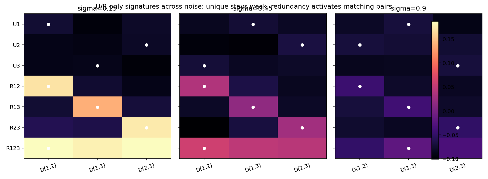

*Figure 2. U/R dependence signature grid across noise.* Each cell is a dependence score `D(i,j)` for one atom and one noise level. Pairwise redundancy atoms activate their matching pair, `R123` elevates all pairs, and increasing `sigma` contracts the scores.

This heatmap is the fastest U/R sanity check. Each cell is `D(i,j)` for one atom and one noise level `sigma`. Unique atoms stay near the noise floor, pairwise redundancy atoms activate the matching pair, and `R123` elevates all pairs. As `sigma` increases, all dependence values contract toward zero.

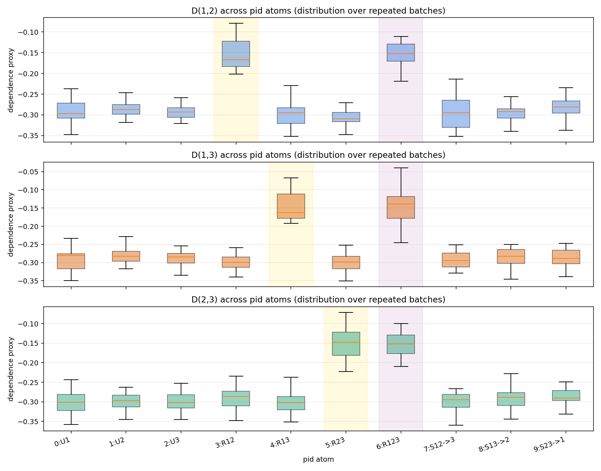

*Figure 3. Repeated-batch distributions of the dependence proxy `D(i,j)` across PID atoms.* Boxplots summarize the expected pair-specific ordering together with finite-sample variability.

This plot adds variability to the same `D(i,j)` story. It shows repeated-batch distributions of `D(1,2)`, `D(1,3)`, and `D(2,3)`, so both the expected ordering and the sampling spread are visible. The key reading remains the same: the matching redundancy atom should dominate its matching `D(i,j)`.

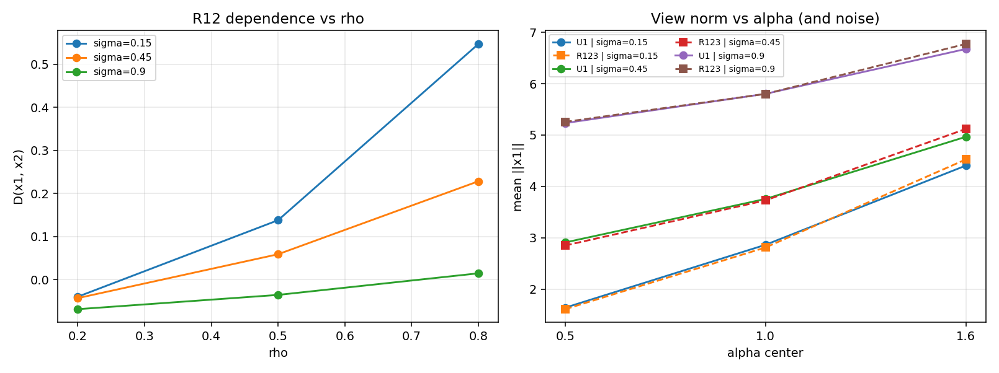

*Figure 4. Hyperparameter sensitivity in the U/R subset.* The left panel links redundancy overlap `rho` to `D(1,2)` for `R12`, and the right panel shows how `alpha` and `sigma` affect the raw observation norm.

This figure links the equations directly to `D`. Increasing `rho` in $r_i=\sqrt{\rho}\,r+\sqrt{1-\rho}\,\eta_i$ increases shared latent content and should increase `D(1,2)` for `R12`. The norm panel shows how `alpha` and `sigma` change raw scale in $x_k=\mathrm{signal}_k+\varepsilon_k$.

### 3.3 Targeted-Boost Stress Tests (Metric-Atom Alignment Matters)

These summaries are stress tests, not correctness checks. They test whether diagnostics move in the expected direction when one atom is selectively amplified via `pid_gain_overrides`, with nuisance settings fixed (`sigma = 0.45`, `rho = 0.5`, `hop = 2`).

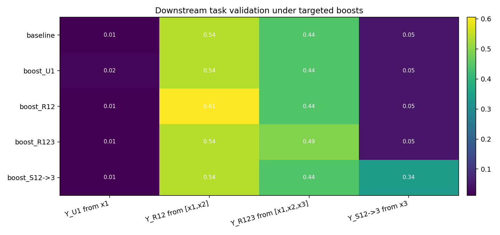

*Figure 5. Targeted-boost stress test using atom-aligned downstream tasks.* Each column is chosen to match one atom family, so selective boosts become visible in the corresponding task score.

This is the most informative boost figure because it uses atom-aligned targets. It makes `boost_U1`, `boost_R12`, `boost_R123`, and `boost_S12->3` visible in the corresponding downstream tasks. Increasing `U1` does not change `y_u1`; it improves predictability of `y_u1` from `x1` by increasing signal in `x1`.

| Scenario | `Y_U1` from `x1` | `Y_R12` from `[x1,x2]` | `Y_R123` from `[x1,x2,x3]` | `Y_S12->3` from `x3` |
| --- | ---: | ---: | ---: | ---: |
| baseline | 0.012 | 0.539 | 0.443 | 0.049 |
| boost `U1` | 0.023 | 0.539 | 0.443 | 0.049 |
| boost `R12` | 0.012 | 0.605 | 0.443 | 0.049 |
| boost `R123` | 0.012 | 0.539 | 0.492 | 0.049 |
| boost `S12->3` | 0.012 | 0.539 | 0.443 | 0.338 |

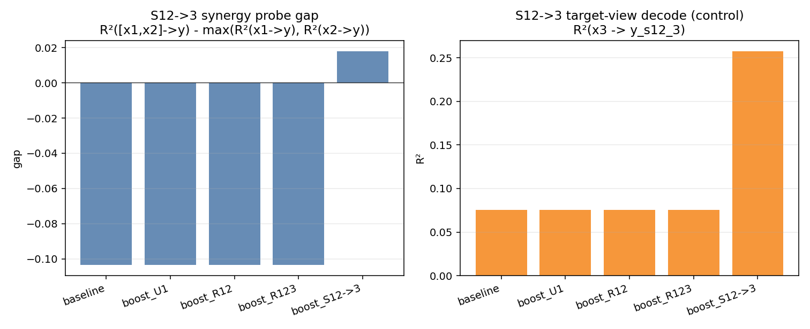

*Figure 6. Synergy-specific stress diagnostic for `S12->3`.* The left panel reports a joint-vs-single probe gap on the latent-derived synergy target, and the right panel reports target-view decode performance as a control readout.

This is the main synergy-specific stress diagnostic. It tracks the joint-vs-single probe gap $\Delta_{\mathrm{task}} = R^2([x_1,x_2]\rightarrow y) - \max\{R^2(x_1\rightarrow y), R^2(x_2\rightarrow y)\}$ for `S12->3`, plus the target-view decode `R²(x3 \rightarrow y_s12_3)`. Absolute values are probe-dependent, so the useful signal is the relative shift under `boost_S12->3`.

| Scenario | `R²(x1→y)` | `R²(x2→y)` | `R²([x1,x2]→y)` | `Δ_task` | `R²(x3→y)` |
| --- | ---: | ---: | ---: | ---: | ---: |
| baseline | -0.159 | -0.093 | -0.197 | -0.104 | 0.076 |
| boost `U1` | -0.159 | -0.093 | -0.197 | -0.104 | 0.076 |
| boost `R12` | -0.159 | -0.093 | -0.197 | -0.104 | 0.076 |
| boost `R123` | -0.159 | -0.093 | -0.197 | -0.104 | 0.076 |
| boost `S12->3` | -0.147 | -0.214 | -0.129 | 0.018 | 0.257 |

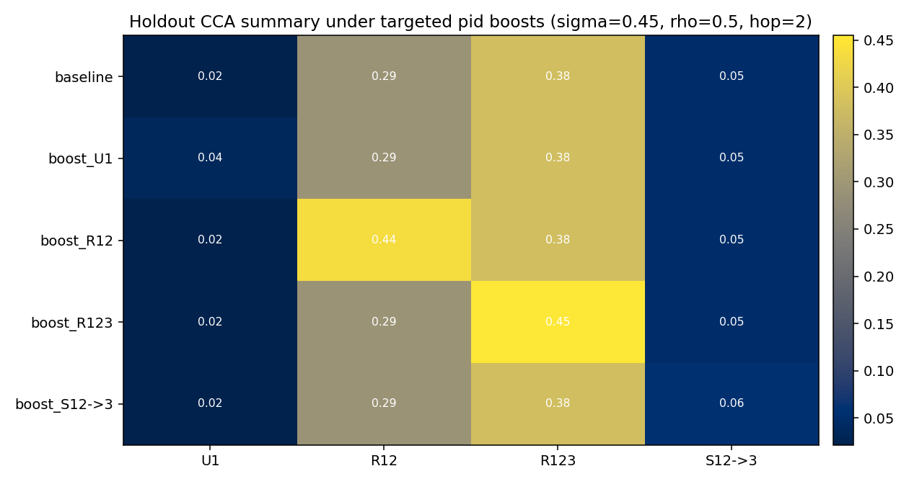

*Figure 7. Holdout CCA summary under targeted boosts.* This figure is mainly informative for redundancy boosts (`R12`, `R123`) and is included as a secondary stress diagnostic.

This CCA boost summary is secondary. It is useful for redundancy boosts (`R12`, `R123`), but it is weak for directional synergy even when `CCA([x1,x2],x3)` is used.

| Scenario | U1 summary CCA | R12 summary CCA | R123 summary CCA | `S12->3` joint CCA (`CCA([x1,x2],x3)`) |
| --- | ---: | ---: | ---: | ---: |
| baseline | 0.022 | 0.294 | 0.380 | 0.028 |
| boost `U1` | 0.035 | 0.294 | 0.380 | 0.028 |
| boost `R12` | 0.022 | 0.436 | 0.380 | 0.028 |
| boost `R123` | 0.022 | 0.294 | 0.455 | 0.028 |
| boost `S12->3` | 0.022 | 0.294 | 0.380 | 0.008 |

### 3.4 Secondary / Optional Diagnostics

The following tests are useful during development but are not required for the main validation argument in this note: `test_plot_pid_metadata_distributions()` (sampling sanity checks) and `test_plot_atom_gain_controls_ur()` (gain-effect intuition).

## 4. Code Tutorial (How the Dataset Is Implemented and Used)

This section maps the formal specification to the implementation.

### 4.1 Instantiate the Generator

`PIDSar3DatasetGenerator` encapsulates fixed projection sampling, fixed synergy MLP sampling, de-leakage fitting, and sample/batch generation.

Minimal example:

```python
from pid_sar3_dataset import PIDDatasetConfig, PIDSar3DatasetGenerator

cfg = PIDDatasetConfig(
    d=32,
    m=8,
    sigma=0.45,
    alpha_min=0.8,
    alpha_max=1.2,
    rho_choices=(0.2, 0.5, 0.8),
    hop_choices=(1, 2, 3, 4),
    seed=0,
)
gen = PIDSar3DatasetGenerator(cfg)
```

To amplify atom families (or specific atoms) unequally, use gain controls:

```python
cfg = PIDDatasetConfig(
    seed=0,
    unique_gain=1.6,       # boost all U atoms
    redundancy_gain=0.8,   # suppress all R atoms
    synergy_gain=1.0,
    pid_gain_overrides={
        3: 2.0,  # specifically boost R12
        6: 0.7,  # specifically weaken R123
    },
)
gen = PIDSar3DatasetGenerator(cfg)
```

The effective signal amplitude becomes `alpha_eff = alpha * gain(pid_id)`, while the additive noise scale `sigma` is unchanged.

### 4.2 Generate a Single Sample

```python
sample = gen.sample(pid_id=3)  # R12

# keys: x1, x2, x3, pid_id, alpha, sigma, rho, hop
print(sample["x1"].shape)  # (32,)
print(sample["pid_id"])    # 3
```

### 4.3 Generate a Balanced U/R Subset

The U/R-only subset corresponds to $\{0,1,2,3,4,5,6\} = \{U_1,U_2,U_3,R_{12},R_{13},R_{23},R_{123}\}$.

```python
import numpy as np

ur_pid_ids = [0, 1, 2, 3, 4, 5, 6]
n_per_atom = 5000
pid_schedule = np.repeat(ur_pid_ids, n_per_atom)

batch = gen.generate(n=len(pid_schedule), pid_ids=pid_schedule.tolist())
print(batch["x1"].shape)      # (35000, d)
print(batch["pid_id"].shape)  # (35000,)
```

### 4.4 Save the Dataset to Disk

```python
import numpy as np
np.savez_compressed("data/pid_sar3_ur_train.npz", **batch)
```

### 4.5 Where the Diagnostics Are Implemented

The core diagnostics used in Section 3 are implemented in `tests/test_pid_sar3_dataset.py`: `test_plot_single_atom_correctness_validation()`, `test_plot_ur_compact_signature_grid_over_sigma()`, `test_plot_pid_dependence_distributions_boxplots()`, `test_plot_ur_hyperparameter_sweeps_compact()`, `test_plot_downstream_task_boosting_summary()`, `test_plot_synergy_task_gap_boosting_summary()`, and `test_plot_cca_boosting_mechanisms_summary()`. Two tests are useful but secondary for the main argument: `test_plot_pid_metadata_distributions()` and `test_plot_atom_gain_controls_ur()`.

## 5. Commands to Reproduce the Dataset and Figures

### 5.1 Generate the Core Validation Figures (Recommended Entry Point)

```bash
python - <<'PY'
from tests.test_pid_sar3_dataset import (
    test_plot_single_atom_correctness_validation,
    test_plot_ur_compact_signature_grid_over_sigma,
    test_plot_pid_dependence_distributions_boxplots,
    test_plot_ur_hyperparameter_sweeps_compact,
    test_plot_downstream_task_boosting_summary,
    test_plot_synergy_task_gap_boosting_summary,
    test_plot_cca_boosting_mechanisms_summary,
)

test_plot_single_atom_correctness_validation()
test_plot_ur_compact_signature_grid_over_sigma()
test_plot_pid_dependence_distributions_boxplots()
test_plot_ur_hyperparameter_sweeps_compact()
test_plot_downstream_task_boosting_summary()
test_plot_synergy_task_gap_boosting_summary()
test_plot_cca_boosting_mechanisms_summary()
print("Saved plots under test_outputs/pid_sar3")
PY
```

This command generates the main figures and CSV summaries referenced in Section 3 (single-atom correctness, `D(i,j)` U/R structure checks, and targeted-boost stress tests).

Optional secondary diagnostics (sampling sanity and gain-intuition):

```bash
python - <<'PY'
from tests.test_pid_sar3_dataset import (
    test_plot_pid_metadata_distributions,
    test_plot_atom_gain_controls_ur,
)
test_plot_pid_metadata_distributions()
test_plot_atom_gain_controls_ur()
print("Saved optional diagnostics under test_outputs/pid_sar3")
PY
```

### 5.2 Generate and Save a Balanced U/R Dataset (`.npz`)

```bash
mkdir -p data
python - <<'PY'
import numpy as np
from pid_sar3_dataset import PIDDatasetConfig, PIDSar3DatasetGenerator

cfg = PIDDatasetConfig(seed=0, d=32, m=8, sigma=0.45)
gen = PIDSar3DatasetGenerator(cfg)

ur_pid_ids = [0, 1, 2, 3, 4, 5, 6]
n_per_atom = 5000
pid_schedule = np.repeat(ur_pid_ids, n_per_atom)

batch = gen.generate(n=len(pid_schedule), pid_ids=pid_schedule.tolist())
np.savez_compressed("data/pid_sar3_ur_train.npz", **batch)
print("Saved data/pid_sar3_ur_train.npz with", len(pid_schedule), "samples")
PY
```

### 5.3 Generate a U/R Dataset with Intentional U/R Imbalance (Gain Controls)

```bash
mkdir -p data
python - <<'PY'
import numpy as np
from pid_sar3_dataset import PIDDatasetConfig, PIDSar3DatasetGenerator

cfg = PIDDatasetConfig(
    seed=7,
    d=32,
    m=8,
    sigma=0.45,
    unique_gain=1.5,
    redundancy_gain=0.9,
    pid_gain_overrides={3: 2.0, 6: 0.6},  # stronger R12, weaker R123
)
gen = PIDSar3DatasetGenerator(cfg)

ur_pid_ids = [0, 1, 2, 3, 4, 5, 6]
pid_schedule = np.repeat(ur_pid_ids, 3000)
batch = gen.generate(n=len(pid_schedule), pid_ids=pid_schedule.tolist())
np.savez_compressed("data/pid_sar3_ur_imbalanced_gain.npz", **batch)
print("Saved data/pid_sar3_ur_imbalanced_gain.npz")
PY
```

### 5.4 Generate Train / Val / Test Splits

```bash
mkdir -p data
python - <<'PY'
import numpy as np
from pid_sar3_dataset import PIDDatasetConfig, PIDSar3DatasetGenerator

cfg = PIDDatasetConfig(seed=42, d=32, m=8, sigma=0.45)
gen = PIDSar3DatasetGenerator(cfg)
ur_pid_ids = [0,1,2,3,4,5,6]

def make_split(path, n_per_atom):
    pid_schedule = np.repeat(ur_pid_ids, n_per_atom)
    batch = gen.generate(n=len(pid_schedule), pid_ids=pid_schedule.tolist())
    np.savez_compressed(path, **batch)
    print("Saved", path, "N=", len(pid_schedule))

make_split("data/pid_sar3_ur_train.npz", 10000)
make_split("data/pid_sar3_ur_val.npz",   1000)
make_split("data/pid_sar3_ur_test.npz",  1000)
PY
```

## 6. SSL Results (Compact, Corrected, and Actionable)

This section summarizes the SSL experiments after fixing a critical evaluation issue.

### 6.1 Evaluation Protocol (Important Correction)

Earlier SSL comparisons used different dataset seeds for train/test probe generators. In this dataset, the seed changes:

- fixed projection matrices
- fixed synergy MLP
- de-leakage maps

So cross-seed probing unintentionally tested transfer across different observation dictionaries, not just generalization to new samples.

Corrected protocol used here:

- same dataset seed for SSL training and probe splits
- different sampled examples for train/test
- frozen encoders
- concatenate `[h1,h2,h3]`
- linear probes on held-out data

Implementation:

- `tests/test_pid_sar3_ssl_fused_confusions.py`

### 6.2 Core Comparison (2 Models, Fused Frozen Encoders)

Models:

1. `A`: sum of 3 unimodal SimCLR losses (`x1`, `x2`, `x3` trained separately)
2. `B`: sum of 3 pairwise InfoNCE losses (`(x1,x2)`, `(x1,x3)`, `(x2,x3)`)

Primary figure:

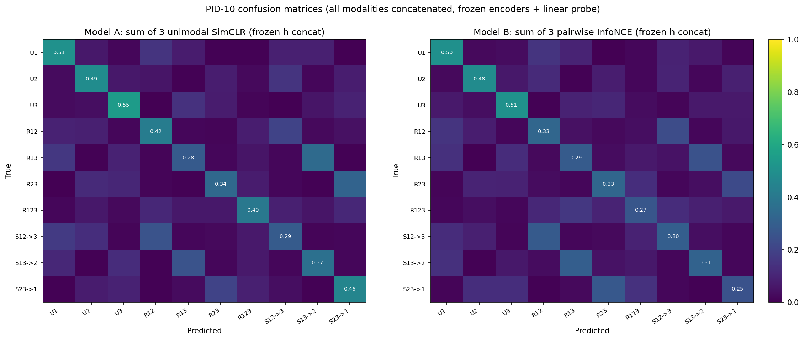

*Figure 8. PID-10 confusion matrices under the corrected same-world split protocol (frozen encoders + concatenated modalities + linear probe).*

#### Table 3. Two-Model Fused Frozen Summary

Source: `test_outputs/pid_sar3_ssl_fused_confusions/fused_frozen_two_models_task_summary.csv`

| Task | A: 3x unimodal SimCLR | B: pairwise InfoNCE | `B - A` |
| --- | ---: | ---: | ---: |
| `PID-10` accuracy | 0.596 | 0.527 | -0.069 |
| `Family-3` accuracy | 0.581 | 0.565 | -0.016 |
| `R²(y_u1)` | 0.496 | 0.505 | +0.009 |
| `R²(y_r12)` | 0.180 | 0.063 | -0.118 |
| `R²(y_r123)` | 0.265 | 0.236 | -0.029 |
| `R²(y_s12_3)` | -0.335 | -0.530 | -0.195 |

#### Table 4. Two-Model Geometry Summary (Why Confusions Differ)

Source: `test_outputs/pid_sar3_ssl_fused_confusions/fused_frozen_two_models_geometry_summary.csv`

| Metric | A: 3x unimodal SimCLR | B: pairwise InfoNCE |
| --- | ---: | ---: |
| overall mean margin (PID classes) | -0.037 | -0.077 |
| mean margin on `R` classes | -0.053 | -0.125 |
| matched `R/S` centroid cosine (mean) | ~0.769 | ~0.941 |
| matched `R/S` nearest-centroid pair acc (mean) | ~0.589 | ~0.606 |

Interpretation:

- Pairwise InfoNCE preserves local matched-pair separability reasonably well.
- But it creates much stronger global overlap between matched redundancy/synergy class centroids (`Rij` and `Sij->k`), which hurts PID-10 class separation.

### 6.3 Higher-Order Alignment Comparison (4 Models)

We compare four methods under the same fused frozen protocol:

1. `A`: 3x unimodal SimCLR
2. `B`: pairwise InfoNCE sum (pairwise SimCLR/NT-Xent)
3. `C`: TRIANGLE (area contrastive; closer to the paper's core similarity than the earlier proxy)
4. `D`: ConFu-style (fusion-head; trainable pair-fusion heads + fused-pair-to-third contrastive terms)

Related papers:

- TRIANGLE (Grassucci et al.): *A TRIANGLE Enables Multimodal Alignment Beyond Cosine Similarity*
- ConFu (Koutoupis et al.): *The More, the Merrier: Contrastive Fusion for Higher-Order Multimodal Alignment*

Primary figures:

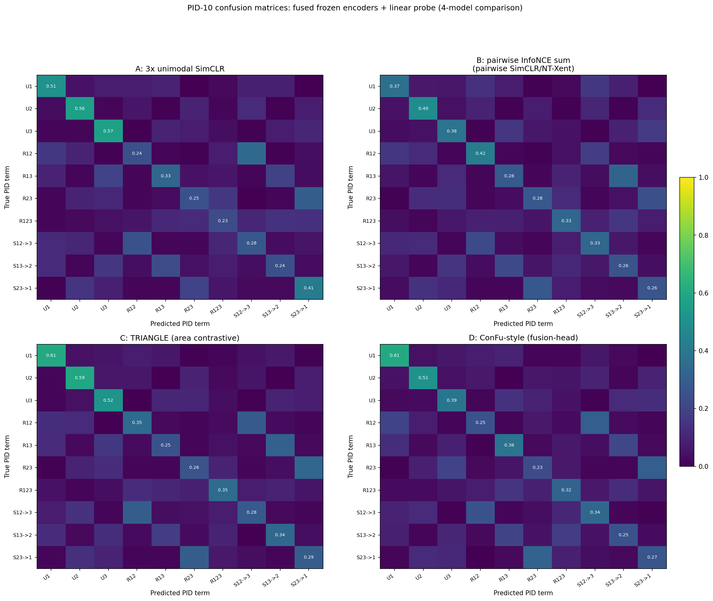

*Figure 9. PID-10 confusion matrices for the 4-model comparison (fused frozen validation).*

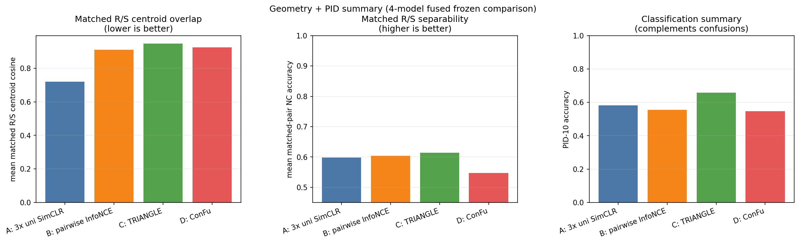

*Figure 10. Compact geometry/pathology summary across the 4 models. Left: matched `R/S` centroid overlap (lower better). Middle: matched-pair separability (higher better). Right: PID-10 accuracy.*

#### Table 5. Key 4-Model Results (Fused Frozen Encoders)

Sources:

- `test_outputs/pid_sar3_ssl_fused_confusions/fused_frozen_four_models_task_summary.csv`
- `test_outputs/pid_sar3_ssl_fused_confusions/fused_frozen_four_models_geometry_summary.csv`

| Model | PID-10 | Family-3 | mean matched `R/S` centroid cosine | mean matched `R/S` NC acc | `R²(y_r12)` | `R²(y_r123)` | `R²(y_s12_3)` |
| --- | ---: | ---: | ---: | ---: | ---: | ---: | ---: |
| A: 3x unimodal SimCLR | 0.580 | 0.590 | 0.729 | 0.582 | 0.398 | 0.430 | -0.252 |
| B: pairwise InfoNCE | 0.555 | 0.567 | 0.911 | 0.604 | 0.103 | 0.365 | -0.635 |
| C: TRIANGLE (area contrastive) | 0.658 | 0.619 | 0.947 | 0.614 | 0.389 | 0.387 | -0.677 |
| D: ConFu-style (fusion-head) | 0.548 | 0.589 | 0.924 | 0.547 | 0.273 | 0.475 | -0.459 |

What matters:

- **TRIANGLE** is best on `PID-10` / `Family-3` in this regime.
- **ConFu-style (fusion-head)** is strongest on `R²(y_r123)` and `R²(y_s12_3)` among the four.
- **Unimodal SimCLR** remains surprisingly strong and is best on `R²(y_r12)` in this run.
- All methods still exhibit the `Rij <-> Sij->k` confusion pathology.

### 6.4 Redundancy-Focused Classification (Sanity Check That Prompted the Split Fix)

Using the corrected same-world split, redundancy terms are much more learnable than in the earlier cross-seed experiments.

From PID confusion matrices (rows `R12/R13/R23/R123`):

- TRIANGLE: avg `R` recall `0.686`, `R -> S` leakage `0.136` (best)
- Unimodal SimCLR: avg `R` recall `0.575`
- Pairwise InfoNCE: avg `R` recall `0.542`
- ConFu-style (fusion-head): avg `R` recall `0.533`

This confirms the earlier poor shared-information results were largely caused by the split protocol, not only by the SSL objective choice.

### 6.5 Subset Predictor Diagnostics (What 1/2/3 Modalities Explain)

We added frozen-feature linear probes over modality subsets (`x1`, `x2`, `x3`, `x12`, `x13`, `x23`, `x123`) to inspect what the encoders actually encode.

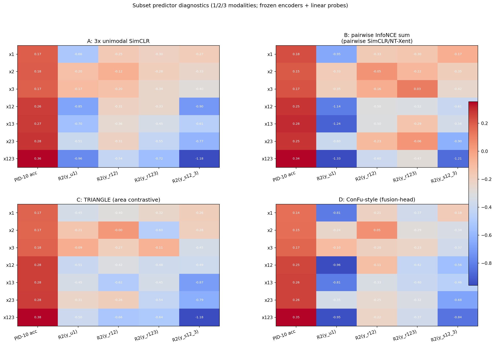

*Figure 11. Subset predictor diagnostics using 1-, 2-, and 3-modality frozen features for each model.*

Key patterns (from `fused_frozen_four_models_subset_predictors.csv`):

- `PID-10` accuracy improves strongly from 1 -> 2 -> 3 modalities for all models.
- TRIANGLE is strongest on fused `x123` PID-10 (`0.658`).
- ConFu-style (fusion-head) is strongest on fused `x123` for `y_r123` and `y_s12_3` in this run.

### 6.6 What Still Looks Weird (and Why That Can Happen)

Even after fixing the split, some methods still look closer than expected. Working hypotheses:

1. **Short training regime masks objective differences**
   - At `~140` steps, some methods may still be in the same optimization phase.
2. **Global PID-10 is too coarse by itself**
   - Objective-specific differences show up more clearly in `Rij <-> Sij->k` confusions, geometry, and latent probes.
3. **Hyperparameters are not tuned per method**
   - TRIANGLE and ConFu likely need different temperatures and term weights.
4. **Objectives have real tradeoffs**
   - Some improve class separation, others improve latent recoverability.

### 6.7 Hyperparameter Sensitivity and Tuning (What Actually Matters)

We ran a reduced-regime sweep (same-world split, smaller probe set, 120-step default) to test whether tuning matters.

Source: `test_outputs/pid_sar3_ssl_fused_confusions/hparam_sensitivity_compact.csv`

Sweeps:

- pairwise InfoNCE temperature: `0.1, 0.2, 0.4`
- TRIANGLE temperature: `0.1, 0.2, 0.4`
- ConFu fusion weight (`confu_fused_weight`): `0.25, 0.5, 0.75` with `confu_pair_weight = 1 - fused`
- TRIANGLE training steps: `80, 240` (vs default `120`)
- directional predictive hybrid: `directional_pred_weight ∈ {0.1, 0.25, 0.5, 1.0, 2.0}`, `temp ∈ {0.1,0.2,0.4}`, and `steps ∈ {80,240,400}` in a reduced sweep

#### Table 6. Hyperparameter Sweep Highlights (Reduced Regime)

| Method / Sweep | Best setting (for PID-10 in sweep) | PID-10 | What moved |
| --- | --- | ---: | --- |
| pairwise InfoNCE temp | `temp=0.2` | 0.539 | temperature changes class scores and latent probes materially |
| TRIANGLE temp | `temp=0.2` | 0.673 | strong sensitivity; clear best in this sweep |
| ConFu fusion weight | `fused=0.75` (PID/Family) | 0.542 | fused weight shifts classification vs latent-task tradeoff |
| TRIANGLE steps | `steps=240` | 0.705 | longer training improves TRIANGLE substantially |
| directional hybrid weight | `directional_pred_weight=0.1` (PID) / `2.0` (synergy target) | 0.544 / `R²(y_s12_3)=-0.231` | strong tradeoff between classification and directional target recoverability |
| directional hybrid steps | `steps=400` (in sweep) | 0.592 | training budget helps classification, but latent probes can move non-monotonically |

Main tuning conclusions:

- **Yes, hyperparameters matter and should be tuned per method.**
- **TRIANGLE is especially sensitive to temperature and training budget.**
- **ConFu-style is sensitive to pair-vs-fused weighting**, and different settings favor different targets.
- **Directional predictive hybrid is sensitive to `directional_pred_weight`**: larger weight helps `y_s12_3` recoverability but can hurt PID-10 classification.
- A single shared hyperparameter point is not sufficient for a fair comparison.
- The reduced sweep is useful for direction finding, but **final method ranking should use a longer run with explicit tuning selection**.

Additional directional sweep artifact:

- `test_outputs/pid_sar3_ssl_fused_confusions/directional_predictive_hparam_sweep_compact.csv`

### 6.8 Tuned Long-Run Downstream Proxy Benchmark (600 Steps, Frozen Encoders, `x123` Main Evaluation)

This is now the primary SSL benchmark result.

Instead of predicting the `PID-10` term label, we evaluate pretrained encoders by frozen-feature downstream regression on the latent proxy targets `y_*`. These are the intended PID-information probes.

We expanded the generator aux outputs to expose the full symmetric set of latent targets (10 total):

- unique: `y_u1`, `y_u2`, `y_u3`
- redundancy: `y_r12`, `y_r13`, `y_r23`, `y_r123`
- synergy: `y_s12_3`, `y_s13_2`, `y_s23_1`

Evaluation protocol (main experiment):

- train SSL encoder(s)
- freeze encoders
- concatenate all three modalities (`x123` -> `[h1,h2,h3]`)
- fit downstream linear regressors (Ridge) for each `y_*` target on the masked subsets
- report held-out `R²`

Tuning protocol:

- same corrected same-world split
- `probe_train` for regressor fit
- `probe_val` for model/hyperparameter selection
- `probe_test` for final report
- selection metric (for the base downstream-tuned models): validation mean `R²` over all 10 `y_*` tasks (`y_macro_r2`)

Methods:

1. `A`: 3x unimodal SimCLR
2. `B`: pairwise InfoNCE
3. `C`: TRIANGLE exact (area contrastive)
4. `D`: ConFu-style (fusion-head)
5. `E`: directional predictive hybrid (`[h_i,h_j] -> h_k`)

Primary downstream artifacts (regression version, kept as supplementary):

- `test_outputs/pid_sar3_ssl_fused_confusions/tuned_long_steps_600_y_downstream_model_selection.csv`
- `test_outputs/pid_sar3_ssl_fused_confusions/tuned_long_steps_600_y_downstream_selected_hparams.csv`
- `test_outputs/pid_sar3_ssl_fused_confusions/tuned_long_steps_600_y_downstream_x123_task_summary.csv`
- `test_outputs/pid_sar3_ssl_fused_confusions/tuned_long_steps_600_y_downstream_x123_summary.png`
- `test_outputs/pid_sar3_ssl_fused_confusions/tuned_long_steps_600_y_downstream_subset_ablations.csv`
- `test_outputs/pid_sar3_ssl_fused_confusions/tuned_long_steps_600_y_downstream_subset_ablations.png`

### 6.8.1 Rotated Pair->Target Modality Classification (Primary Metric)

The main downstream benchmark should use modalities directly:

- input: **two modalities**
- target: **the third modality**
- frozen encoders
- rotate across all three directions: `23 -> 1`, `13 -> 2`, `12 -> 3`

This avoids introducing a separate hand-designed target variable as the primary task. Instead, we test whether the pretrained representation supports actual cross-modal prediction.

Task construction (classification, random ≈ 0 baseline on the normalized score):

- use frozen features of the two input modalities (concatenated)
- predict the target modality observation vector `x_target`
- convert each target dimension into a binary classification task by thresholding at the **train median** (per dimension)
- fit a linear classifier per target dimension
- average across target dimensions

Reported metrics:

- `macro-F1` (averaged over target dimensions)
- `κ` (Cohen's kappa; random near `0`)
- `F1-skill = (F1 - 0.5) / 0.5` for the median-balanced binary tasks, so **random ≈ 0**

We evaluate:

- overall per rotation (`23->1`, `13->2`, `12->3`)
- per PID atom within each rotation (full `PID x rotation` table/heatmap)

Primary pair->target artifacts:

- `test_outputs/pid_sar3_ssl_fused_confusions/tuned_long_steps_600_pair_to_target_summary.csv`
- `test_outputs/pid_sar3_ssl_fused_confusions/tuned_long_steps_600_pair_to_target_overall_rotation_scores.csv`
- `test_outputs/pid_sar3_ssl_fused_confusions/tuned_long_steps_600_pair_to_target_pid_rotation_scores.csv`
- `test_outputs/pid_sar3_ssl_fused_confusions/tuned_long_steps_600_pair_to_target_summary.png`
- `test_outputs/pid_sar3_ssl_fused_confusions/tuned_long_steps_600_pair_to_target_pid_rotation_heatmaps.png`

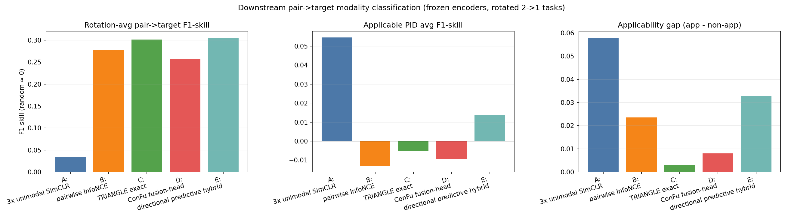

*Figure 12. Main downstream benchmark: rotated pair->target modality classification with frozen encoders. Left: rotation-averaged `F1-skill`. Middle: heuristic “applicable PID” average. Right: applicability gap (`applicable - non-applicable`).*

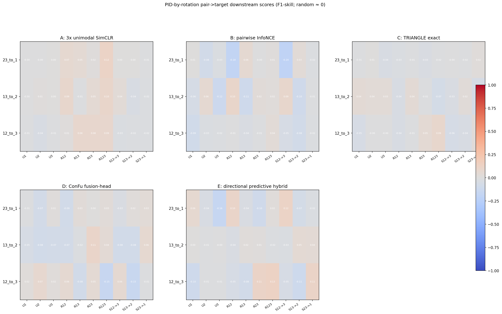

*Figure 13. Full `PID x rotation` pair->target downstream scores (`F1-skill`; random ≈ 0) for each method.*

#### Table 7. Rotated Pair->Target Downstream Results (frozen encoders, held-out test; primary report uses per-rotation macro-F1)

Sources:

- `test_outputs/pid_sar3_ssl_fused_confusions/tuned_long_steps_600_pair_to_target_summary.csv`
- `test_outputs/pid_sar3_ssl_fused_confusions/tuned_long_steps_600_pair_to_target_overall_rotation_scores.csv`

| Model | `23->1` macro-F1 | `13->2` macro-F1 | `12->3` macro-F1 |
| --- | ---: | ---: | ---: |
| A: 3x unimodal SimCLR | 0.520 | 0.518 | 0.514 |
| B: pairwise InfoNCE | 0.628 | 0.649 | 0.640 |
| C: TRIANGLE exact | 0.643 | 0.655 | 0.653 |
| D: ConFu fusion-head | 0.647 | 0.599 | 0.640 |

Rotation-level highlights:

- `23->1`: **D** is strongest on macro-F1 (`0.647`), with `C` close (`0.643`)
- `13->2`: **C** is strongest (`0.655`)
- `12->3`: **C** is strongest (`0.653`)

What this clarifies:

- This benchmark is much closer to the intended multimodal question than PID-label classification or latent `y_*` probes alone.
- **Cross-modal methods now clearly outperform unimodal SimCLR** on the true pair->target task (A is near-random on the normalized scale).
- **TRIANGLE exact is the strongest method across two of the three rotations** (`13->2`, `12->3`) when reporting macro-F1 directly.
- **ConFu fusion-head** is competitive and strongest on one rotation (`23->1`).
- **Pairwise InfoNCE** is consistently strong and clearly above unimodal SimCLR on all three rotations.

Important note on the heuristic “applicable PID” averages:

- We also computed a simple heuristic split of PID atoms into “applicable / non-applicable” for each rotation, but the averages are noisy and not yet a reliable primary metric.
- The full `PID x rotation` heatmaps are more informative than the heuristic scalar summary.
- We also tested a directional predictive hybrid (`E`) in exploratory runs, but it is omitted from the primary table here per the current reporting preference.

### 6.8.2 Downstream Proxy Classification on `y_*` (Supplementary Diagnostic)

We convert each scalar `y_*` target into a balanced classification task by binning it into `5` quantile bins (fit on the train split only, per task), then train frozen-feature linear classifiers (multinomial logistic regression) on the masked subsets.

Reported metrics:

- `macro-F1`
- `κ` (Cohen's kappa; random baseline near `0`)
- `F1-skill = (macro-F1 - 1/K) / (1 - 1/K)` with `K=5`, so **random guessing is approximately `0`**

Supplementary `y_*` classification artifacts:

- `test_outputs/pid_sar3_ssl_fused_confusions/tuned_long_steps_600_ycls_x123_task_summary.csv`
- `test_outputs/pid_sar3_ssl_fused_confusions/tuned_long_steps_600_ycls_x123_summary.png`
- `test_outputs/pid_sar3_ssl_fused_confusions/tuned_long_steps_600_ycls_subset_ablations.csv`
- `test_outputs/pid_sar3_ssl_fused_confusions/tuned_long_steps_600_ycls_subset_ablations.png`

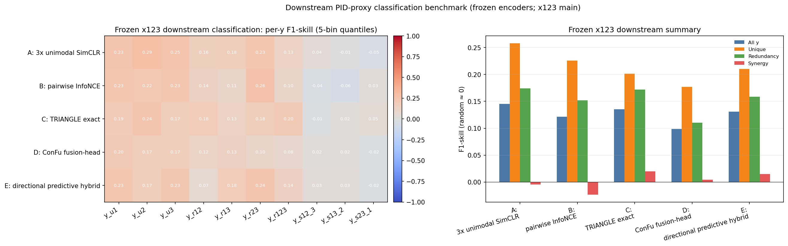

*Figure 14. Supplementary diagnostic: frozen `x123` downstream proxy classification on latent `y_*` targets. Left: per-target `F1-skill`. Right: family-level macro `F1-skill` summaries (random ≈ 0).*

#### Table 8. Tuned 600-Step `y_*` Downstream Classification Proxy Results (`x123`, held-out test)

Sources:

- `test_outputs/pid_sar3_ssl_fused_confusions/tuned_long_steps_600_ycls_x123_task_summary.csv`
- `test_outputs/pid_sar3_ssl_fused_confusions/tuned_long_steps_600_y_downstream_selected_hparams.csv` (hyperparameters reused from the downstream regression tuning run)

| Model | Selected hparams | all-`y` macro-F1 | all-`y` `F1-skill` | all-`y` `κ` | unique `F1-skill` | redundancy `F1-skill` | synergy `F1-skill` |
| --- | --- | ---: | ---: | ---: | ---: | ---: | ---: |
| A: 3x unimodal SimCLR | `temp=0.1` | **0.316** | **0.145** | **0.155** | **0.258** | **0.174** | -0.005 |
| B: pairwise InfoNCE | `temp=0.1` | 0.297 | 0.121 | 0.129 | 0.225 | 0.152 | -0.023 |
| C: TRIANGLE exact | `temp=0.2` | 0.308 | 0.135 | 0.143 | 0.201 | 0.172 | **0.020** |
| D: ConFu fusion-head | `temp=0.1`, pair/fused=`0.25/0.75` | 0.279 | 0.098 | 0.105 | 0.177 | 0.110 | 0.004 |
| E: directional predictive hybrid | `temp=0.4`, `directional_pred_weight=0.5` | 0.305 | 0.131 | 0.138 | 0.210 | 0.158 | 0.015 |

#### Table 9. Selected Per-Target `y_*` Classification Results (held-out test, frozen `x123`)

Source: `test_outputs/pid_sar3_ssl_fused_confusions/tuned_long_steps_600_ycls_x123_task_summary.csv`

| Target | Best model (`F1-skill`) | Notes |
| --- | --- | --- |
| `y_u1`, `y_u2`, `y_u3` | A (all three) | strongest unique-factor class separability under frozen linear probes |
| `y_r12` | C (`0.182`) | TRIANGLE best on this pairwise redundancy target |
| `y_r13` | E (`0.183`) | directional hybrid edges out others on this redundancy target |
| `y_r23` | B (`0.261`) | pairwise InfoNCE strongest on this pairwise redundancy target |
| `y_r123` | C (`0.199`) | TRIANGLE strongest on the 3-way redundancy target in classification form |
| `y_s12_3` | A (`0.041`) | weak but positive; most others near/below zero |
| `y_s13_2` | E (`0.034`) | directional hybrid best here |
| `y_s23_1` | C (`0.049`) | TRIANGLE best here |

What this clarifies (and why this is a better primary benchmark than `PID-10`):

- **The SSL methods are not interchangeable once the downstream target is explicit.**
- **Ranking depends on the evaluation objective**:
  - TRIANGLE wins on PID-term classification (Section 6.3 / classification-style analyses),
  - but **unimodal SimCLR wins on frozen linear latent recoverability (`y_*` downstream probes)**.
- **All methods are above random on many downstream tasks**, and the `F1-skill` scale makes that easy to read (`0` ≈ random).
- **Unique and redundancy proxies are consistently learnable** (positive family `F1-skill` across methods), while **synergy remains much weaker**.
- **TRIANGLE** is not the best overall downstream method, but it improves some specific redundancy/synergy proxy classification tasks (e.g. `y_r12`, `y_r123`, `y_s23_1`).
- **Directional predictive hybrid** shows targeted gains on some synergy/redundancy proxies (`y_s13_2`, `y_r13`) but not enough to win the all-`y` downstream metric.

This is the right interpretation target for the benchmark: frozen encoders should be judged by what PID-related latent variables they make linearly accessible, not only by a supervised PID label classifier.

#### Secondary Ablation (Subsets of Modalities)

Subset ablations are now explicitly secondary and only used to diagnose what the encoders encode.

Artifacts:

- `test_outputs/pid_sar3_ssl_fused_confusions/tuned_long_steps_600_ycls_subset_ablations.png`
- `test_outputs/pid_sar3_ssl_fused_confusions/tuned_long_steps_600_ycls_subset_ablations.csv`

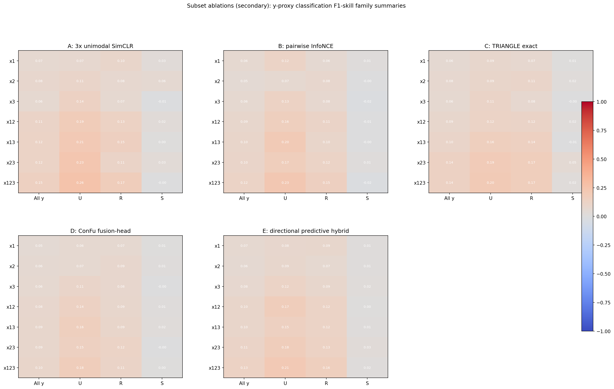

*Figure 15. Secondary ablations: frozen-feature downstream `y_*` classification family summaries (`F1-skill`) for modality subsets (`x1`, `x2`, `x3`, `x12`, `x13`, `x23`, `x123`).*

Key ablation pattern:

- `x123` is best for the downstream classification proxy metric for A, B, D, and E.
- For C (TRIANGLE), `x23` slightly outperforms `x123` on all-`y` `F1-skill` in this run.
- This reinforces why subset ablations should be diagnostic only, not the main ranking criterion.

Supporting note:

- We keep both the regression-based downstream probes (`tuned_long_steps_600_y_downstream_*`) and the PID-label classification artifacts (`tuned_long_steps_600_five_models_*`) as supporting analyses, but the primary SSL conclusion in this notes file is now based on the **rotated pair->target modality** downstream benchmark (Section 6.8.1). The `y_*` probe suites remain useful diagnostics for interpretability.

### 6.9 What To Do Next (Downstream-First)

1. Add a **synergy-focused tuning track** (select on validation synergy `F1-skill` instead of all-`y`) and compare with the all-`y` selected models.
2. Evaluate both `h` and `z` (encoder vs projector outputs) for the downstream `y_*` classification probes; some objectives may hide more linear information in `h`.
3. Add regime-stratified downstream results (`rho`, `sigma`, `hop`) to identify where higher-order methods help or hurt.
4. Add formal `R-only` and `S-only` benchmark stages with the same frozen-encoder downstream protocol.
5. Keep PID-term classification as a separate supervised stress test, not the main SSL ranking metric.

### 6.10 Reproducing the SSL Comparisons

```bash
python - <<'PY'
from tests.test_pid_sar3_ssl_fused_confusions import test_plot_fused_confusions_two_models
from tests.test_pid_sar3_ssl_fused_confusions import test_plot_fused_confusions_four_models_higher_order

test_plot_fused_confusions_two_models()
test_plot_fused_confusions_four_models_higher_order()
print("Saved outputs under test_outputs/pid_sar3_ssl_fused_confusions")
PY
```
