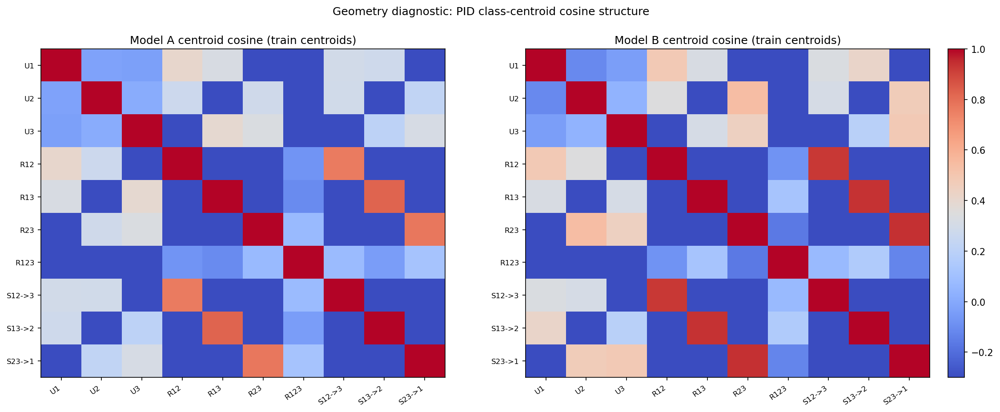
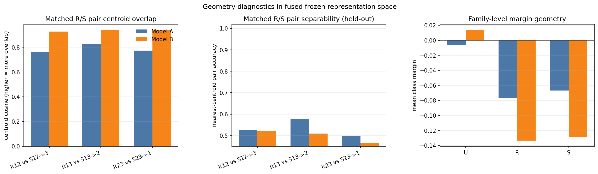

# PID-SAR-3++ Dataset Notes

This note summarizes the dataset definition, raw-data validation metrics, key diagnostic figures, and the implementation entry points in `pid_sar3_dataset.py` and `tests/test_pid_sar3_dataset.py`.

## 1. Formal Dataset and Task Specification

### 1.1 Dataset Overview and Notation

PID-SAR-3++ is a synthetic three-view benchmark for multi-view representation learning under controlled information structure. Each sample contains three observations $x_1, x_2, x_3 \in \mathbb{R}^d$, and exactly one PID-inspired atom is active. The atom set is $\mathcal{A}=\{U_1,U_2,U_3,R_{12},R_{13},R_{23},R_{123},S_{12 \to 3},S_{13 \to 2},S_{23 \to 1}\}$. The generator returns $(x_1,x_2,x_3,\mathrm{pid\_id},\alpha,\sigma,\rho,h)$, where `rho=-1` for non-redundancy atoms and `h=0` for non-synergy atoms.

### 1.2 Task Definition (Training and Evaluation Protocol)

During training, the learner sees only `(x1, x2, x3)`; metadata (`pid_id`, `rho`, `h`) are hidden. During evaluation, frozen representations are probed for unique, redundant, and directional-synergistic structure. Before encoder training, the generator should be validated directly on raw observations to verify that empirical signatures match the intended atom structure. This note emphasizes the `U/R` subset first because it provides the most interpretable sanity checks.

### 1.3 Generative Parameters

The latent dimensionality satisfies `m << d`. Typical defaults are $d=32$, $m=8$, $\alpha \sim \mathrm{Uniform}(\alpha_{\min},\alpha_{\max})$, $\sigma>0$, and $(\rho,h)\in \mathcal{R}\times\mathcal{H}$ with $\mathcal{R}\subset(0,1)$ and $\mathcal{H}\subset\mathbb{N}$. In `pid_sar3_dataset.py`, defaults are `alpha_min=0.8`, `alpha_max=1.2`, `rho_choices={0.2,0.5,0.8}`, and `hop_choices={1,2,3,4}`.

### 1.4 Fixed Projection Operators (Sampled Once per Dataset Seed)

For each view `k ∈ {1,2,3}` and each component `c`, the generator samples a fixed projection matrix $P_k^{(c)} \in \mathbb{R}^{d \times m}$ with entries $P_k^{(c)}[i,j] \sim \mathcal{N}(0,1/d)$, and each column is normalized as $P_k^{(c)}[:,j] \leftarrow P_k^{(c)}[:,j]/\|P_k^{(c)}[:,j]\|_2$. These operators are then held fixed for all samples generated with the same dataset seed.

### 1.5 Observation Noise

Each view receives additive isotropic Gaussian noise $\varepsilon_k \sim \mathcal{N}(0,\sigma^2 I_d)$ for $k\in\{1,2,3\}$, and the observed variable is $x_k = \mathrm{signal}_k + \varepsilon_k$.

### 1.6 Unique Atoms

For `U_i`, the generator samples a latent Gaussian vector $u \sim \mathcal{N}(0,I_m)$ and places the signal only in the active view, i.e., $x_i = \alpha P_i^{(U_i)} u + \varepsilon_i$, while inactive views contain noise only, $x_j = \varepsilon_j$ for $j \neq i$.

### 1.7 Pairwise Redundancy Atoms

For `R_{ij}`, the generator first samples three independent latent vectors `r`, `eta_i`, and `eta_j`, each from a standard Gaussian in `R^m`. It then constructs view-specific latent realizations with overlap coefficient `rho` as $r_i = \sqrt{\rho}\,r + \sqrt{1-\rho}\,\eta_i$ and $r_j = \sqrt{\rho}\,r + \sqrt{1-\rho}\,\eta_j$. The observations are generated as $x_i = \alpha P_i^{(R_{ij})} r_i + \varepsilon_i$ and $x_j = \alpha P_j^{(R_{ij})} r_j + \varepsilon_j$, while $x_k = \varepsilon_k$ for $k\notin\{i,j\}$. As `rho` increases, the shared structure between the two active views becomes stronger.

### 1.8 Triple Redundancy Atom

For `R_{123}`, the generator samples $r,\eta_1,\eta_2,\eta_3 \overset{\mathrm{i.i.d.}}{\sim} \mathcal{N}(0,I_m)$, defines per-view redundant latents $r_k = \sqrt{\rho}\,r + \sqrt{1-\rho}\,\eta_k$ for $k\in\{1,2,3\}$, and sets $x_k = \alpha P_k^{(R_{123})} r_k + \varepsilon_k$.

### 1.9 Directional Synergy Atoms

For `S_{ij→k}`, the generator samples source latents and a hop parameter, $a,b \sim \mathcal{N}(0,I_m)$ and $h \in \mathcal{H}$. The source views are generated linearly as $x_i = \alpha P_i^{(A_{ij})} a + \varepsilon_i$ and $x_j = \alpha P_j^{(B_{ij})} b + \varepsilon_j$. A fixed nonlinear readout network `phi_h` then produces a target latent $s_0 = \phi_h([a,b]) \in \mathbb{R}^m$, which is de-leaked via $s = s_0 - C_a^{(h)} a - C_b^{(h)} b$, and the target view is generated as $x_k = \alpha P_k^{(\mathrm{SYN}_{ij})} s + \varepsilon_k$. This construction reduces single-source linear leakage and yields a more directional synergy signal.

### 1.10 Synergy De-leakage Fit (Offline, per Dataset Seed)

For each hop `h`, de-leakage maps are fit by ridge regression on synthetic latent samples:

```math
W^{(h)} = \arg\min_W \|S_0 - XW\|_F^2 + \lambda \|W\|_F^2,
```

with

```math
X = [A\;B] \in \mathbb{R}^{N\times 2m},\qquad S_0 \in \mathbb{R}^{N\times m}.
```

The fitted matrix is partitioned as

```math
W^{(h)} =
\begin{bmatrix}
C_a^{(h)} \\
C_b^{(h)}
\end{bmatrix}.
```

and these maps are then used during generation to compute the de-leaked target latent `s`.

## 2. Validation Metrics (Raw Data, Pre-Encoder)

### 2.1 Symmetric Dependence Proxy

Given two view matrices `X_A` and `X_B`, define $D(X_A,X_B)=\frac{1}{2}\left(R^2(X_A\to X_B)+R^2(X_B\to X_A)\right)$, where each `R^2` is computed by ridge regression on a train/test split. Intuitively, `D(1,2)` measures shared predictable structure between views 1 and 2: it is low for `U1`, high for `R12`, and elevated for `R123`. It is not a PID estimator or a causal quantity; it is a controlled dependence proxy for validating raw cross-view geometry. Expected U/R signatures are low values for `U1/U2/U3`, pair-specific peaks for `R12/R13/R23`, broad elevation for `R123`, monotonic growth with `rho`, and decay as `sigma` increases.

### 2.2 CCA-Based Geometric Diagnostics

For a fixed atom, let `X_k` denote the sample matrix from view `k`. Linear CCA is used as a cross-view geometric diagnostic, with fit-on-train and report-on-test to reduce overfitting. CCA complements `D(i,j)`; it does not replace it.

## 3. Dataset Exploration (Core Validation First)

This section is ordered by evidential value for validating the generator. First comes single-atom correctness (the strongest check), then raw cross-view structure through the dependence proxy $D$, then stress behavior under targeted boosts. Throughout this section, `D(1,2)` means one thing: how much linearly predictable structure is shared between views 1 and 2.

### 3.1 Single-Atom Correctness Validation (Most Important)


*Figure 1A. Single-atom correctness validation with logistic-regression probes (AUROC).* The left 2x2 block uses low noise (`sigma = 0.05`) and the right 2x2 block uses higher noise (`sigma = 0.45`), with `alpha = 1.5`, `rho = 0.8`, and `hop = 2` fixed. Each panel corresponds to one atom-only dataset (`U1`, `R12`, `R123`, `S12->3`) and reports atom-aligned held-out classification scores.


*Figure 1B. Single-atom correctness validation with a stronger supervised MLP probe (AUROC).* The panel layout and noise settings are identical to Figure 1A, which allows direct comparison between a linear classifier and a higher-capacity nonlinear probe.

These are the primary validation figures. If the low-noise block fails in either Figure 1A or Figure 1B, the rest of the diagnostics are not interpretable. The higher-noise block is included to show degradation under noisier observations without changing the task definition.

Figures 1A and 1B use held-out `AUROC` (area under the ROC curve) for binary probe tasks obtained by thresholding each latent target into a binary label. If $\hat{s}^{\mathrm{te}}$ denotes a probe score on the test split and $z^{\mathrm{te}}\in\{0,1\}$ the corresponding binary label, then AUROC is the probability that a randomly chosen positive example receives a higher score than a randomly chosen negative example. Bars labeled `joint gain` or `source gain` report a difference in AUROC relative to the best single-source probe (that is, `ΔAUROC`).

Table 1 summarizes a compact subset of the AUROC results shown in Figures 1A and 1B. The columns are chosen to reflect the main visual claims: an aligned probe, a control probe, a joint redundancy probe, a triple-redundancy probe, a target-view synergy probe, and a source-joint synergy probe.

| Noise | Probe | `U1: x1->u1` | `U1 ctrl: x2->u1` | `R12: [x1,x2]->r12` | `R123: [x123]->r123` | `S12->3: x3->s` | `S12->3: [x1,x2]->s` |
| --- | --- | ---: | ---: | ---: | ---: | ---: | ---: |
| low (`sigma=0.05`) | logistic | 0.998 | 0.469 | 0.966 | 0.968 | 0.992 | 0.509 |
| low (`sigma=0.05`) | stronger MLP | 0.997 | 0.508 | 0.967 | 0.963 | 0.952 | 0.574 |
| low (`sigma=0.05`) | RBF-SVM | 0.997 | 0.468 | 0.958 | 0.963 | 0.965 | 0.670 |
| higher (`sigma=0.45`) | logistic | 0.967 | 0.537 | 0.912 | 0.944 | 0.736 | 0.568 |
| higher (`sigma=0.45`) | stronger MLP | 0.961 | 0.538 | 0.931 | 0.947 | 0.755 | 0.519 |
| higher (`sigma=0.45`) | RBF-SVM | 0.947 | 0.509 | 0.938 | 0.946 | 0.642 | 0.583 |

Table 1 should be read together with Figures 1A and 1B. Aligned probes remain high for `U1`, `R12`, and `R123`, control probes remain near chance (`AUROC ≈ 0.5`), and `x3 -> s` is the stable correctness probe for `S12->3`. Increasing noise degrades aligned probes without changing these qualitative roles.

For `AUROC`, values near `1` indicate strong separability, and values near `0.5` indicate near-chance binary discrimination.

The bar labels follow a strict convention: `input -> target`. For example, `x1 -> y_u1` means a probe predicts the latent-derived target `y_u1` from view `x1`, and `[x1,x2] -> y_r12` means a probe predicts `y_r12` from the concatenated views `x1` and `x2`. Labels ending in `(ctrl)` are controls and should stay near chance because that view should not carry the target information. Bars named `joint gain` or `source joint gain` are improvements over the best single-view source and are included only to show whether combining sources helps.

Read Figures 1A and 1B row-wise, comparing the same atom across the low-noise and higher-noise column blocks, and then compare Figure 1A (linear classifier) against Figure 1B (small nonlinear probe). For `U1`, `x1 -> y_u1` should be high and both control bars should stay near chance. For `R12`, `x1 -> y_r12` and `x2 -> y_r12` should both be high, `x3 -> y_r12 (ctrl)` should remain low, and `[x1,x2] -> y_r12` should be best. For `R123`, all three single-view bars should be high and `[x123] -> y_r123` should be highest. For `S12->3`, the stable correctness criterion is `x3 -> y_s` (target view), because the synergy latent is projected into view 3.

### 3.2 Dependence Proxy Signatures (`D(i,j)`) for U/R Structure

The next three figures validate raw cross-view structure through the dependence proxy $D(X_A,X_B)=\tfrac{1}{2}(R^2(X_A\to X_B)+R^2(X_B\to X_A))$. The interpretation is the same throughout: `D(1,2)` is high only when views 1 and 2 share predictable structure. In this dataset, `D(1,2)` should be low for `U1`, high for `R12`, and elevated for `R123`. This is the main raw-data sanity statistic for the U/R subset. When in doubt, inspect `D(1,2)` first and then check whether the matching atom (`R12`) is the one that moves.


*Figure 2. U/R dependence signature grid across noise.* Each cell is a dependence score `D(i,j)` for one atom and one noise level. Pairwise redundancy atoms activate their matching pair, `R123` elevates all pairs, and increasing `sigma` contracts the scores.

This heatmap is the fastest U/R sanity check. Each cell is `D(i,j)` for one atom and one noise level `sigma`. Unique atoms stay near the noise floor, pairwise redundancy atoms activate the matching pair, and `R123` elevates all pairs. As `sigma` increases, all dependence values contract toward zero.


*Figure 3. Repeated-batch distributions of the dependence proxy `D(i,j)` across PID atoms.* Boxplots summarize the expected pair-specific ordering together with finite-sample variability.

This plot adds variability to the same `D(i,j)` story. It shows repeated-batch distributions of `D(1,2)`, `D(1,3)`, and `D(2,3)`, so both the expected ordering and the sampling spread are visible. The key reading remains the same: the matching redundancy atom should dominate its matching `D(i,j)`.


*Figure 4. Hyperparameter sensitivity in the U/R subset.* The left panel links redundancy overlap `rho` to `D(1,2)` for `R12`, and the right panel shows how `alpha` and `sigma` affect the raw observation norm.

This figure links the equations directly to `D`. Increasing `rho` in $r_i=\sqrt{\rho}\,r+\sqrt{1-\rho}\,\eta_i$ increases shared latent content and should increase `D(1,2)` for `R12`. The norm panel shows how `alpha` and `sigma` change raw scale in $x_k=\mathrm{signal}_k+\varepsilon_k$.

### 3.3 Targeted-Boost Stress Tests (Metric-Atom Alignment Matters)

These summaries are stress tests, not correctness checks. They test whether diagnostics move in the expected direction when one atom is selectively amplified via `pid_gain_overrides`, with nuisance settings fixed (`sigma = 0.45`, `rho = 0.5`, `hop = 2`).


*Figure 5. Targeted-boost stress test using atom-aligned downstream tasks.* Each column is chosen to match one atom family, so selective boosts become visible in the corresponding task score.

This is the most informative boost figure because it uses atom-aligned targets. It makes `boost_U1`, `boost_R12`, `boost_R123`, and `boost_S12->3` visible in the corresponding downstream tasks. Increasing `U1` does not change `y_u1`; it improves predictability of `y_u1` from `x1` by increasing signal in `x1`.

| Scenario | `Y_U1` from `x1` | `Y_R12` from `[x1,x2]` | `Y_R123` from `[x1,x2,x3]` | `Y_S12->3` from `x3` |
| --- | ---: | ---: | ---: | ---: |
| baseline | 0.012 | 0.539 | 0.443 | 0.049 |
| boost `U1` | 0.023 | 0.539 | 0.443 | 0.049 |
| boost `R12` | 0.012 | 0.605 | 0.443 | 0.049 |
| boost `R123` | 0.012 | 0.539 | 0.492 | 0.049 |
| boost `S12->3` | 0.012 | 0.539 | 0.443 | 0.338 |


*Figure 6. Synergy-specific stress diagnostic for `S12->3`.* The left panel reports a joint-vs-single probe gap on the latent-derived synergy target, and the right panel reports target-view decode performance as a control readout.

This is the main synergy-specific stress diagnostic. It tracks the joint-vs-single probe gap $\Delta_{\mathrm{task}} = R^2([x_1,x_2]\rightarrow y) - \max\{R^2(x_1\rightarrow y), R^2(x_2\rightarrow y)\}$ for `S12->3`, plus the target-view decode `R²(x3 \rightarrow y_s12_3)`. Absolute values are probe-dependent, so the useful signal is the relative shift under `boost_S12->3`.

| Scenario | `R²(x1→y)` | `R²(x2→y)` | `R²([x1,x2]→y)` | `Δ_task` | `R²(x3→y)` |
| --- | ---: | ---: | ---: | ---: | ---: |
| baseline | -0.159 | -0.093 | -0.197 | -0.104 | 0.076 |
| boost `U1` | -0.159 | -0.093 | -0.197 | -0.104 | 0.076 |
| boost `R12` | -0.159 | -0.093 | -0.197 | -0.104 | 0.076 |
| boost `R123` | -0.159 | -0.093 | -0.197 | -0.104 | 0.076 |
| boost `S12->3` | -0.147 | -0.214 | -0.129 | 0.018 | 0.257 |


*Figure 7. Holdout CCA summary under targeted boosts.* This figure is mainly informative for redundancy boosts (`R12`, `R123`) and is included as a secondary stress diagnostic.

This CCA boost summary is secondary. It is useful for redundancy boosts (`R12`, `R123`), but it is weak for directional synergy even when `CCA([x1,x2],x3)` is used.

| Scenario | U1 summary CCA | R12 summary CCA | R123 summary CCA | `S12->3` joint CCA (`CCA([x1,x2],x3)`) |
| --- | ---: | ---: | ---: | ---: |
| baseline | 0.022 | 0.294 | 0.380 | 0.028 |
| boost `U1` | 0.035 | 0.294 | 0.380 | 0.028 |
| boost `R12` | 0.022 | 0.436 | 0.380 | 0.028 |
| boost `R123` | 0.022 | 0.294 | 0.455 | 0.028 |
| boost `S12->3` | 0.022 | 0.294 | 0.380 | 0.008 |

### 3.4 Secondary / Optional Diagnostics

The following tests are useful during development but are not required for the main validation argument in this note: `test_plot_pid_metadata_distributions()` (sampling sanity checks) and `test_plot_atom_gain_controls_ur()` (gain-effect intuition).

## 4. Code Tutorial (How the Dataset Is Implemented and Used)

This section maps the formal specification to the implementation.

### 4.1 Instantiate the Generator

`PIDSar3DatasetGenerator` encapsulates fixed projection sampling, fixed synergy MLP sampling, de-leakage fitting, and sample/batch generation.

Minimal example:

```python
from pid_sar3_dataset import PIDDatasetConfig, PIDSar3DatasetGenerator

cfg = PIDDatasetConfig(
    d=32,
    m=8,
    sigma=0.45,
    alpha_min=0.8,
    alpha_max=1.2,
    rho_choices=(0.2, 0.5, 0.8),
    hop_choices=(1, 2, 3, 4),
    seed=0,
)
gen = PIDSar3DatasetGenerator(cfg)
```

To amplify atom families (or specific atoms) unequally, use gain controls:

```python
cfg = PIDDatasetConfig(
    seed=0,
    unique_gain=1.6,       # boost all U atoms
    redundancy_gain=0.8,   # suppress all R atoms
    synergy_gain=1.0,
    pid_gain_overrides={
        3: 2.0,  # specifically boost R12
        6: 0.7,  # specifically weaken R123
    },
)
gen = PIDSar3DatasetGenerator(cfg)
```

The effective signal amplitude becomes `alpha_eff = alpha * gain(pid_id)`, while the additive noise scale `sigma` is unchanged.

### 4.2 Generate a Single Sample

```python
sample = gen.sample(pid_id=3)  # R12

# keys: x1, x2, x3, pid_id, alpha, sigma, rho, hop
print(sample["x1"].shape)  # (32,)
print(sample["pid_id"])    # 3
```

### 4.3 Generate a Balanced U/R Subset

The U/R-only subset corresponds to $\{0,1,2,3,4,5,6\} = \{U_1,U_2,U_3,R_{12},R_{13},R_{23},R_{123}\}$.

```python
import numpy as np

ur_pid_ids = [0, 1, 2, 3, 4, 5, 6]
n_per_atom = 5000
pid_schedule = np.repeat(ur_pid_ids, n_per_atom)

batch = gen.generate(n=len(pid_schedule), pid_ids=pid_schedule.tolist())
print(batch["x1"].shape)      # (35000, d)
print(batch["pid_id"].shape)  # (35000,)
```

### 4.4 Save the Dataset to Disk

```python
import numpy as np
np.savez_compressed("data/pid_sar3_ur_train.npz", **batch)
```

### 4.5 Where the Diagnostics Are Implemented

The core diagnostics used in Section 3 are implemented in `tests/test_pid_sar3_dataset.py`: `test_plot_single_atom_correctness_validation()`, `test_plot_ur_compact_signature_grid_over_sigma()`, `test_plot_pid_dependence_distributions_boxplots()`, `test_plot_ur_hyperparameter_sweeps_compact()`, `test_plot_downstream_task_boosting_summary()`, `test_plot_synergy_task_gap_boosting_summary()`, and `test_plot_cca_boosting_mechanisms_summary()`. Two tests are useful but secondary for the main argument: `test_plot_pid_metadata_distributions()` and `test_plot_atom_gain_controls_ur()`.

## 5. Commands to Reproduce the Dataset and Figures

### 5.1 Generate the Core Validation Figures (Recommended Entry Point)

```bash
python - <<'PY'
from tests.test_pid_sar3_dataset import (
    test_plot_single_atom_correctness_validation,
    test_plot_ur_compact_signature_grid_over_sigma,
    test_plot_pid_dependence_distributions_boxplots,
    test_plot_ur_hyperparameter_sweeps_compact,
    test_plot_downstream_task_boosting_summary,
    test_plot_synergy_task_gap_boosting_summary,
    test_plot_cca_boosting_mechanisms_summary,
)

test_plot_single_atom_correctness_validation()
test_plot_ur_compact_signature_grid_over_sigma()
test_plot_pid_dependence_distributions_boxplots()
test_plot_ur_hyperparameter_sweeps_compact()
test_plot_downstream_task_boosting_summary()
test_plot_synergy_task_gap_boosting_summary()
test_plot_cca_boosting_mechanisms_summary()
print("Saved plots under test_outputs/pid_sar3")
PY
```

This command generates the main figures and CSV summaries referenced in Section 3 (single-atom correctness, `D(i,j)` U/R structure checks, and targeted-boost stress tests).

Optional secondary diagnostics (sampling sanity and gain-intuition):

```bash
python - <<'PY'
from tests.test_pid_sar3_dataset import (
    test_plot_pid_metadata_distributions,
    test_plot_atom_gain_controls_ur,
)
test_plot_pid_metadata_distributions()
test_plot_atom_gain_controls_ur()
print("Saved optional diagnostics under test_outputs/pid_sar3")
PY
```

### 5.2 Generate and Save a Balanced U/R Dataset (`.npz`)

```bash
mkdir -p data
python - <<'PY'
import numpy as np
from pid_sar3_dataset import PIDDatasetConfig, PIDSar3DatasetGenerator

cfg = PIDDatasetConfig(seed=0, d=32, m=8, sigma=0.45)
gen = PIDSar3DatasetGenerator(cfg)

ur_pid_ids = [0, 1, 2, 3, 4, 5, 6]
n_per_atom = 5000
pid_schedule = np.repeat(ur_pid_ids, n_per_atom)

batch = gen.generate(n=len(pid_schedule), pid_ids=pid_schedule.tolist())
np.savez_compressed("data/pid_sar3_ur_train.npz", **batch)
print("Saved data/pid_sar3_ur_train.npz with", len(pid_schedule), "samples")
PY
```

### 5.3 Generate a U/R Dataset with Intentional U/R Imbalance (Gain Controls)

```bash
mkdir -p data
python - <<'PY'
import numpy as np
from pid_sar3_dataset import PIDDatasetConfig, PIDSar3DatasetGenerator

cfg = PIDDatasetConfig(
    seed=7,
    d=32,
    m=8,
    sigma=0.45,
    unique_gain=1.5,
    redundancy_gain=0.9,
    pid_gain_overrides={3: 2.0, 6: 0.6},  # stronger R12, weaker R123
)
gen = PIDSar3DatasetGenerator(cfg)

ur_pid_ids = [0, 1, 2, 3, 4, 5, 6]
pid_schedule = np.repeat(ur_pid_ids, 3000)
batch = gen.generate(n=len(pid_schedule), pid_ids=pid_schedule.tolist())
np.savez_compressed("data/pid_sar3_ur_imbalanced_gain.npz", **batch)
print("Saved data/pid_sar3_ur_imbalanced_gain.npz")
PY
```

### 5.4 Generate Train / Val / Test Splits

```bash
mkdir -p data
python - <<'PY'
import numpy as np
from pid_sar3_dataset import PIDDatasetConfig, PIDSar3DatasetGenerator

cfg = PIDDatasetConfig(seed=42, d=32, m=8, sigma=0.45)
gen = PIDSar3DatasetGenerator(cfg)
ur_pid_ids = [0,1,2,3,4,5,6]

def make_split(path, n_per_atom):
    pid_schedule = np.repeat(ur_pid_ids, n_per_atom)
    batch = gen.generate(n=len(pid_schedule), pid_ids=pid_schedule.tolist())
    np.savez_compressed(path, **batch)
    print("Saved", path, "N=", len(pid_schedule))

make_split("data/pid_sar3_ur_train.npz", 10000)
make_split("data/pid_sar3_ur_val.npz",   1000)
make_split("data/pid_sar3_ur_test.npz",  1000)
PY
```

## 6. SSL Comparison (Revised): Fused Frozen-Encoder Confusions for Two Contrastive Setups

This section replaces the earlier SSL write-up with a stricter and more relevant comparison.

### 6.1 What Was Wrong With the Previous SSL Results (Self-Critique)

The earlier SSL additions were too broad and mixed multiple validation views (per-modality probes, scalar summaries, and several objectives) before locking down the most important question:

- **How do the learned frozen encoders behave when all three modalities are used together?**
- **Which PID terms are confused with which, not just what the aggregate accuracy is?**

That made the story harder to interpret. In particular:

- aggregate `PID-10` / `Family-3` scores hid important error structure
- multiple objectives were compared before the validation target was nailed down
- some plots were informative for debugging but not central for the report

This revision keeps only the most important result structure:

- two models only
- frozen encoders
- all modalities concatenated at validation
- confusion matrices as the primary output

### 6.2 Compared Models (Exactly Two)

We compare the two setups requested:

1. **Model A: sum of three unimodal SimCLR losses**
   - one SimCLR stream per modality (`x1`, `x2`, `x3`)
   - augmentation-based positives within each modality
   - three encoders trained separately, then frozen

2. **Model B: sum of three pairwise InfoNCE losses**
   - cross-modal positives over `(x1,x2)`, `(x1,x3)`, `(x2,x3)`
   - one tri-modal model with three encoders trained jointly
   - frozen encoders for validation

Validation protocol (same for both):

- freeze encoders
- concatenate representations `[h1,h2,h3]`
- fit linear probes on held-out data

Implementation entry point:

- `tests/test_pid_sar3_ssl_fused_confusions.py`

### 6.3 Primary Results: Confusion Matrices (Fused Frozen Validation)

#### PID-10 Confusions (Primary Figure)


*Figure 8. Row-normalized `PID-10` confusion matrices for the two contrastive models using frozen encoders and concatenated modalities (`[h1,h2,h3]`) with a linear probe.* This is the main result figure for SSL comparison at this stage.

### 6.4 What the Confusions Show (Most Important Takeaways)

From the fused frozen `PID-10` confusions:

- Both models strongly confuse **paired redundancy atoms with the matching directional synergy atoms**:
  - `R12 <-> S12->3`
  - `R13 <-> S13->2`
  - `R23 <-> S23->1`
- This is not noise; it is a consistent structural confusion and should guide the next objective design.

Model-specific behavior in this run:

- **Model A (sum of 3 unimodal SimCLR)** is better on PID-term classification overall and preserves stronger diagonal mass on many classes.
- **Model B (sum of 3 pairwise InfoNCE)** improves latent-target linear recoverability (see Table 3 below), but its `PID-10` confusion matrix is more diffuse, especially for redundancy/triple-redundancy terms.

Concrete high-count off-diagonal examples (from `fused_frozen_two_models_confusions.csv`):

- Model A:
  - `S13->2 -> R13` (`51`)
  - `R23 -> S23->1` (`50`)
  - `S12->3 -> R12` (`48`)
- Model B:
  - `S13->2 -> R13` (`48`)
  - `S12->3 -> R12` (`45`)
  - `S23->1 -> R23` (`44`)

This is the core result to optimize against, more than a single scalar accuracy.

### 6.5 Geometry Diagnostics (Why the Confusions Look This Way)

To make the representation-space argument explicit (instead of relying only on probe outcomes), we added geometry diagnostics on the fused frozen feature space `[h1,h2,h3]`.

Diagnostics use:

- train-set PID centroids in standardized + row-normalized feature space
- held-out sample margins vs nearest competing centroid
- matched `Rij` vs `Sij->k` pair overlap/separability metrics

#### PID Class-Centroid Geometry



*Figure 9. PID class-centroid cosine matrices (train centroids) in the fused frozen representation space.* Model B (pairwise InfoNCE) shows much higher cosine similarity between matched redundancy/synergy class centroids, indicating stronger geometric overlap.

#### Matched R/S Overlap and Margin Diagnostics



*Figure 10. Geometry diagnostics for the fused frozen representation space.* Left: matched `Rij`/`Sij->k` centroid cosine (higher means more overlap). Middle: nearest-centroid separability within each matched `Rij` vs `Sij->k` pair. Right: family-level mean margin (`U/R/S`) on held-out data.

#### Table 3. Geometry Summary (Most Important Metrics)

Source: `test_outputs/pid_sar3_ssl_fused_confusions/fused_frozen_two_models_geometry_summary.csv`

| Metric | Item | Model A (3 unimodal SimCLR) | Model B (3 pairwise InfoNCE) | `B - A` |
| --- | --- | ---: | ---: | ---: |
| Overall mean margin | all PID classes | -0.053 | -0.088 | -0.035 |
| Family mean margin | `U` | -0.006 | 0.014 | +0.020 |
| Family mean margin | `R` | -0.076 | -0.134 | -0.057 |
| Family mean margin | `S` | -0.067 | -0.129 | -0.062 |
| Matched pair centroid cosine | `R12` vs `S12->3` | 0.763 | 0.929 | +0.166 |
| Matched pair centroid cosine | `R13` vs `S13->2` | 0.825 | 0.938 | +0.113 |
| Matched pair centroid cosine | `R23` vs `S23->1` | 0.774 | 0.940 | +0.166 |
| Matched pair nearest-centroid acc | `R12` vs `S12->3` | 0.528 | 0.522 | -0.006 |
| Matched pair nearest-centroid acc | `R13` vs `S13->2` | 0.578 | 0.509 | -0.069 |
| Matched pair nearest-centroid acc | `R23` vs `S23->1` | 0.500 | 0.466 | -0.034 |

This makes the earlier interpretation concrete:

- Model B improves some latent linear readouts but geometrically pulls matched `Rij` and `Sij->k` classes closer together.
- That increased centroid overlap is consistent with the larger `Rij <-> Sij->k` confusion bands in Figure 8.

### 6.6 Compact Supervised Summary (Same Fused Frozen Protocol)

We keep one compact summary table for the full supervised suite under the same validation protocol:

- `PID-10` classification
- `Family-3` classification
- latent-target regression probes (`y_u1`, `y_r12`, `y_r123`, `y_s12_3`)

#### Table 4. Fused Frozen Linear-Probe Summary for the Two Models

Source: `test_outputs/pid_sar3_ssl_fused_confusions/fused_frozen_two_models_task_summary.csv`

| Task | Model A: sum of 3 unimodal SimCLR | Model B: sum of 3 pairwise InfoNCE | `B - A` |
| --- | ---: | ---: | ---: |
| `PID-10` accuracy | 0.415 | 0.357 | -0.058 |
| `Family-3` accuracy | 0.498 | 0.449 | -0.048 |
| `R²(y_u1)` | -0.407 | -0.234 | +0.173 |
| `R²(y_r12)` | -0.684 | -0.326 | +0.358 |
| `R²(y_r123)` | -0.760 | -0.580 | +0.180 |
| `R²(y_s12_3)` | -0.920 | -0.513 | +0.407 |

Interpretation:

- Model A is better for the current **classification-oriented** readout.
- Model B is better for the current **latent scalar linear recoverability** readout (all `R²` values are still poor/negative, but consistently less bad).
- The objectives appear to emphasize different geometry, which is exactly what this validation is meant to expose.

### 6.7 What To Improve Next (Based on Confusions + Geometry)

The persistent `Rij <-> Sij->k` confusion suggests the current contrastive objectives do not sufficiently separate:

- pairwise shared structure (redundancy)
- directional target-generating structure (synergy)

The next objective variants should be judged by whether they reduce those specific off-diagonal bands in Figure 8 **and** lower the matched `Rij`/`Sij->k` centroid cosine in Figure 10.

Promising next directions:

1. Add a predictive head `([h_i,h_j] -> h_k)` to explicitly model directional structure.
2. Use a hybrid loss: pairwise contrastive + target prediction, then re-check the `Rij <-> Sij->k` confusion bands.
3. Probe `h` vs `z` separately (encoder output vs projector output), since SimCLR-style projectors can hide linearly decodable latent structure.

### 6.8 Reproducing the Revised SSL Comparison

```bash
python - <<'PY'
from tests.test_pid_sar3_ssl_fused_confusions import test_plot_fused_confusions_two_models
test_plot_fused_confusions_two_models()
print("Saved outputs under test_outputs/pid_sar3_ssl_fused_confusions")
PY
```
