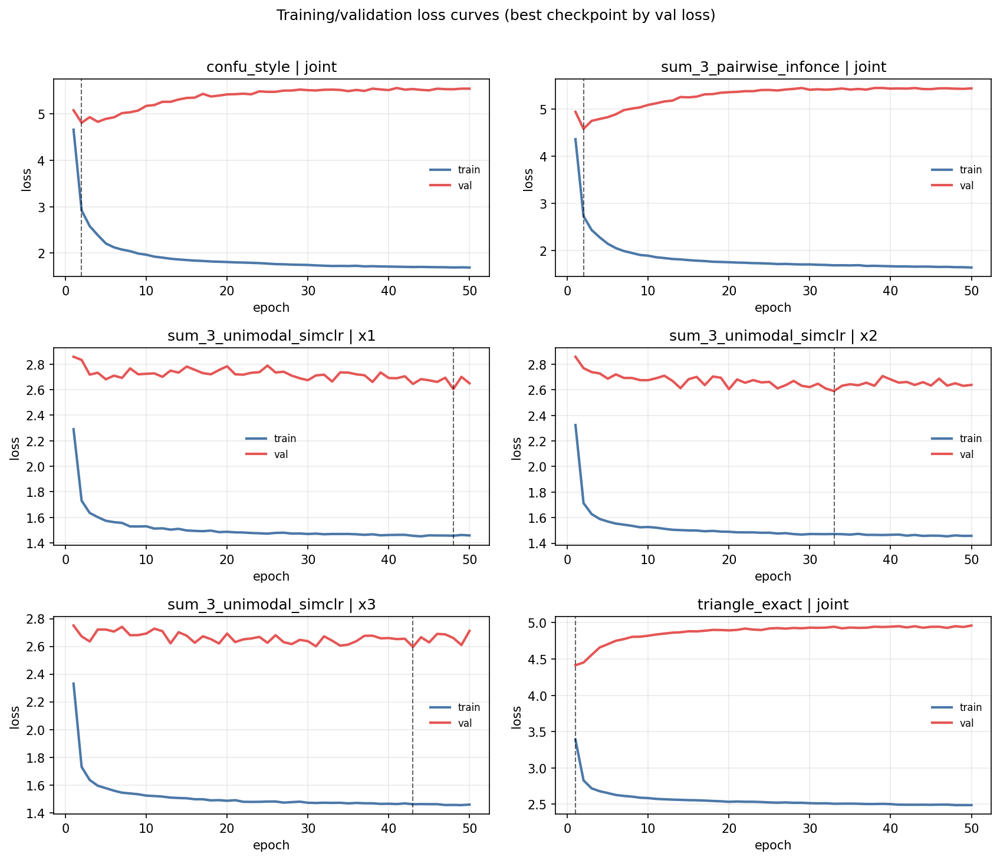

# PID-SAR-3++ SSL Main Results

This document reports the current SSL results after adding a compositional dataset mode and a dataset-side difficulty ladder. The main purpose of this revision is to establish a benchmarkable regime first, then place the earlier strict single-atom results in that context.

## 6. SSL Results (Main Results)

### 6.1 Main Result (Dataset First)

The central result of this revision is a dataset result, not a model ranking result.

1. The original single-atom generator yields a severe `pair->heldout` pathology under exact-instance retrieval: raw observations are near random, even at very low noise.
2. A compositional dataset mode (multi-atom summation + shared backbone) produces a clearly solvable retrieval regime under the same metric.
3. This gives a practical difficulty ladder for rerunning SSL model comparisons in a controlled way, instead of comparing objectives on a pathological benchmark.

The immediate conclusion is that the previous strict benchmark remains scientifically useful as a stress test, but it is not an appropriate starting point for objective comparison under exact retrieval and heldout-modality transfer.

### 6.2 Evaluation Setup (Condensed)

We use frozen-feature downstream evaluations and a same-world split (shared dataset seed for SSL and probes, disjoint train/test samples). For retrieval diagnostics, we report exact-instance retrieval in cosine space using Recall@\(K\),
\[
\mathrm{R@}K = \frac{1}{N}\sum_{i=1}^{N} \mathbf{1}[\mathrm{rank}_i \le K],
\]
and mean reciprocal rank,
\[
\mathrm{MRR} = \frac{1}{N}\sum_{i=1}^{N} \frac{1}{\mathrm{rank}_i}.
\]

Unless otherwise noted, `pair->heldout` refers to the rotated tasks `23->1`, `13->2`, `12->3`.

### 6.3 Dataset Difficulty Ladder (Primary Result For This Revision)

We added a backward-compatible compositional dataset mode with the following new controls:

- `composition_mode` (`single_atom` / `multi_atom`)
- `active_atoms_per_sample`
- `shared_backbone_gain`
- `shared_backbone_tied_projection`
- `synergy_deleak_lambda`

The ladder below evaluates **RAW exact-instance retrieval** (no learned encoder) to isolate benchmarkability before rerunning full SSL comparisons.

Artifacts:

- `test_outputs/pid_sar3_ssl_fused_confusions/dataset_difficulty_ladder_raw_retrieval.csv`
- `test_outputs/pid_sar3_ssl_fused_confusions/dataset_difficulty_ladder_raw_retrieval_grouped.csv`
- `test_outputs/pid_sar3_ssl_fused_confusions/dataset_difficulty_ladder_raw_retrieval.png`

Random baseline for `Recall@1` with `n=1800` gallery items is `1/1800 ≈ 0.00056`.

#### Table 6a. Ladder Definition (dataset-side knobs)

| Level | Setting | `sigma` | `active_atoms` | `shared_gain` | shared proj tied? | `synergy_deleak_lambda` |
| --- | --- | ---: | ---: | ---: | --- | ---: |
| L0 | `compositional_very_easy` | 0.02 | 5 | 4.0 | yes | 0.25 |
| L1 | `compositional_easy_plus` | 0.025 | 4 | 3.2 | yes | 0.35 |
| L2 | `compositional_easy` | 0.03 | 4 | 2.5 | yes | 0.5 |

#### Table 6b. RAW Retrieval Across The Difficulty Ladder (group means, Recall@1)

| Level | pair->heldout | pair->member | `123->target` |
| --- | ---: | ---: | ---: |
| L0 `compositional_very_easy` | 0.6487 | 0.9976 | 0.9624 |
| L1 `compositional_easy_plus` | 0.5839 | 0.9970 | 0.9511 |
| L2 `compositional_easy` | 0.3856 | 0.9924 | 0.9002 |

Main interpretation of the ladder:

- `L0 -> L1 -> L2` provides a clean monotonic progression on `pair->heldout` exact retrieval (`0.649 -> 0.584 -> 0.386` in raw `Recall@1`).
- All three levels are decisively above random (`≈ 0.00056`) and therefore benchmarkable under the current retrieval metric.
- `L2` remains challenging enough to be useful as a first nontrivial benchmark level, while `L0/L1` are calibration levels for debugging objectives and probes.

This ladder is the correct starting point for the next model reruns: it lets us compare objectives while controlling dataset difficulty explicitly.

### 6.4 Compositional-Very-Easy Model Rerun (L0)

After establishing the ladder, we reran the main downstream analyses on `L0 = compositional_very_easy` to verify that the objectives separate in a benchmarkable regime.

This rerun is a heavier pass (GPU-assisted SSL training) intended to strengthen the `L0` calibration results:

- SSL training: `480` steps on GPU
- probe set: `100` samples per primary PID label (`n=1000`)
- kappa and reconstruction: `5` folds
- kappa evaluation restricted to source subsets `{12,13,23,123}` (the post-6.3 task focus)

Artifacts:

- `test_outputs/pid_sar3_ssl_fused_confusions/compositional_very_easy_source_to_target_four_models_5fold_summary.csv`
- `test_outputs/pid_sar3_ssl_fused_confusions/compositional_very_easy_source_to_target_four_models_5fold_grouped_summary.csv`
- `test_outputs/pid_sar3_ssl_fused_confusions/compositional_very_easy_retrieval_source_to_target_four_models_summary.csv`
- `test_outputs/pid_sar3_ssl_fused_confusions/compositional_very_easy_source_to_target_reconstruction_four_models_5fold_summary.csv`
- `test_outputs/pid_sar3_ssl_fused_confusions/compositional_very_easy_source_to_target_reconstruction_four_models_5fold_grouped_summary.csv`

#### 6.4.1 Source->Target Prediction (Cohen's \(\kappa\), compositional `L0`)

For the source->target benchmark, we predict thresholded raw target coordinates and report macro Cohen's kappa,
\[
\bar{\kappa}=\frac{1}{D}\sum_{d=1}^{D}\kappa_d, \qquad \kappa=\frac{p_o-p_e}{1-p_e}.
\]

##### Table 7a. Grouped Summary (compositional `L0`, macro-\(\kappa\), 5-fold)

| Model | pair->heldout target | pair->member target | `123->target` |
| --- | ---: | ---: | ---: |
| A: 3x unimodal SimCLR | 0.674 | 0.757 | 0.752 |
| B: pairwise InfoNCE | 0.671 | 0.717 | 0.715 |
| C: TRIANGLE | 0.666 | 0.719 | 0.721 |
| D: ConFu | 0.651 | 0.693 | 0.694 |

In `L0`, the benchmark is solvable and chance-corrected performance is high across all three groups, which is the intended behavior of a calibration regime.

##### Table 7. Rotated Pair->Heldout Targets (compositional `L0`, macro-\(\kappa\), 5-fold mean \(\pm\) SE)

| Model | `23->1` \(\kappa\) | `13->2` \(\kappa\) | `12->3` \(\kappa\) |
| --- | ---: | ---: | ---: |
| A: 3x unimodal SimCLR | 0.669 ± 0.001 | 0.673 ± 0.003 | 0.679 ± 0.005 |
| B: pairwise InfoNCE | 0.670 ± 0.003 | 0.668 ± 0.004 | 0.677 ± 0.004 |
| C: TRIANGLE | 0.652 ± 0.003 | 0.667 ± 0.002 | 0.680 ± 0.002 |
| D: ConFu | 0.641 ± 0.006 | 0.650 ± 0.003 | 0.662 ± 0.004 |

##### Table 7b. Pair/Triple Source->Target Matrix (compositional `L0`, macro-\(\kappa\), 5-fold means)

Cell colors use a fixed threshold at \(\kappa=0.25\): green for \(\kappa>0.25\), red for \(\kappa\le 0.25\).

<table>
  <thead>
    <tr>
      <th align="left">Source-&gt;Target</th>
      <th align="right">A</th>
      <th align="right">B</th>
      <th align="right">C</th>
      <th align="right">D</th>
    </tr>
  </thead>
  <tbody>
    <tr><td><code>12->1</code></td><td align="right" style="background:#d9f2d9;">0.755</td><td align="right" style="background:#d9f2d9;">0.711</td><td align="right" style="background:#d9f2d9;">0.735</td><td align="right" style="background:#d9f2d9;">0.689</td></tr>
    <tr><td><code>12->2</code></td><td align="right" style="background:#d9f2d9;">0.753</td><td align="right" style="background:#d9f2d9;">0.715</td><td align="right" style="background:#d9f2d9;">0.718</td><td align="right" style="background:#d9f2d9;">0.701</td></tr>
    <tr><td><code>12->3</code></td><td align="right" style="background:#d9f2d9;">0.679</td><td align="right" style="background:#d9f2d9;">0.677</td><td align="right" style="background:#d9f2d9;">0.680</td><td align="right" style="background:#d9f2d9;">0.662</td></tr>
    <tr><td><code>13->1</code></td><td align="right" style="background:#d9f2d9;">0.749</td><td align="right" style="background:#d9f2d9;">0.713</td><td align="right" style="background:#d9f2d9;">0.730</td><td align="right" style="background:#d9f2d9;">0.680</td></tr>
    <tr><td><code>13->2</code></td><td align="right" style="background:#d9f2d9;">0.673</td><td align="right" style="background:#d9f2d9;">0.668</td><td align="right" style="background:#d9f2d9;">0.667</td><td align="right" style="background:#d9f2d9;">0.650</td></tr>
    <tr><td><code>13->3</code></td><td align="right" style="background:#d9f2d9;">0.763</td><td align="right" style="background:#d9f2d9;">0.723</td><td align="right" style="background:#d9f2d9;">0.721</td><td align="right" style="background:#d9f2d9;">0.698</td></tr>
    <tr><td><code>23->1</code></td><td align="right" style="background:#d9f2d9;">0.669</td><td align="right" style="background:#d9f2d9;">0.670</td><td align="right" style="background:#d9f2d9;">0.652</td><td align="right" style="background:#d9f2d9;">0.641</td></tr>
    <tr><td><code>23->2</code></td><td align="right" style="background:#d9f2d9;">0.754</td><td align="right" style="background:#d9f2d9;">0.717</td><td align="right" style="background:#d9f2d9;">0.700</td><td align="right" style="background:#d9f2d9;">0.691</td></tr>
    <tr><td><code>23->3</code></td><td align="right" style="background:#d9f2d9;">0.765</td><td align="right" style="background:#d9f2d9;">0.724</td><td align="right" style="background:#d9f2d9;">0.712</td><td align="right" style="background:#d9f2d9;">0.696</td></tr>
    <tr><td><code>123->1</code></td><td align="right" style="background:#d9f2d9;">0.745</td><td align="right" style="background:#d9f2d9;">0.710</td><td align="right" style="background:#d9f2d9;">0.730</td><td align="right" style="background:#d9f2d9;">0.687</td></tr>
    <tr><td><code>123->2</code></td><td align="right" style="background:#d9f2d9;">0.748</td><td align="right" style="background:#d9f2d9;">0.716</td><td align="right" style="background:#d9f2d9;">0.712</td><td align="right" style="background:#d9f2d9;">0.696</td></tr>
    <tr><td><code>123->3</code></td><td align="right" style="background:#d9f2d9;">0.762</td><td align="right" style="background:#d9f2d9;">0.718</td><td align="right" style="background:#d9f2d9;">0.721</td><td align="right" style="background:#d9f2d9;">0.700</td></tr>
  </tbody>
</table>

Main point for `L0`: the downstream benchmark is no longer collapsed, and the methods can be meaningfully separated.

#### 6.4.2 Frozen Retrieval (compositional `L0`, single run)

Retrieval in `L0` is a much stronger diagnostic than in the strict single-atom regime because the task is benchmarkable under the current metric.

| Model | pair->heldout `R@1` | pair->member `R@1` | `123->target` `R@1` |
| --- | ---: | ---: | ---: |
| A: 3x unimodal SimCLR | 0.1437 | 0.7540 | 0.6223 |
| B: pairwise InfoNCE | 0.0013 | 0.5360 | 0.2470 |
| C: TRIANGLE | 0.0000 | 0.1692 | 0.1060 |
| D: ConFu | 0.0003 | 0.5303 | 0.2413 |

This reveals a strong separation in the current `L0` setting: unimodal SimCLR dominates exact retrieval, while the contrastive fusion variants lag substantially on this metric.

#### 6.4.3 Frozen-Decoder Reconstruction (compositional `L0`, 5-fold)

We retain the same reconstruction benchmark definition and report macro \(R^2\), where positive values indicate better-than-baseline reconstruction and higher is better.

Grouped summary (macro \(R^2\)):

| Decoder | Model | pair->heldout target | pair->member target | `123->target` |
| --- | --- | ---: | ---: | ---: |
| Ridge | A: 3x unimodal SimCLR | 0.768 | 0.874 | 0.877 |
| Ridge | B: pairwise InfoNCE | 0.769 | 0.833 | 0.836 |
| Ridge | C: TRIANGLE | 0.759 | 0.837 | 0.845 |
| Ridge | D: ConFu | 0.741 | 0.804 | 0.812 |
| MLP | A: 3x unimodal SimCLR | 0.742 | 0.822 | 0.822 |
| MLP | B: pairwise InfoNCE | 0.736 | 0.769 | 0.772 |
| MLP | C: TRIANGLE | 0.720 | 0.758 | 0.766 |
| MLP | D: ConFu | 0.697 | 0.725 | 0.732 |

Rotated `pair->heldout` slice (macro \(R^2\), 5-fold mean \(\pm\) SE):

| Decoder | Model | `23->1` | `13->2` | `12->3` |
| --- | --- | ---: | ---: | ---: |
| Ridge | A: 3x unimodal SimCLR | 0.767 ± 0.001 | 0.766 ± 0.003 | 0.769 ± 0.002 |
| Ridge | B: pairwise InfoNCE | 0.768 ± 0.002 | 0.765 ± 0.002 | 0.773 ± 0.003 |
| Ridge | C: TRIANGLE | 0.748 ± 0.002 | 0.760 ± 0.002 | 0.767 ± 0.003 |
| Ridge | D: ConFu | 0.734 ± 0.003 | 0.737 ± 0.003 | 0.751 ± 0.002 |
| MLP | A: 3x unimodal SimCLR | 0.742 ± 0.001 | 0.739 ± 0.004 | 0.746 ± 0.002 |
| MLP | B: pairwise InfoNCE | 0.732 ± 0.001 | 0.733 ± 0.002 | 0.742 ± 0.003 |
| MLP | C: TRIANGLE | 0.702 ± 0.003 | 0.723 ± 0.001 | 0.734 ± 0.004 |
| MLP | D: ConFu | 0.694 ± 0.004 | 0.692 ± 0.002 | 0.704 ± 0.005 |

In `L0`, reconstruction is uniformly strong and no longer dominated by near-chance behavior. This confirms that the new compositional regime is suitable for objective comparison.

#### 6.4.4 Optimization Sanity Check (Fixed 10k/2k Budget)

To rule out a trivial optimization failure explanation, we logged per-epoch training and validation losses for one full `L0` balanced run under the fixed finite-data regime used below (`10k` train, `2k` validation, batch size `128`, `50` epochs, best checkpoint selected by validation loss).

Artifacts:

- `test_outputs/pid_sar3_ssl_fused_confusions/compositional_very_easy_training_diagnostics_history.csv`
- `test_outputs/pid_sar3_ssl_fused_confusions/compositional_very_easy_training_diagnostics_loss_curves.png`

The loss curves show the expected optimization behavior: training loss decreases, validation loss decreases early and then flattens, and the selected checkpoints occur at finite epochs rather than degenerate first/last-epoch behavior. This supports the interpretation that the downstream similarities are not caused by a simple failure to optimize the SSL objectives.

#### 6.4.5 Training-Mixture Sensitivity at `L0` (Balanced vs Skewed PID Mixes, Fixed 10k Train Budget)

To test whether the `L0` results are stable to the SSL training distribution under a fixed finite-data budget, we reran the same `L0` bundle with:

- SSL training set: `10,000` samples (fixed dataset)
- validation set: `2,000` samples (fixed dataset)
- optimizer batch size: `128`
- training length: `50` epochs
- checkpoint selection: best validation loss
- probe/evaluation set: balanced `n=1000` (`100` per PID atom), `5` folds for \(\kappa\) and reconstruction

The imbalance is applied only to the SSL training/validation distributions; probe/evaluation sets remain balanced across the 10 PID atoms.

We use three family-level skews:

| Training mix | Unique share | Redundancy share | Synergy share |
| --- | ---: | ---: | ---: |
| Balanced (baseline) | 0.30 | 0.40 | 0.30 |
| Unique-heavy | 0.72 | 0.22 | 0.06 |
| Redundancy-heavy | 0.30 | 0.60 | 0.10 |
| Synergy-heavy | 0.24 | 0.29 | 0.47 |

Compact comparison on the main `pair->heldout` metrics (balanced evaluation):

| Training mix | Model | pair->heldout \(\kappa\) | pair->heldout `R@1` | pair->heldout Ridge \(R^2\) |
| --- | --- | ---: | ---: | ---: |
| Balanced | A | 0.624 | 0.0003 | 0.714 |
| Balanced | B | 0.646 | 0.0003 | 0.740 |
| Balanced | C | 0.639 | 0.0013 | 0.736 |
| Balanced | D | 0.646 | 0.0000 | 0.739 |
| Unique-heavy | A | 0.624 | 0.0010 | 0.709 |
| Unique-heavy | B | 0.644 | 0.0017 | 0.737 |
| Unique-heavy | C | 0.643 | 0.0003 | 0.737 |
| Unique-heavy | D | 0.643 | 0.0003 | 0.735 |
| Redundancy-heavy | A | 0.621 | 0.0010 | 0.712 |
| Redundancy-heavy | B | 0.644 | 0.0007 | 0.738 |
| Redundancy-heavy | C | 0.644 | 0.0010 | 0.737 |
| Redundancy-heavy | D | 0.641 | 0.0010 | 0.734 |
| Synergy-heavy | A | 0.624 | 0.0010 | 0.710 |
| Synergy-heavy | B | 0.645 | 0.0007 | 0.737 |
| Synergy-heavy | C | 0.644 | 0.0003 | 0.738 |
| Synergy-heavy | D | 0.645 | 0.0007 | 0.738 |

Main observations:

1. Under the fixed `10k` train budget, all methods have near-random exact `pair->heldout` retrieval in `L0` (roughly `0.0000` to `0.0017` in `R@1`), including the balanced run.
2. In contrast, chance-corrected decodability remains clearly above chance and fairly stable: `pair->heldout` macro-\(\kappa\) stays around `0.62–0.65` across methods and training skews.
3. Frozen reconstruction is also stable and positive: pair->heldout Ridge \(R^2\) remains around `0.71–0.74`.
4. The ranking changes relative to the earlier larger-step run: in this fixed-budget setting, `B/C/D` are stronger than `A` on \(\kappa\) and Ridge \(R^2\), while retrieval no longer separates models meaningfully.

This indicates that the earlier large retrieval effects were training-regime dependent. With fixed finite data and validation-loss checkpointing, `L0` still supports decodability comparisons (\(\kappa\), \(R^2\)), but exact retrieval becomes much less informative at this budget.

#### 6.4.6 `R123`-Only Training Control (Fixed 10k/2k Budget)

As a simple control, we trained all four methods using a true `R123`-only SSL training/validation dataset (single-atom training mode with `R123` only, i.e. no extra compositional atoms during SSL training/validation) and evaluated on the same balanced compositional `L0` downstream suite.

Training distribution (`R123`-only):
- `P(R123)=1`
- all other PID atoms have probability `0`

Artifacts:

- `test_outputs/pid_sar3_ssl_fused_confusions/compositional_very_easy_source_to_target_four_models_5fold_r123_only_summary.csv`
- `test_outputs/pid_sar3_ssl_fused_confusions/compositional_very_easy_source_to_target_four_models_5fold_r123_only_grouped_summary.csv`
- `test_outputs/pid_sar3_ssl_fused_confusions/compositional_very_easy_retrieval_source_to_target_four_models_r123_only_summary.csv`
- `test_outputs/pid_sar3_ssl_fused_confusions/compositional_very_easy_source_to_target_reconstruction_four_models_5fold_r123_only_grouped_summary.csv`

Compact grouped comparison (`L0` balanced evaluation):

| Model | Train mix | pair->heldout \(\kappa\) | pair->member \(\kappa\) | `123->target` \(\kappa\) | pair->heldout `R@1` | pair->heldout Ridge \(R^2\) |
| --- | --- | ---: | ---: | ---: | ---: | ---: |
| A | Balanced | 0.624 | 0.696 | 0.701 | 0.0003 | 0.714 |
| A | `R123`-only | 0.621 | 0.688 | 0.695 | 0.0017 | 0.706 |
| B | Balanced | 0.646 | 0.731 | 0.732 | 0.0003 | 0.740 |
| B | `R123`-only | 0.645 | 0.733 | 0.733 | 0.0010 | 0.739 |
| C | Balanced | 0.639 | 0.727 | 0.727 | 0.0013 | 0.736 |
| C | `R123`-only | 0.642 | 0.714 | 0.723 | 0.0000 | 0.736 |
| D | Balanced | 0.646 | 0.729 | 0.731 | 0.0000 | 0.739 |
| D | `R123`-only | 0.641 | 0.727 | 0.728 | 0.0003 | 0.736 |

Main observation:

The true `R123`-only training control still yields downstream \(\kappa\) and reconstruction values in the same broad range as the balanced run (especially for `B` and `D`), while exact retrieval remains near-random. This further supports the conclusion that, at this fixed `10k/2k` budget in `L0`, the current downstream decoders are reading broadly useful structure while exact-instance retrieval is not the discriminative diagnostic.

### 6.5 Strict Single-Atom Pathology Diagnostics (Reference)

We retain the strict single-atom pathology diagnostics as a separate stress-test track.

Artifacts:

- `test_outputs/pid_sar3_ssl_fused_confusions/pair_to_heldout_retrieval_applicability_low_noise.csv`
- `test_outputs/pid_sar3_ssl_fused_confusions/pair_to_heldout_retrieval_applicability_low_noise.png`
- `test_outputs/pid_sar3_ssl_fused_confusions/pair_to_heldout_retrieval_applicability_low_noise_redundancy_train_only.csv`

Low-noise (`sigma=0.05`) applicable-split `pair->heldout` retrieval remains near-random even for raw observations, confirming that the old single-atom regime should be treated as a pathology probe rather than the first objective-comparison benchmark.

### 6.6 Rerun Plan (From Very Easy To Nontrivial)

Now that `L0` is benchmarkable and the full post-6.3 analysis has been rerun there, the next step is to move the same analysis stack to `L1` and `L2`.

1. Rerun the compositional analysis bundle on `L1` and `L2` (same outputs: kappa/retrieval/reconstruction).
2. Track where the current objective ranking starts to change between `L0`, `L1`, and `L2`.
3. Add a learned frozen-feature `pair->target` retrieval adapter and repeat on `L0 -> L2`.
4. Keep strict single-atom diagnostics as a separate pathology/stress-test track.

### 6.7 Summary

The post-6.3 analyses now run on a benchmarkable compositional regime (`L0`) rather than the pathological single-atom regime. This changes the interpretation of the results: objective differences can now be measured in a solvable setting, while the strict single-atom generator is retained as a deliberate stress test.
