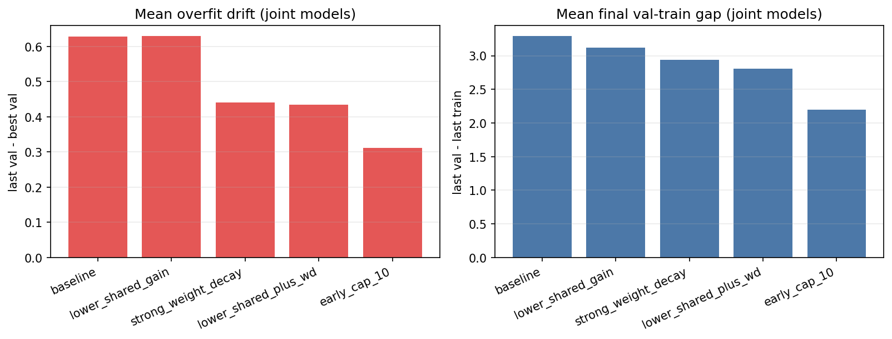
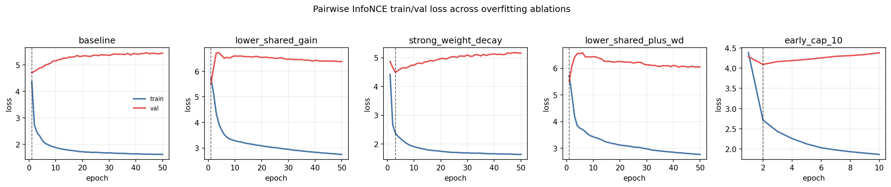

# PID-SAR-3++ SSL Overfitting Comparison (L0 Fixed-Budget)

This note compares train/validation loss overfitting behavior for the joint SSL objectives in the `L0` compositional regime under a fixed finite-data setup:

- train set: `10,000` samples (balanced over PID atoms)
- validation set: `2,000` samples (balanced over PID atoms)
- batch size: `128`
- up to `50` epochs
- GPU training

We compare five interventions:

- `baseline`: `shared_backbone_gain=4.0`, `weight_decay=1e-5`, `50` epochs
- `lower_shared_gain`: `shared_backbone_gain=1.0`, `weight_decay=1e-5`, `50` epochs
- `strong_weight_decay`: `shared_backbone_gain=4.0`, `weight_decay=1e-3`, `50` epochs
- `lower_shared_plus_wd`: `shared_backbone_gain=1.0`, `weight_decay=1e-3`, `50` epochs
- `early_cap_10`: `shared_backbone_gain=4.0`, `weight_decay=1e-5`, `10` epochs

We summarize two overfitting diagnostics for each model:

- final validation-train gap: `val_last - train_last`
- overfit drift: `val_last - val_best`

Lower is better for both.

## Artifacts

- `test_outputs/pid_sar3_ssl_fused_confusions/l0_optimization_gap_ablations_summary.csv`
- `test_outputs/pid_sar3_ssl_fused_confusions/l0_optimization_gap_ablations_history.csv`
- `test_outputs/pid_sar3_ssl_fused_confusions/l0_optimization_gap_ablations_bars.png`
- `test_outputs/pid_sar3_ssl_fused_confusions/l0_optimization_gap_ablations_pairwise_curves.png`

## Main Result

The best overfit reduction in this sweep comes from **`early_cap_10`**.

Mean over joint models (`pairwise InfoNCE`, `TRIANGLE`, `ConFu`):

| Variant | Mean final val-train gap | Mean overfit drift (`val_last - val_best`) |
| --- | ---: | ---: |
| `early_cap_10` | `2.199` | `0.311` |
| `lower_shared_plus_wd` | `2.810` | `0.434` |
| `strong_weight_decay` | `2.939` | `0.441` |
| `baseline` | `3.288` | `0.628` |
| `lower_shared_gain` | `3.120` | `0.629` |

Interpretation:

- Simply lowering the shared backbone gain does **not** fix overfitting by itself.
- Stronger weight decay helps.
- The strongest improvement in this sweep is to **cap training early** (`10` epochs).

## Figures

## Per-Model Details (Compact)

Selected metric: overfit drift (`val_last - val_best`), lower is better.

| Variant | Pairwise InfoNCE | TRIANGLE | ConFu |
| --- | ---: | ---: | ---: |
| `baseline` | `0.741` | `0.377` | `0.766` |
| `lower_shared_gain` | `0.866` | `0.171` | `0.849` |
| `strong_weight_decay` | `0.661` | `0.128` | `0.533` |
| `lower_shared_plus_wd` | `0.550` | `0.163` | `0.588` |
| `early_cap_10` | `0.286` | `0.288` | `0.360` |

## What To Use Next

For fixed-budget (`10k/2k`) experiments, the best setting found here is:

- `max_epochs = 10` (or explicit early stopping with patience)
- keep validation-loss checkpoint selection
- optionally add stronger weight decay (`1e-3`) as a secondary regularization knob

This should be treated as the current best-case anti-overfitting training regime for the `L0` fixed-budget comparisons.
