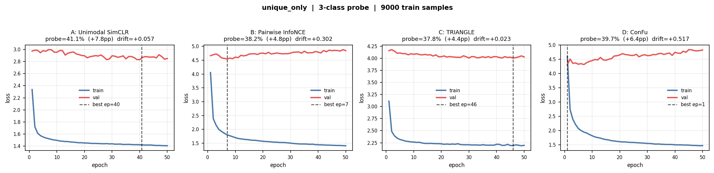
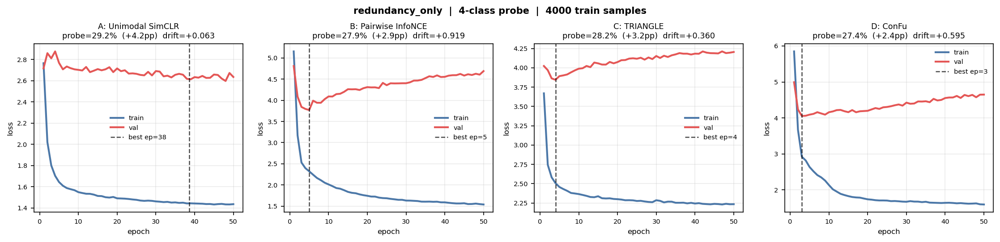
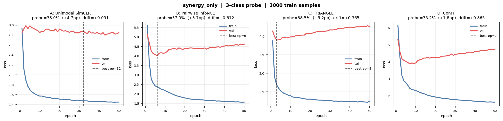

# L0 Training Losses and Cohen's Kappa (4 SSL Methods)

<table>
  <tr>
    <td valign="top" width="68%">
      <figure>
        
        <figcaption>
          Train vs validation loss curves on compositional <code>L0</code> (fixed 10k/2k budget, 50 epochs).
          Method A is shown as the mean across the three unimodal streams (<code>x1/x2/x3</code>).
          Methods B/C/D are joint-model runs.
        </figcaption>
      </figure>
    </td>
    <td valign="top" width="32%">
      <h4>Macro Cohen's &kappa; (5-fold grouped summary)</h4>
      <table>
        <thead>
          <tr>
            <th align="left">Model</th>
            <th align="right">pair-&gt;heldout</th>
            <th align="right">pair-&gt;member</th>
            <th align="right">123-&gt;target</th>
          </tr>
        </thead>
        <tbody>
          <tr>
            <td>A: 3x unimodal SimCLR</td>
            <td align="right">0.624</td>
            <td align="right">0.696</td>
            <td align="right">0.701</td>
          </tr>
          <tr>
            <td>B: pairwise InfoNCE</td>
            <td align="right">0.646</td>
            <td align="right">0.731</td>
            <td align="right">0.732</td>
          </tr>
          <tr>
            <td>C: TRIANGLE</td>
            <td align="right">0.639</td>
            <td align="right">0.727</td>
            <td align="right">0.727</td>
          </tr>
          <tr>
            <td>D: ConFu</td>
            <td align="right">0.646</td>
            <td align="right">0.729</td>
            <td align="right">0.731</td>
          </tr>
        </tbody>
      </table>
      <p><small>Source: <code>test_outputs/pid_sar3_ssl_fused_confusions/compositional_very_easy_source_to_target_four_models_5fold_grouped_summary.csv</code></small></p>
    </td>
  </tr>
</table>

## Family-Aware Cohen's &kappa; Breakdown (Derived Task-Regime View)

<p>
This is a <b>task-regime interpretation</b> of the same source-&gt;target macro-&kappa; results:
for each target information family (Unique / Redundancy / Synergy), columns indicate whether that family-specific signal is
<code>heldout</code>, available in a source <code>member</code>, or fully present in the source including the <code>target</code>.
No separate family-specific kappa artifact was stored, so values are aggregated from the per-task macro-&kappa; table.
</p>

<table>
  <thead>
    <tr>
      <th align="left">Block</th>
      <th align="left">Model</th>
      <th align="right">heldout</th>
      <th align="right">member</th>
      <th align="right">target</th>
    </tr>
  </thead>
  <tbody>
    <tr><td><b>Unique</b></td><td>A: 3x unimodal SimCLR</td><td align="right">0.624</td><td align="right">0.696</td><td align="right">0.701</td></tr>
    <tr><td>Unique</td><td>B: pairwise InfoNCE</td><td align="right">0.646</td><td align="right">0.731</td><td align="right">0.732</td></tr>
    <tr><td>Unique</td><td>C: TRIANGLE</td><td align="right">0.639</td><td align="right">0.727</td><td align="right">0.727</td></tr>
    <tr><td>Unique</td><td>D: ConFu</td><td align="right">0.646</td><td align="right">0.729</td><td align="right">0.731</td></tr>

    <tr><td colspan="5"><hr /></td></tr>

    <tr><td><b>Redundancy</b></td><td>A: 3x unimodal SimCLR</td><td align="right">N/A</td><td align="right">0.672</td><td align="right">0.701</td></tr>
    <tr><td>Redundancy</td><td>B: pairwise InfoNCE</td><td align="right">N/A</td><td align="right">0.703</td><td align="right">0.732</td></tr>
    <tr><td>Redundancy</td><td>C: TRIANGLE</td><td align="right">N/A</td><td align="right">0.698</td><td align="right">0.727</td></tr>
    <tr><td>Redundancy</td><td>D: ConFu</td><td align="right">N/A</td><td align="right">0.702</td><td align="right">0.731</td></tr>

    <tr><td colspan="5"><hr /></td></tr>

    <tr><td><b>Synergy</b></td><td>A: 3x unimodal SimCLR</td><td align="right">0.696</td><td align="right">0.624</td><td align="right">0.701</td></tr>
    <tr><td>Synergy</td><td>B: pairwise InfoNCE</td><td align="right">0.731</td><td align="right">0.646</td><td align="right">0.732</td></tr>
    <tr><td>Synergy</td><td>C: TRIANGLE</td><td align="right">0.727</td><td align="right">0.639</td><td align="right">0.727</td></tr>
    <tr><td>Synergy</td><td>D: ConFu</td><td align="right">0.729</td><td align="right">0.646</td><td align="right">0.731</td></tr>
  </tbody>
</table>

<p><small>
Mappings used for the derived view:
Unique = {pair-&gt;heldout, pair-&gt;member, 123-&gt;target};
Synergy swaps pair-heldout/member semantics (because the target synergy term is in the source pair only for pair-&gt;heldout tasks);
Redundancy has no <code>heldout</code> case under pair/triple sources, so that column is <code>N/A</code>.
</small></p>

## Redundancy-Heavy Train Mix (L0) — Family-Aware Cohen's &kappa; Breakdown (Derived Task-Regime View)

<p><small>
Derived from <code>test_outputs/pid_sar3_ssl_fused_confusions/compositional_very_easy_source_to_target_four_models_5fold_imb_l0_redundancy_heavy_summary.csv</code>
</small></p>

<table>
  <thead>
    <tr>
      <th align="left">Block</th>
      <th align="left">Model</th>
      <th align="right">heldout</th>
      <th align="right">member</th>
      <th align="right">target</th>
    </tr>
  </thead>
  <tbody>
    <tr><td><b>Unique</b></td><td>A: 3x unimodal SimCLR</td><td align="right">0.621</td><td align="right">0.690</td><td align="right">0.697</td></tr>
    <tr><td>Unique</td><td>B: pairwise InfoNCE</td><td align="right">0.644</td><td align="right">0.727</td><td align="right">0.731</td></tr>
    <tr><td>Unique</td><td>C: TRIANGLE</td><td align="right">0.644</td><td align="right">0.726</td><td align="right">0.727</td></tr>
    <tr><td>Unique</td><td>D: ConFu</td><td align="right">0.641</td><td align="right">0.723</td><td align="right">0.726</td></tr>
    <tr><td colspan="5"><hr /></td></tr>
    <tr><td><b>Redundancy</b></td><td>A: 3x unimodal SimCLR</td><td align="right">N/A</td><td align="right">0.667</td><td align="right">0.697</td></tr>
    <tr><td>Redundancy</td><td>B: pairwise InfoNCE</td><td align="right">N/A</td><td align="right">0.700</td><td align="right">0.731</td></tr>
    <tr><td>Redundancy</td><td>C: TRIANGLE</td><td align="right">N/A</td><td align="right">0.699</td><td align="right">0.727</td></tr>
    <tr><td>Redundancy</td><td>D: ConFu</td><td align="right">N/A</td><td align="right">0.696</td><td align="right">0.726</td></tr>
    <tr><td colspan="5"><hr /></td></tr>
    <tr><td><b>Synergy</b></td><td>A: 3x unimodal SimCLR</td><td align="right">0.690</td><td align="right">0.621</td><td align="right">0.697</td></tr>
    <tr><td>Synergy</td><td>B: pairwise InfoNCE</td><td align="right">0.727</td><td align="right">0.644</td><td align="right">0.731</td></tr>
    <tr><td>Synergy</td><td>C: TRIANGLE</td><td align="right">0.726</td><td align="right">0.644</td><td align="right">0.727</td></tr>
    <tr><td>Synergy</td><td>D: ConFu</td><td align="right">0.723</td><td align="right">0.641</td><td align="right">0.726</td></tr>
  </tbody>
</table>

## Synergy-Heavy Train Mix (L0) — Family-Aware Cohen's &kappa; Breakdown (Derived Task-Regime View)

<p><small>
Derived from <code>test_outputs/pid_sar3_ssl_fused_confusions/compositional_very_easy_source_to_target_four_models_5fold_imb_l0_synergy_heavy_summary.csv</code>
</small></p>

<table>
  <thead>
    <tr>
      <th align="left">Block</th>
      <th align="left">Model</th>
      <th align="right">heldout</th>
      <th align="right">member</th>
      <th align="right">target</th>
    </tr>
  </thead>
  <tbody>
    <tr><td><b>Unique</b></td><td>A: 3x unimodal SimCLR</td><td align="right">0.624</td><td align="right">0.688</td><td align="right">0.697</td></tr>
    <tr><td>Unique</td><td>B: pairwise InfoNCE</td><td align="right">0.645</td><td align="right">0.728</td><td align="right">0.732</td></tr>
    <tr><td>Unique</td><td>C: TRIANGLE</td><td align="right">0.644</td><td align="right">0.730</td><td align="right">0.730</td></tr>
    <tr><td>Unique</td><td>D: ConFu</td><td align="right">0.645</td><td align="right">0.729</td><td align="right">0.732</td></tr>
    <tr><td colspan="5"><hr /></td></tr>
    <tr><td><b>Redundancy</b></td><td>A: 3x unimodal SimCLR</td><td align="right">N/A</td><td align="right">0.666</td><td align="right">0.697</td></tr>
    <tr><td>Redundancy</td><td>B: pairwise InfoNCE</td><td align="right">N/A</td><td align="right">0.701</td><td align="right">0.732</td></tr>
    <tr><td>Redundancy</td><td>C: TRIANGLE</td><td align="right">N/A</td><td align="right">0.701</td><td align="right">0.730</td></tr>
    <tr><td>Redundancy</td><td>D: ConFu</td><td align="right">N/A</td><td align="right">0.701</td><td align="right">0.732</td></tr>
    <tr><td colspan="5"><hr /></td></tr>
    <tr><td><b>Synergy</b></td><td>A: 3x unimodal SimCLR</td><td align="right">0.688</td><td align="right">0.624</td><td align="right">0.697</td></tr>
    <tr><td>Synergy</td><td>B: pairwise InfoNCE</td><td align="right">0.728</td><td align="right">0.645</td><td align="right">0.732</td></tr>
    <tr><td>Synergy</td><td>C: TRIANGLE</td><td align="right">0.730</td><td align="right">0.644</td><td align="right">0.730</td></tr>
    <tr><td>Synergy</td><td>D: ConFu</td><td align="right">0.729</td><td align="right">0.645</td><td align="right">0.732</td></tr>
  </tbody>
</table>

## True Family-Only Learning Curves (3x4 Panels)

<p><small>
These are the actual family-only train/val runs from <code>run_l0_family_only_probes.sh</code>.
Each figure is a 1x4 panel (A/B/C/D); together they form the requested 3x4 view.
</small></p>

<figure>
  
  <figcaption><code>unique_only</code> (single-atom family-restricted train/val/probe; 4 model panels)</figcaption>
</figure>

<figure>
  
  <figcaption><code>redundancy_only</code> (single-atom family-restricted train/val/probe; 4 model panels)</figcaption>
</figure>

<figure>
  
  <figcaption><code>synergy_only</code> (single-atom family-restricted train/val/probe; 4 model panels)</figcaption>
</figure>

## Commands To Regenerate These Results

### Compositional L0 bundle (produces kappa/retrieval/reconstruction + training history/loss curves)

Run the same test twice, changing the train PID schedule and output suffix.

```bash
PIDSSL_L0_DEVICE=cpu \
PIDSSL_L0_TRAIN_MODE=epoch_val_select \
PIDSSL_L0_EPOCHS=50 \
PIDSSL_L0_TRAIN_N=10000 \
PIDSSL_L0_VAL_N=2000 \
PIDSSL_L0_BATCH_SIZE=128 \
PIDSSL_L0_PROBE_N_PER_PID=100 \
PIDSSL_L0_N_FOLDS=5 \
PIDSSL_L0_TRAIN_PID_SCHEDULE=imb_l0_redundancy_heavy \
PIDSSL_L0_OUTPUT_SUFFIX=imb_l0_redundancy_heavy \
pytest -q tests/test_pid_sar3_ssl_fused_confusions.py::test_analysis_bundle_four_models_compositional_very_easy -s
```

```bash
PIDSSL_L0_DEVICE=cpu \
PIDSSL_L0_TRAIN_MODE=epoch_val_select \
PIDSSL_L0_EPOCHS=50 \
PIDSSL_L0_TRAIN_N=10000 \
PIDSSL_L0_VAL_N=2000 \
PIDSSL_L0_BATCH_SIZE=128 \
PIDSSL_L0_PROBE_N_PER_PID=100 \
PIDSSL_L0_N_FOLDS=5 \
PIDSSL_L0_TRAIN_PID_SCHEDULE=imb_l0_synergy_heavy \
PIDSSL_L0_OUTPUT_SUFFIX=imb_l0_synergy_heavy \
pytest -q tests/test_pid_sar3_ssl_fused_confusions.py::test_analysis_bundle_four_models_compositional_very_easy -s
```

This writes (among others):

- <code>test_outputs/pid_sar3_ssl_fused_confusions/compositional_very_easy_source_to_target_four_models_5fold_imb_l0_redundancy_heavy_{summary,grouped_summary}.csv</code>
- <code>test_outputs/pid_sar3_ssl_fused_confusions/compositional_very_easy_source_to_target_four_models_5fold_imb_l0_synergy_heavy_{summary,grouped_summary}.csv</code>
- <code>test_outputs/pid_sar3_ssl_fused_confusions/compositional_very_easy_training_diagnostics_imb_l0_redundancy_heavy_{history,loss_curves}.csv/png</code>
- <code>test_outputs/pid_sar3_ssl_fused_confusions/compositional_very_easy_training_diagnostics_imb_l0_synergy_heavy_{history,loss_curves}.csv/png</code>

### Family-only probe experiments (single-atom controls)

If by “redundant and synergy” you also mean the family-only probe controls:

```bash
pytest -q tests/test_pid_sar3_ssl_fused_confusions.py::test_l0_family_redundancy_probe -s
pytest -q tests/test_pid_sar3_ssl_fused_confusions.py::test_l0_family_synergy_probe -s
```

Outputs:

- <code>test_outputs/pid_sar3_ssl_fused_confusions/l0_exp_redundancy_only.csv</code>
- <code>test_outputs/pid_sar3_ssl_fused_confusions/l0_exp_synergy_only.csv</code>
