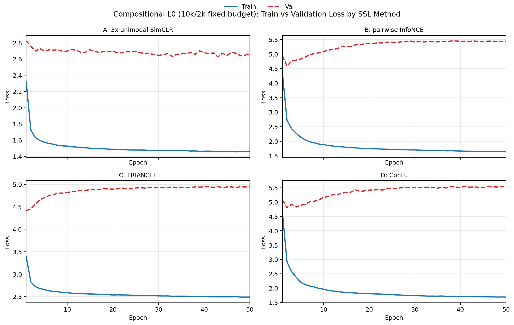

# L0 Training Losses and Cohen's Kappa (4 SSL Methods)

<table>
  <tr>
    <td valign="top" width="68%">
      <figure>
        
        <figcaption>
          Train vs validation loss curves on compositional <code>L0</code> (fixed 10k/2k budget, 50 epochs).
          Method A is shown as the mean across the three unimodal streams (<code>x1/x2/x3</code>).
          Methods B/C/D are joint-model runs.
        </figcaption>
      </figure>
    </td>
    <td valign="top" width="32%">
      <h4>Macro Cohen's &kappa; (5-fold grouped summary)</h4>
      <table>
        <thead>
          <tr>
            <th align="left">Model</th>
            <th align="right">pair-&gt;heldout</th>
            <th align="right">pair-&gt;member</th>
            <th align="right">123-&gt;target</th>
          </tr>
        </thead>
        <tbody>
          <tr>
            <td>A: 3x unimodal SimCLR</td>
            <td align="right">0.624</td>
            <td align="right">0.696</td>
            <td align="right">0.701</td>
          </tr>
          <tr>
            <td>B: pairwise InfoNCE</td>
            <td align="right">0.646</td>
            <td align="right">0.731</td>
            <td align="right">0.732</td>
          </tr>
          <tr>
            <td>C: TRIANGLE</td>
            <td align="right">0.639</td>
            <td align="right">0.727</td>
            <td align="right">0.727</td>
          </tr>
          <tr>
            <td>D: ConFu</td>
            <td align="right">0.646</td>
            <td align="right">0.729</td>
            <td align="right">0.731</td>
          </tr>
        </tbody>
      </table>
      
<small>Source: <code>test_outputs/pid_sar3_ssl_fused_confusions/compositional_very_easy_source_to_target_four_models_5fold_grouped_summary.csv</code></small>

    </td>
  </tr>
</table>

## Family-Aware Cohen's &kappa; Breakdown (Derived Task-Regime View)

This is a <b>task-regime interpretation</b> of the same source-&gt;target macro-&kappa; results:
for each target information family (Unique / Redundancy / Synergy), columns indicate whether that family-specific signal is
<code>heldout</code>, available in a source <code>member</code>, or fully present in the source including the <code>target</code>.
No separate family-specific kappa artifact was stored, so values are aggregated from the per-task macro-&kappa; table.

<table>
  <thead>
    <tr>
      <th align="left">Block</th>
      <th align="left">Model</th>
      <th align="right">heldout</th>
      <th align="right">member</th>
      <th align="right">target</th>
    </tr>
  </thead>
  <tbody>
    <tr><td><b>Unique</b></td><td>A: 3x unimodal SimCLR</td><td align="right">0.624</td><td align="right">0.696</td><td align="right">0.701</td></tr>
    <tr><td>Unique</td><td>B: pairwise InfoNCE</td><td align="right">0.646</td><td align="right">0.731</td><td align="right">0.732</td></tr>
    <tr><td>Unique</td><td>C: TRIANGLE</td><td align="right">0.639</td><td align="right">0.727</td><td align="right">0.727</td></tr>
    <tr><td>Unique</td><td>D: ConFu</td><td align="right">0.646</td><td align="right">0.729</td><td align="right">0.731</td></tr>

    <tr><td colspan="5">
</td></tr>

    <tr><td><b>Redundancy</b></td><td>A: 3x unimodal SimCLR</td><td align="right">N/A</td><td align="right">0.672</td><td align="right">0.701</td></tr>
    <tr><td>Redundancy</td><td>B: pairwise InfoNCE</td><td align="right">N/A</td><td align="right">0.703</td><td align="right">0.732</td></tr>
    <tr><td>Redundancy</td><td>C: TRIANGLE</td><td align="right">N/A</td><td align="right">0.698</td><td align="right">0.727</td></tr>
    <tr><td>Redundancy</td><td>D: ConFu</td><td align="right">N/A</td><td align="right">0.702</td><td align="right">0.731</td></tr>

    <tr><td colspan="5">
</td></tr>

    <tr><td><b>Synergy</b></td><td>A: 3x unimodal SimCLR</td><td align="right">0.696</td><td align="right">0.624</td><td align="right">0.701</td></tr>
    <tr><td>Synergy</td><td>B: pairwise InfoNCE</td><td align="right">0.731</td><td align="right">0.646</td><td align="right">0.732</td></tr>
    <tr><td>Synergy</td><td>C: TRIANGLE</td><td align="right">0.727</td><td align="right">0.639</td><td align="right">0.727</td></tr>
    <tr><td>Synergy</td><td>D: ConFu</td><td align="right">0.729</td><td align="right">0.646</td><td align="right">0.731</td></tr>
  </tbody>
</table>

<small>
Mappings used for the derived view:
Unique = {pair-&gt;heldout, pair-&gt;member, 123-&gt;target};
Synergy swaps pair-heldout/member semantics (because the target synergy term is in the source pair only for pair-&gt;heldout tasks);
Redundancy has no <code>heldout</code> case under pair/triple sources, so that column is <code>N/A</code>.
</small>

